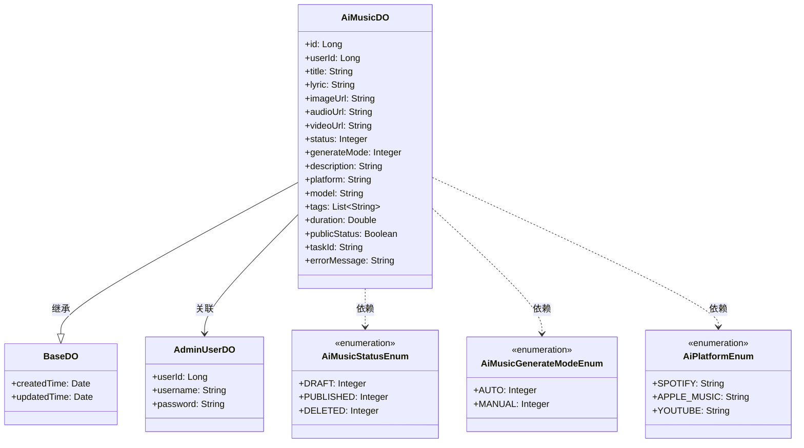
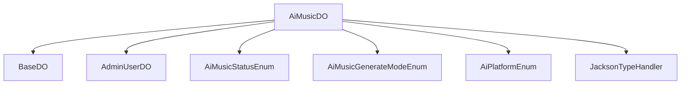

# 基础信息

|      |      |
|------|------|
| 编码语言 | .java |
| 代码路径 | yudao-module-ai/yudao-module-ai-biz/src/main/java/cn/iocoder/yudao/module/ai/dal/dataobject/music/AiMusicDO.java |
| 包名 | cn.iocoder.yudao.module.ai.dal.dataobject.music |
| 依赖项 | ['cn.iocoder.yudao.framework.ai.core.enums.AiPlatformEnum', 'cn.iocoder.yudao.framework.mybatis.core.dataobject.BaseDO', 'cn.iocoder.yudao.module.ai.enums.music.AiMusicGenerateModeEnum', 'cn.iocoder.yudao.module.ai.enums.music.AiMusicStatusEnum', 'com.baomidou.mybatisplus.annotation.KeySequence', 'com.baomidou.mybatisplus.annotation.TableField', 'com.baomidou.mybatisplus.annotation.TableId', 'com.baomidou.mybatisplus.annotation.TableName', 'com.baomidou.mybatisplus.extension.handlers.JacksonTypeHandler', 'lombok.Data', 'java.util.List'] |
| 概述说明 | AiMusicDO类用于表示AI音乐数据，包含编号、用户编号、音乐名称、歌词、图片地址、音频地址、视频地址、音乐状态、生成模式、描述词、平台、模型、音乐风格标签、音乐时长、是否公开、任务编号和错误信息等字段。 |

# 说明

AiMusicDO类是一个用于表示AI音乐数据的类，包含了多个字段以全面描述音乐的相关信息。该类的主要字段包括编号，用于唯一标识每首音乐；用户编号，表示生成该音乐的用户；音乐名称，即音乐的名称；歌词，包含音乐的歌词内容；图片地址，指向音乐的封面图片；音频地址，指向音乐的音频文件；视频地址，指向音乐的视频文件；音乐状态，表示音乐的当前状态，如生成中、已完成等；生成模式，描述音乐生成的方式或模式；描述词，用于描述音乐的关键词或标签；平台，表示音乐生成所使用的平台；模型，表示生成音乐所使用的AI模型；音乐风格标签，描述音乐的风格或类型；音乐时长，表示音乐的总时长；是否公开，表示音乐是否对外公开；任务编号，用于关联生成音乐的任务；错误信息，记录生成过程中可能出现的错误信息。这些字段共同构成了AiMusicDO类，使其能够全面、详细地描述AI音乐数据的各个方面。

# 类列表 Class Summary

| 名称   | 类型  | 说明 |
|-------|------|-------------|
| AiMusicDO | class | AiMusicDO类用于表示AI音乐数据，包含编号、用户编号、音乐名称、歌词、图片地址、音频地址、视频地址、音乐状态、生成模式、描述词、平台、模型、音乐风格标签、音乐时长、是否公开、任务编号和错误信息等字段。 |

## 类 AiMusicDO

|      |      |
|------|------|
| 访问范围 | @TableName(value = "ai_music", autoResultMap = true);@KeySequence("ai_music_seq") // 用于 Oracle、PostgreSQL、Kingbase、DB2、H2 数据库的主键自增。如果是 MySQL 等数据库，可不写。;@Data;public |
| 类型 | class |
| 名称 | AiMusicDO |
| 说明 | AiMusicDO类用于表示AI音乐数据，包含编号、用户编号、音乐名称、歌词、图片地址、音频地址、视频地址、音乐状态、生成模式、描述词、平台、模型、音乐风格标签、音乐时长、是否公开、任务编号和错误信息等字段。 |

### UML类图

### 描述信息：
该UML类图展示了`AiMusicDO`类与`BaseDO`类的继承关系，以及与`AdminUserDO`类的关联关系。`AiMusicDO`类依赖于多个枚举类（`AiMusicStatusEnum`、`AiMusicGenerateModeEnum`、`AiPlatformEnum`）来表示状态、生成模式和平台信息。图中所有类都包含属性和方法，确保没有空的类定义。

### 内部方法调用关系图

### 描述信息：
该图展示了 `AiMusicDO` 类与其他类或枚举之间的调用关系。`AiMusicDO` 继承自 `BaseDO`，并关联了 `AdminUserDO` 的 `userId` 字段。此外，`AiMusicDO` 还使用了多个枚举类（如 `AiMusicStatusEnum`、`AiMusicGenerateModeEnum` 和 `AiPlatformEnum`）以及 `JacksonTypeHandler` 来处理数据。这些关系清晰地映射了类之间的依赖和调用。

### 字段列表 Field List

| 名称  | 类型  | 说明 |
|-------|-------|------|
| taskId | String | 任务ID为私有字符串类型变量，用于唯一标识任务。 |
| duration | Double | duration 是一个私有的双精度浮点数类型变量。 |
| userId | Long | 用户ID为长整型数据，用于唯一标识用户。 |
| audioUrl | String | 音频文件的URL地址存储在私有字符串变量audioUrl中。 |
| generateMode | Integer | generateMode为私有整型变量，用于控制生成模式。 |
| platform | String | 平台信息为私有字符串类型，变量名为platform。 |
| videoUrl | String | 视频链接存储在私有字符串变量videoUrl中。 |
| errorMessage | String | private String errorMessage; 定义了一个私有字符串变量，用于存储错误信息。 |
| description | String | private String description; 是一个Java类中的私有字符串变量声明，用于存储描述信息。 |
| title | String | private String title; 定义了一个私有的字符串类型变量title，用于存储标题信息。 |
| lyric | String | 该信息描述了一个私有字符串变量，名为"lyric"，用于存储歌词内容。 |
| status | Integer | private Integer status; 表示一个私有的整型状态变量，用于存储状态信息。 |
| model | String | private String model; 是一个Java类的私有成员变量，用于存储模型数据。 |
| imageUrl | String | private String imageUrl; 声明了一个私有的字符串类型变量imageUrl，用于存储图像的URL地址。 |
| publicStatus | Boolean | 该信息表示一个布尔类型的私有变量`publicStatus`，用于存储公开状态的真假值。 |
| id | Long | 在代码中，`@TableId`注解用于标识实体类中的主键字段，`private Long id;`表示该主键字段为长整型且私有。 |
| tags | List<String> | 该代码片段定义了一个私有字段`tags`，其类型为`List<String>`，并使用`@TableField`注解指定了类型处理器为`JacksonTypeHandler.class`，用于处理该字段的序列化和反序列化。 |

### 方法列表 Method List

| 名称  | 类型  | 说明 |
|-------|-------|------|

