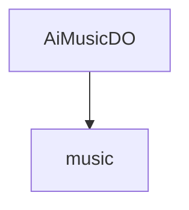

# 基础信息

|      |      |
|------|------|
| 编码语言 | .java |
| 代码路径 | yudao-module-ai/yudao-module-ai-biz/src/main/java/cn/iocoder/yudao/module/ai/dal/dataobject/music |
| 包名 | cn.iocoder.yudao.module.ai.dal.dataobject.music |
| 概述说明 | AiMusicDO类用于表示AI音乐数据，包含编号、用户编号、音乐名称、歌词、图片地址、音频地址、视频地址、音乐状态、生成模式、描述词、平台、模型、音乐风格标签、音乐时长、是否公开、任务编号和错误信息等字段。 |

# 说明

AiMusicDO类是一个用于表示AI音乐数据的类，包含了多个字段以全面描述音乐的相关信息。该类的主要字段包括编号，用于唯一标识每首音乐；用户编号，表示生成该音乐的用户；音乐名称，即音乐的名称；歌词，包含音乐的歌词内容；图片地址，指向音乐的封面图片；音频地址，指向音乐的音频文件；视频地址，指向音乐的视频文件；音乐状态，表示音乐的当前状态，如生成中、已完成等；生成模式，描述音乐生成的方式或模式；描述词，用于描述音乐的关键词或标签；平台，表示音乐生成所使用的平台；模型，表示生成音乐所使用的AI模型；音乐风格标签，描述音乐的风格或类型；音乐时长，表示音乐的总时长；是否公开，表示音乐是否对外公开；任务编号，用于关联生成音乐的任务；错误信息，记录生成过程中可能出现的错误信息。这些字段共同构成了AiMusicDO类，使其能够全面、详细地描述AI音乐数据的各个方面。

### 包内部结构视图

### 描述信息：
该Mermaid图展示了`AiMusicDO.java`文件与`music`文件夹之间的调用关系。`AiMusicDO.java`文件位于`music`文件夹内，表示它是该文件夹的一部分。图中清晰地展示了文件与文件夹之间的层级关系。

# 文件列表 File List

| 名称   | 类型  | 说明 |
|-------|------|-------------|
| [AiMusicDO.java](AiMusicDO.md) | file | AiMusicDO类用于表示AI音乐数据，包含编号、用户编号、音乐名称、歌词、图片地址、音频地址、视频地址、音乐状态、生成模式、描述词、平台、模型、音乐风格标签、音乐时长、是否公开、任务编号和错误信息等字段。 |

