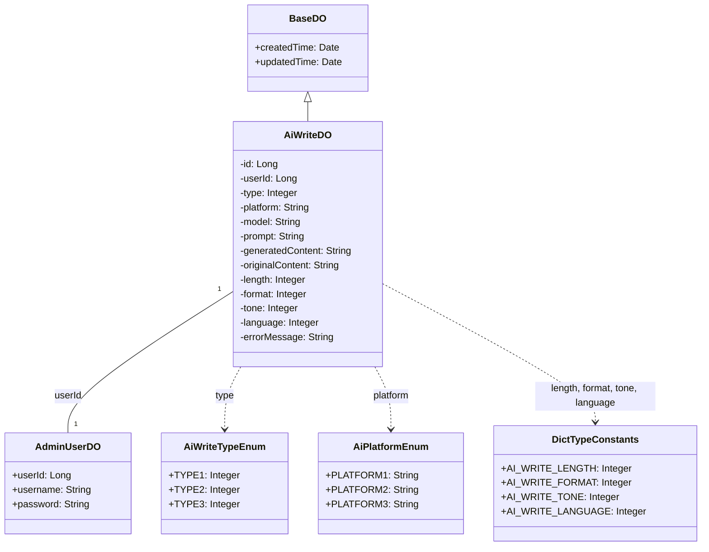
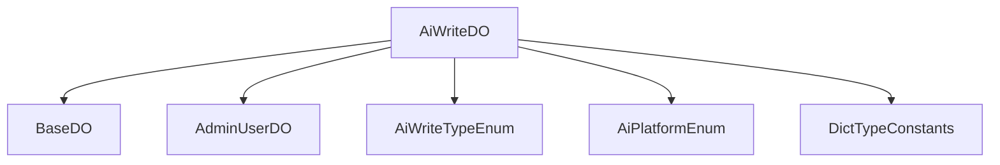

# 基础信息

|      |      |
|------|------|
| 编码语言 | .java |
| 代码路径 | yudao-module-ai/yudao-module-ai-biz/src/main/java/cn/iocoder/yudao/module/ai/dal/dataobject/write/AiWriteDO.java |
| 包名 | cn.iocoder.yudao.module.ai.dal.dataobject.write |
| 依赖项 | ['cn.iocoder.yudao.framework.ai.core.enums.AiPlatformEnum', 'cn.iocoder.yudao.framework.mybatis.core.dataobject.BaseDO', 'cn.iocoder.yudao.module.ai.enums.write.AiWriteTypeEnum', 'com.baomidou.mybatisplus.annotation.KeySequence', 'com.baomidou.mybatisplus.annotation.TableId', 'com.baomidou.mybatisplus.annotation.TableName', 'lombok.Data'] |
| 概述说明 | AiWriteDO类用于表示AI写作数据，包含编号、用户编号、写作类型、平台、模型、生成内容提示、生成内容、原文、长度提示词、格式提示词、语气提示词、语言提示词及错误信息等字段，部分字段关联枚举或字典类型。 |

# 说明

AiWriteDO类是一个用于表示AI写作数据的类，包含了多个字段以详细描述AI生成内容的相关信息。该类的主要字段包括编号、用户编号、写作类型、平台、模型、生成内容提示、生成内容、原文、长度提示词、格式提示词、语气提示词、语言提示词以及错误信息等。编号字段用于唯一标识每个AI写作数据实例，用户编号则关联到生成该内容的用户。写作类型字段描述了内容的类型，可能关联到枚举或字典类型以提供具体的类型选项。平台字段表示生成内容所使用的平台，模型字段则指定了使用的AI模型。生成内容提示字段提供了生成内容时的提示信息，生成内容字段存储了AI实际生成的内容，而原文字段则可能用于存储用户提供的原始文本或参考内容。长度提示词、格式提示词、语气提示词和语言提示词等字段分别用于指导生成内容的长度、格式、语气和语言风格，这些字段可能也关联到枚举或字典类型以提供具体的选项。最后，错误信息字段用于记录在生成内容过程中可能出现的错误或异常情况。通过这些字段，AiWriteDO类能够全面且详尽地描述AI写作数据的各个方面，为后续的处理和分析提供了丰富的信息基础。

# 类列表 Class Summary

| 名称   | 类型  | 说明 |
|-------|------|-------------|
| AiWriteDO | class | AiWriteDO类用于表示AI写作数据，包含编号、用户编号、写作类型、平台、模型、生成内容提示、生成内容、原文、长度提示词、格式提示词、语气提示词、语言提示词及错误信息等字段，部分字段关联枚举或字典类型。 |

## 类 AiWriteDO

|      |      |
|------|------|
| 访问范围 | @TableName("ai_write");@KeySequence("ai_write_seq") // 用于 Oracle、PostgreSQL、Kingbase、DB2、H2 数据库的主键自增。如果是 MySQL 等数据库，可不写。;@Data;public |
| 类型 | class |
| 名称 | AiWriteDO |
| 说明 | AiWriteDO类用于表示AI写作数据，包含编号、用户编号、写作类型、平台、模型、生成内容提示、生成内容、原文、长度提示词、格式提示词、语气提示词、语言提示词及错误信息等字段，部分字段关联枚举或字典类型。 |

### UML类图

### 描述信息：
该UML类图展示了`AiWriteDO`类及其相关类和接口的关系。`AiWriteDO`继承自`BaseDO`，并关联了`AdminUserDO`、`AiWriteTypeEnum`、`AiPlatformEnum`和`DictTypeConstants`等类。`AiWriteDO`类包含了多个私有属性，如`id`、`userId`、`type`等，并通过枚举和字典类来定义某些属性的取值范围。

### 内部方法调用关系图

### 描述信息：
该图展示了 `AiWriteDO` 类与其他类或枚举之间的调用关系。`AiWriteDO` 继承自 `BaseDO`，并通过 `userId` 字段关联到 `AdminUserDO`。此外，`AiWriteDO` 还引用了 `AiWriteTypeEnum`、`AiPlatformEnum` 和 `DictTypeConstants` 枚举类，用于定义写作类型、平台和字典类型。

### 字段列表 Field List

| 名称  | 类型  | 说明 |
|-------|-------|------|
| length | Integer | 概要说明：该信息涉及一个私有整数类型的变量，变量名为length，用于存储长度相关的数值。 |
| originalContent | String | private String originalContent; 是一个私有字符串变量声明，用于存储原始内容。 |
| platform | String | 平台名称存储在私有字符串变量中。 |
| userId | Long | 用户ID为长整型数据。 |
| format | Integer | 概要说明：该信息涉及一个私有整数类型的变量，名为format。 |
| type | Integer | 概要说明：该信息涉及一个私有整数类型的变量，命名为"type"。 |
| model | String | 该信息描述了一个私有字符串变量，变量名为"model"。 |
| tone | Integer | 概要说明：该信息涉及一个私有整数类型的变量，名为“tone”。 |
| language | Integer | 该信息描述了一个私有整型变量，名为`language`，用于存储语言相关的数值。 |
| generatedContent | String | 生成的概要说明：内容涉及私有字符串变量generatedContent，需提炼关键信息，确保语言简洁，避免使用任何文本语法格式。 |
| id | Long | 概要说明：代码片段定义了一个私有长整型变量id，并使用@TableId注解标记，表明该变量是表的主键标识。 |
| prompt | String | 该信息要求根据总结描述生成一个不超过100字的概要说明，需包含所有关键点和重要信息，语言简洁，且不使用任何文本语法格式如Markdown等。 |
| errorMessage | String | private String errorMessage; 用于存储错误信息，通常用于捕获和显示程序中的异常或错误情况。 |

### 方法列表 Method List

| 名称  | 类型  | 说明 |
|-------|-------|------|

