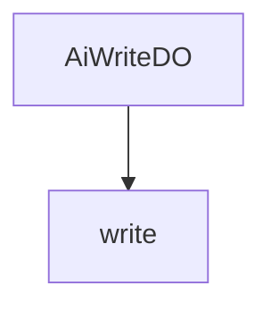

# 基础信息

|      |      |
|------|------|
| 编码语言 | .java |
| 代码路径 | yudao-module-ai/yudao-module-ai-biz/src/main/java/cn/iocoder/yudao/module/ai/dal/dataobject/write |
| 包名 | cn.iocoder.yudao.module.ai.dal.dataobject.write |
| 概述说明 | AiWriteDO类用于表示AI写作数据，包含编号、用户编号、写作类型、平台、模型、生成内容提示、生成内容、原文、长度提示词、格式提示词、语气提示词、语言提示词及错误信息等字段，部分字段关联枚举或字典类型。 |

# 说明

AiWriteDO类是一个用于表示AI写作数据的类，包含了多个字段以详细描述AI生成内容的相关信息。该类的主要字段包括编号、用户编号、写作类型、平台、模型、生成内容提示、生成内容、原文、长度提示词、格式提示词、语气提示词、语言提示词以及错误信息等。编号字段用于唯一标识每个AI写作数据实例，用户编号则关联到生成该内容的用户。写作类型字段描述了内容的类型，可能关联到枚举或字典类型以提供具体的类型选项。平台字段表示生成内容所使用的平台，模型字段则指定了使用的AI模型。生成内容提示字段提供了生成内容时的提示信息，生成内容字段存储了AI实际生成的内容，而原文字段则可能用于存储用户提供的原始文本或参考内容。长度提示词、格式提示词、语气提示词和语言提示词等字段分别用于指导生成内容的长度、格式、语气和语言风格，这些字段可能也关联到枚举或字典类型以提供具体的选项。最后，错误信息字段用于记录在生成内容过程中可能出现的错误或异常情况。通过这些字段，AiWriteDO类能够全面且详尽地描述AI写作数据的各个方面，为后续的处理和分析提供了丰富的信息基础。

### 包内部结构视图

### 描述信息：
该Mermaid图展示了`AiWriteDO.java`文件与`write`文件夹之间的调用关系。`AiWriteDO.java`文件位于`write`文件夹内，表示该文件属于`write`文件夹的一部分。图中清晰地展示了文件与文件夹之间的层级关系。

# 文件列表 File List

| 名称   | 类型  | 说明 |
|-------|------|-------------|
| [AiWriteDO.java](AiWriteDO.md) | file | AiWriteDO类用于表示AI写作数据，包含编号、用户编号、写作类型、平台、模型、生成内容提示、生成内容、原文、长度提示词、格式提示词、语气提示词、语言提示词及错误信息等字段，部分字段关联枚举或字典类型。 |

