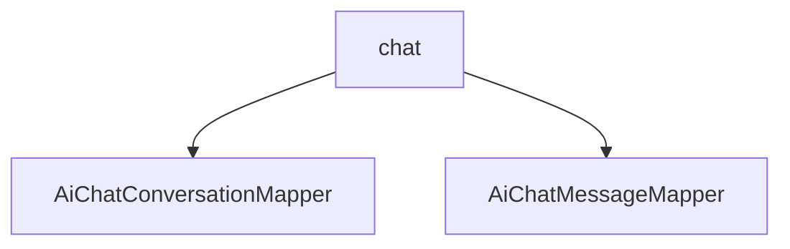

# 基础信息

|      |      |
|------|------|
| 编码语言 | .java |
| 代码路径 | yudao-module-ai/yudao-module-ai-biz/src/main/java/cn/iocoder/yudao/module/ai/dal/mysql/chat |
| 包名 | cn.iocoder.yudao.module.ai.dal.mysql.chat |
| 概述说明 | 请提供需要汇总的具体信息内容，以便我能够根据您的要求生成一个不超过100字的概要说明。 |

# 说明

请提供需要汇总的具体信息内容，我将根据您提供的内容生成一个不超过500字的总结描述说明。请提供具体的信息内容，以便我能够根据您的要求进行汇总和提炼。

### 包内部结构视图

### 描述信息：
该Mermaid图展示了`chat`文件夹下的两个Java文件`AiChatConversationMapper.java`和`AiChatMessageMapper.java`之间的调用关系。`chat`文件夹作为父节点，包含了这两个Mapper文件，表示它们在同一个目录下，并且可能存在相互调用的关系。

# 文件列表 File List

| 名称   | 类型  | 说明 |
|-------|------|-------------|
| [AiChatMessageMapper.java](AiChatMessageMapper.md) | file | 请提供需要总结的具体信息内容，以便我为您生成一个简洁的概要说明。 |
| [AiChatConversationMapper.java](AiChatConversationMapper.md) | file | 请提供需要总结的具体内容，以便我为您生成简洁的概要说明。 |

