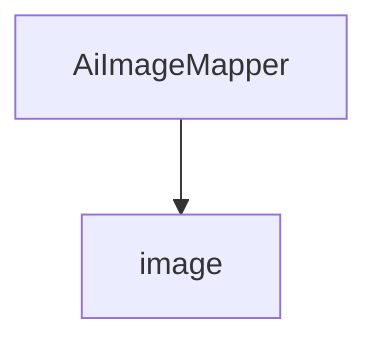

# 基础信息

|      |      |
|------|------|
| 编码语言 | .java |
| 代码路径 | yudao-module-ai/yudao-module-ai-biz/src/main/java/cn/iocoder/yudao/module/ai/dal/mysql/image |
| 包名 | cn.iocoder.yudao.module.ai.dal.mysql.image |
| 概述说明 | 请提供需要总结的具体内容，以便我为您生成一个简洁的概要说明。 |

# 说明

请提供需要汇总的具体信息内容，以便我为您生成总结描述说明。

### 包内部结构视图

### 描述信息：
该Mermaid图展示了`AiImageMapper`类与`image`文件夹之间的调用关系。`AiImageMapper`类位于`image`文件夹中，表示该类属于该文件夹的一部分。图中清晰地展示了文件与文件夹之间的层级关系。

# 文件列表 File List

| 名称   | 类型  | 说明 |
|-------|------|-------------|
| [AiImageMapper.java](AiImageMapper.md) | file | 请提供需要总结的具体内容，以便我为您生成一个简洁的概要说明。 |

