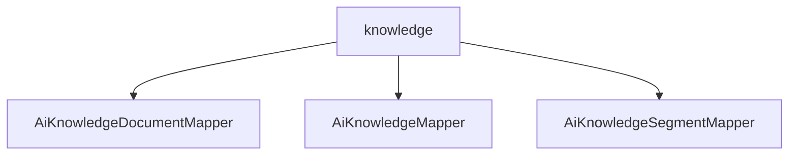

# 基础信息

|      |      |
|------|------|
| 编码语言 | .java |
| 代码路径 | yudao-module-ai/yudao-module-ai-biz/src/main/java/cn/iocoder/yudao/module/ai/dal/mysql/knowledge |
| 包名 | cn.iocoder.yudao.module.ai.dal.mysql.knowledge |
| 概述说明 | 请提供具体的信息内容，以便我能够根据您的要求进行汇总和提炼生成总结描述说明。 |

# 说明

由于您没有提供具体的信息内容，我无法进行汇总和提炼生成总结描述说明。请您提供需要处理的具体信息内容，我将根据您的要求进行详细的描述和总结。

### 包内部结构视图

### 描述信息：
该Mermaid图展示了`knowledge`文件夹下的三个Java文件之间的调用关系。`knowledge`文件夹包含了`AiKnowledgeDocumentMapper.java`、`AiKnowledgeMapper.java`和`AiKnowledgeSegmentMapper.java`三个文件，它们都位于同一个目录下，且没有直接的调用关系，而是通过`knowledge`文件夹进行组织和管理。

# 文件列表 File List

| 名称   | 类型  | 说明 |
|-------|------|-------------|
| [AiKnowledgeSegmentMapper.java](AiKnowledgeSegmentMapper.md) | file | 请提供需要总结的具体内容，以便我为您生成概要说明。 |
| [AiKnowledgeMapper.java](AiKnowledgeMapper.md) | file | 请提供需要处理的总结描述内容，以便我为您生成不超过100字的概要说明。 |
| [AiKnowledgeDocumentMapper.java](AiKnowledgeDocumentMapper.md) | file | 请提供需要总结的具体信息内容，以便我为您生成一个简洁的概要说明。 |

