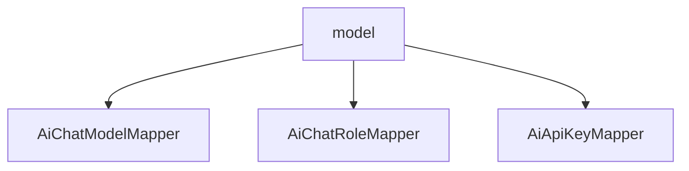

# 基础信息

|      |      |
|------|------|
| 编码语言 | .java |
| 代码路径 | yudao-module-ai/yudao-module-ai-biz/src/main/java/cn/iocoder/yudao/module/ai/dal/mysql/model |
| 包名 | cn.iocoder.yudao.module.ai.dal.mysql.model |
| 概述说明 | 由于未提供具体信息内容，无法生成总结描述说明。请提供需要汇总和提炼的具体信息，以便进行进一步处理。 |

# 说明

由于您提供的信息为空，我无法进行具体的汇总和提炼。为了生成一个全面且详尽的总结描述说明，我需要您提供具体的内容或信息。这些信息可以包括但不限于：主题、背景、关键点、数据、事件、人物、时间、地点等。一旦您提供了这些信息，我将能够根据您的要求，提炼出关键细节，并生成一个不超过500字的总结描述说明。请提供相关信息，以便我能够更好地协助您。

### 包内部结构视图

### 描述信息：
该Mermaid图展示了`model`文件夹与其中的三个Java文件（`AiChatModelMapper.java`、`AiChatRoleMapper.java`、`AiApiKeyMapper.java`）之间的层级关系。`model`文件夹包含了这三个Mapper类文件，这些文件可能用于处理与AI相关的数据库操作。

# 文件列表 File List

| 名称   | 类型  | 说明 |
|-------|------|-------------|
| [AiApiKeyMapper.java](AiApiKeyMapper.md) | file | 请提供需要总结的具体信息内容，以便我为您生成一个简洁的概要说明。 |
| [AiChatRoleMapper.java](AiChatRoleMapper.md) | file | 请提供需要总结的具体内容，以便我为您生成一个简洁的概要说明。 |
| [AiChatModelMapper.java](AiChatModelMapper.md) | file | 请提供需要总结的具体内容，以便我为您生成一个简洁的概要说明。 |

