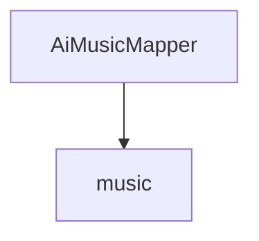

# 基础信息

|      |      |
|------|------|
| 编码语言 | .java |
| 代码路径 | yudao-module-ai/yudao-module-ai-biz/src/main/java/cn/iocoder/yudao/module/ai/dal/mysql/music |
| 包名 | cn.iocoder.yudao.module.ai.dal.mysql.music |
| 概述说明 | 请提供需要处理的总结描述内容，以便我为您提炼生成一个不超过100字的概要说明。 |

# 说明

请提供需要汇总和提炼的具体信息内容，以便我能够根据您的要求生成一个不超过500字的总结描述说明。

### 包内部结构视图

### 描述信息：
该Mermaid图展示了`AiMusicMapper`类与`music`文件夹之间的调用关系。`AiMusicMapper`类位于`music`文件夹中，表示该类属于该文件夹的一部分。图中清晰地展示了类与文件夹之间的层级关系。

# 文件列表 File List

| 名称   | 类型  | 说明 |
|-------|------|-------------|
| [AiMusicMapper.java](AiMusicMapper.md) | file | 请提供需要处理的总结描述内容，以便我为您提炼生成一个不超过100字的概要说明。 |

