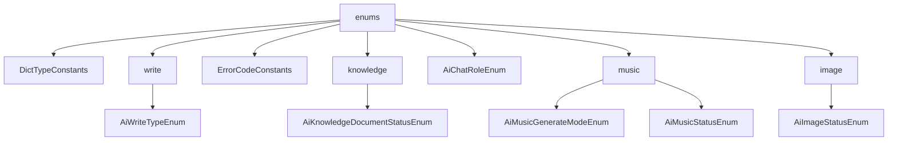

# 基础信息

|      |      |
|------|------|
| 编码语言 | .java |
| 代码路径 | yudao-module-ai/yudao-module-ai-api/src/main/java/cn/iocoder/yudao/module/ai/enums |
| 包名 | cn.iocoder.yudao.module.ai.enums |
| 概述说明 | 请提供具体的信息内容，以便我能够根据您的要求进行汇总和提炼生成总结描述说明。 |

# 说明

请提供需要汇总和提炼的具体信息内容，以便我能够根据您的要求生成一个不超过500字的总结描述说明。

### 包内部结构视图

### 描述信息：
该Mermaid图展示了`yudao-module-ai`模块中`enums`文件夹下的文件与子文件夹之间的调用关系。`enums`文件夹包含多个子文件夹和文件，如`write`、`knowledge`、`music`和`image`，每个子文件夹下又有具体的枚举类文件。图中清晰地展示了这些文件与文件夹之间的层级关系。

# 文件列表 File List

| 名称   | 类型  | 说明 |
|-------|------|-------------|
| [AiChatRoleEnum.java](AiChatRoleEnum.md) | file | 请提供需要总结的具体内容，以便我为您生成一个简洁的概要说明。 |
| [ErrorCodeConstants.java](ErrorCodeConstants.md) | file | 请提供需要处理的总结描述内容，以便我为您生成不超过100字的概要说明。 |
| [DictTypeConstants.java](DictTypeConstants.md) | file | 请提供需要处理的总结描述内容，以便我为您生成不超过100字的概要说明。 |
| [image](image/_package.md) | folder | 请提供需要总结的具体信息内容，以便我为您生成一个简洁的概要说明。 |
| [music](music/_package.md) | folder | 请提供具体的信息内容，以便我能够根据您的要求进行汇总和提炼生成总结描述说明。 |
| [knowledge](knowledge/_package.md) | folder | 请提供需要总结的具体信息内容，以便我为您生成概要说明。 |
| [write](write/_package.md) | folder | 请提供需要处理的总结描述内容，以便我为您生成不超过100字的概要说明。 |

