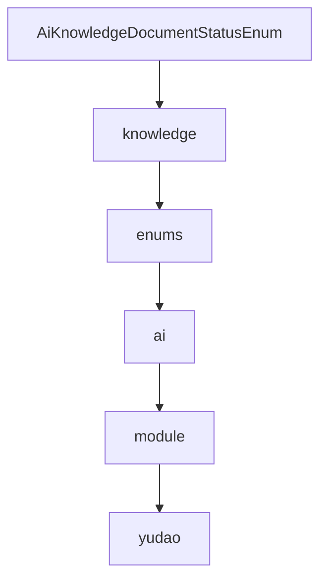

# 基础信息

|      |      |
|------|------|
| 编码语言 | .java |
| 代码路径 | yudao-module-ai/yudao-module-ai-api/src/main/java/cn/iocoder/yudao/module/ai/enums/knowledge |
| 包名 | cn.iocoder.yudao.module.ai.enums.knowledge |
| 概述说明 | 请提供需要总结的具体信息内容，以便我为您生成概要说明。 |

# 说明

请提供具体的信息内容，以便我能够根据您的要求生成总结描述说明。

### 包内部结构视图

### 描述信息：
该Mermaid图展示了`AiKnowledgeDocumentStatusEnum.java`文件在项目中的层级调用关系。从`yudao`模块开始，逐步深入到`ai`模块的`enums`文件夹中的`knowledge`文件夹，最终调用`AiKnowledgeDocumentStatusEnum.java`文件。图形简洁明了，展示了文件与文件夹之间的层级关系。

# 文件列表 File List

| 名称   | 类型  | 说明 |
|-------|------|-------------|
| [AiKnowledgeDocumentStatusEnum.java](AiKnowledgeDocumentStatusEnum.md) | file | 请提供需要总结的具体信息内容，以便我为您生成概要说明。 |

