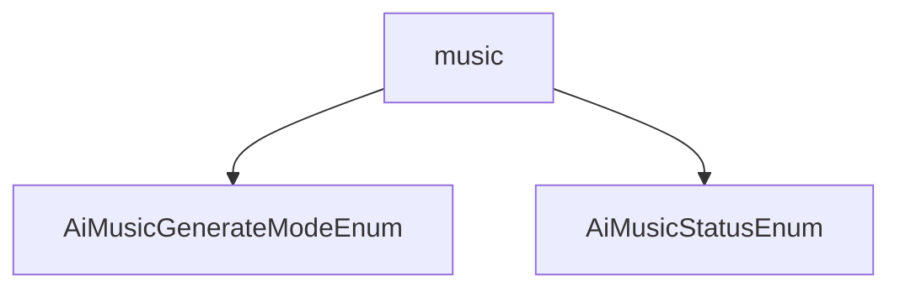

# 基础信息

|      |      |
|------|------|
| 编码语言 | .java |
| 代码路径 | yudao-module-ai/yudao-module-ai-api/src/main/java/cn/iocoder/yudao/module/ai/enums/music |
| 包名 | cn.iocoder.yudao.module.ai.enums.music |
| 概述说明 | 请提供具体的信息内容，以便我能够根据您的要求进行汇总和提炼生成总结描述说明。 |

# 说明

请提供具体的信息内容，以便我能够根据您的要求进行汇总和提炼生成总结描述说明。

### 包内部结构视图

### 描述信息：
该Mermaid图展示了`music`文件夹下的两个枚举类`AiMusicGenerateModeEnum`和`AiMusicStatusEnum`之间的调用关系。`music`文件夹作为父节点，包含这两个枚举类文件，图形清晰地展示了文件与文件夹之间的层级关系。

# 文件列表 File List

| 名称   | 类型  | 说明 |
|-------|------|-------------|
| [AiMusicStatusEnum.java](AiMusicStatusEnum.md) | file | 请提供需要总结的具体内容，以便我为您生成概要说明。 |
| [AiMusicGenerateModeEnum.java](AiMusicGenerateModeEnum.md) | file | 请提供需要总结的具体信息内容，以便我为您生成一个简洁的概要说明。 |

