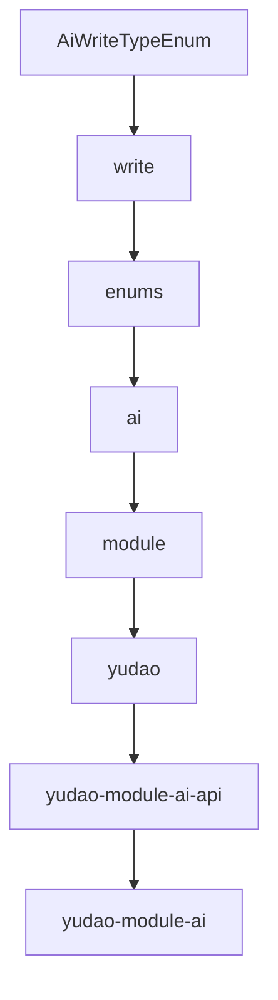

# 基础信息

|      |      |
|------|------|
| 编码语言 | .java |
| 代码路径 | yudao-module-ai/yudao-module-ai-api/src/main/java/cn/iocoder/yudao/module/ai/enums/write |
| 包名 | cn.iocoder.yudao.module.ai.enums.write |
| 概述说明 | 请提供需要处理的总结描述内容，以便我为您生成不超过100字的概要说明。 |

# 说明

请提供具体的信息内容，以便我能够根据您的要求进行汇总和提炼。

### 包内部结构视图

### 描述信息：
该Mermaid图展示了`AiWriteTypeEnum.java`文件在`yudao-module-ai`项目中的层级调用关系。从最底层的`AiWriteTypeEnum`开始，逐步向上追溯到`yudao-module-ai`模块，清晰地展示了文件与文件夹之间的层级结构。

# 文件列表 File List

| 名称   | 类型  | 说明 |
|-------|------|-------------|
| [AiWriteTypeEnum.java](AiWriteTypeEnum.md) | file | 请提供需要处理的总结描述内容，以便我为您生成不超过100字的概要说明。 |

