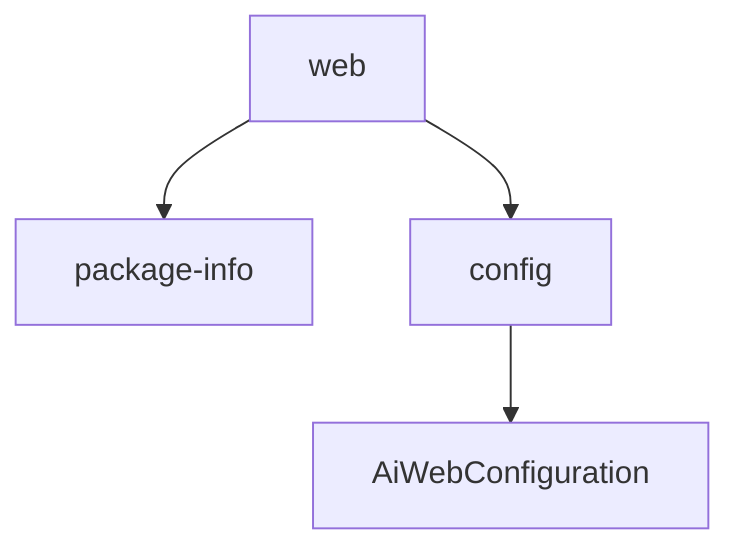

# 基础信息

|      |      |
|------|------|
| 编码语言 | .java |
| 代码路径 | yudao-module-ai/yudao-module-ai-biz/src/main/java/cn/iocoder/yudao/module/ai/framework/web |
| 包名 | cn.iocoder.yudao.module.ai.framework.web |
| 概述说明 | `AiWebConfiguration`是一个配置类，使用`@Configuration`注解标记，并设置`proxyBeanMethods`为`false`以避免代理开销。其中定义了`aiGroupedOpenApi`方法，使用`@Bean`注解返回一个与AI模块相关的API分组实例。该方法调用`YudaoSwaggerAutoConfiguration`中的`buildGroupedOpenApi`方法生成具体API分组，有效组织和管理AI模块的API接口。 |

# 说明

该代码片段描述了一个名为`AiWebConfiguration`的配置类，该类通过`@Configuration`注解标记，表明它是一个配置类。在配置类中，`proxyBeanMethods`属性被设置为`false`，这意味着该类中的Bean方法不会被代理，从而避免了不必要的代理开销。配置类中定义了一个名为`aiGroupedOpenApi`的方法，该方法使用`@Bean`注解，表明它将返回一个Bean实例。该方法的目的是创建并返回一个与AI模块相关的API分组。为了实现这一功能，`aiGroupedOpenApi`方法调用了`YudaoSwaggerAutoConfiguration`类中的`buildGroupedOpenApi`方法，该方法负责生成具体的API分组。通过这种方式，`AiWebConfiguration`类能够有效地组织和管理与AI模块相关的API接口，确保它们能够被正确地分组和展示。

### 包内部结构视图

### 描述信息：
该Mermaid图展示了`web`文件夹与其子文件夹和文件之间的关系。`web`文件夹包含`package-info.java`文件和`config`文件夹，而`config`文件夹中又包含`AiWebConfiguration.java`文件。图中清晰地展示了文件与文件夹之间的层级调用关系。

# 文件列表 File List

| 名称   | 类型  | 说明 |
|-------|------|-------------|
| [package-info.java](package-info.md) | file | 请提供需要总结的具体信息内容，以便我为您生成一个简洁的概要说明。 |
| [config](config/_package.md) | folder | 该代码片段定义了一个名为`AiWebConfiguration`的配置类，使用`@Configuration`注解标记，并设置`proxyBeanMethods`为`false`。其中包含一个`aiGroupedOpenApi`方法，通过`@Bean`注解调用`YudaoSwaggerAutoConfiguration`的`buildGroupedOpenApi`方法，生成并返回与AI模块相关的API分组。 |

