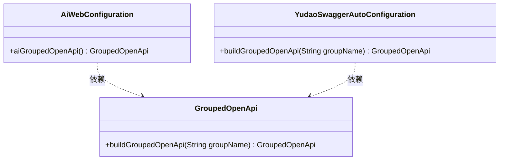
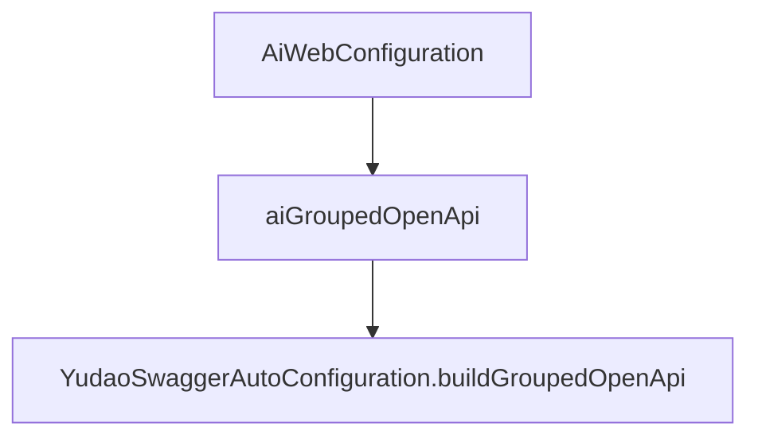

# 基础信息

|      |      |
|------|------|
| 编码语言 | .java |
| 代码路径 | yudao-module-ai/yudao-module-ai-biz/src/main/java/cn/iocoder/yudao/module/ai/framework/web/config/AiWebConfiguration.java |
| 包名 | cn.iocoder.yudao.module.ai.framework.web.config |
| 依赖项 | ['cn.iocoder.yudao.framework.swagger.config.YudaoSwaggerAutoConfiguration', 'org.springdoc.core.models.GroupedOpenApi', 'org.springframework.context.annotation.Bean', 'org.springframework.context.annotation.Configuration'] |
| 概述说明 | 该代码片段定义了一个名为`AiWebConfiguration`的配置类，使用`@Configuration`注解标记，并设置`proxyBeanMethods`为`false`。其中包含一个`aiGroupedOpenApi`方法，通过`@Bean`注解调用`YudaoSwaggerAutoConfiguration`的`buildGroupedOpenApi`方法，生成并返回与AI模块相关的API分组。 |

# 说明

该代码片段定义了一个名为`AiWebConfiguration`的配置类，该类通过`@Configuration`注解进行标记，表明它是一个配置类。配置类中的`proxyBeanMethods`属性被设置为`false`，这意味着该类中的Bean方法不会被代理，从而避免了不必要的代理开销。在该配置类中，定义了一个名为`aiGroupedOpenApi`的方法，该方法使用`@Bean`注解，表明它将返回一个Bean实例。该方法的目的是创建并返回一个与AI模块相关的API分组。为了实现这一功能，`aiGroupedOpenApi`方法调用了`YudaoSwaggerAutoConfiguration`类中的`buildGroupedOpenApi`方法，该方法负责生成具体的API分组。通过这种方式，`AiWebConfiguration`类能够有效地组织和管理与AI模块相关的API接口，确保它们能够被正确地分组和展示。

# 类列表 Class Summary

| 名称   | 类型  | 说明 |
|-------|------|-------------|
| AiWebConfiguration | class | 该代码片段定义了一个名为`AiWebConfiguration`的配置类，其中包含一个`aiGroupedOpenApi`方法，用于创建并返回一个与AI模块相关的API分组。配置类通过`@Configuration`注解标记，且`proxyBeanMethods`设置为`false`，表示不代理Bean方法。`aiGroupedOpenApi`方法使用`@Bean`注解，调用`YudaoSwaggerAutoConfiguration`的`buildGroupedOpenApi`方法生成API分组。 |

## 类 AiWebConfiguration

|      |      |
|------|------|
| 访问范围 | @Configuration(proxyBeanMethods = false);public |
| 类型 | class |
| 名称 | AiWebConfiguration |
| 说明 | 该代码片段定义了一个名为`AiWebConfiguration`的配置类，其中包含一个`aiGroupedOpenApi`方法，用于创建并返回一个与AI模块相关的API分组。配置类通过`@Configuration`注解标记，且`proxyBeanMethods`设置为`false`，表示不代理Bean方法。`aiGroupedOpenApi`方法使用`@Bean`注解，调用`YudaoSwaggerAutoConfiguration`的`buildGroupedOpenApi`方法生成API分组。 |

### UML类图

### 描述信息：
该UML类图展示了`AiWebConfiguration`类通过`aiGroupedOpenApi`方法创建`GroupedOpenApi`实例，并依赖于`YudaoSwaggerAutoConfiguration`类中的`buildGroupedOpenApi`方法。类之间的关系通过依赖关系表示，确保类之间的协作清晰可见。

### 内部方法调用关系图

### 描述信息：
`AiWebConfiguration` 类中的 `aiGroupedOpenApi` 方法调用了 `YudaoSwaggerAutoConfiguration` 类的 `buildGroupedOpenApi` 方法，用于构建 AI 模块的 API 分组。该调用关系展示了配置类如何通过依赖其他类的方法来完成特定的配置任务。

### 字段列表 Field List

| 名称  | 类型  | 说明 |
|-------|-------|------|

### 方法列表 Method List

| 名称  | 类型  | 说明 |
|-------|-------|------|
| aiGroupedOpenApi | GroupedOpenApi | 该代码片段定义了一个名为`aiGroupedOpenApi`的Bean，使用`YudaoSwaggerAutoConfiguration`类的`buildGroupedOpenApi`方法创建并返回一个分组OpenAPI对象，分组名称为"ai"。 |

