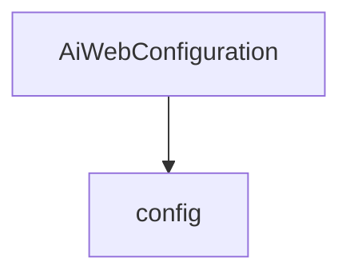

# 基础信息

|      |      |
|------|------|
| 编码语言 | .java |
| 代码路径 | yudao-module-ai/yudao-module-ai-biz/src/main/java/cn/iocoder/yudao/module/ai/framework/web/config |
| 包名 | cn.iocoder.yudao.module.ai.framework.web.config |
| 概述说明 | 该代码片段定义了一个名为`AiWebConfiguration`的配置类，使用`@Configuration`注解标记，并设置`proxyBeanMethods`为`false`。其中包含一个`aiGroupedOpenApi`方法，通过`@Bean`注解调用`YudaoSwaggerAutoConfiguration`的`buildGroupedOpenApi`方法，生成并返回与AI模块相关的API分组。 |

# 说明

该代码片段定义了一个名为`AiWebConfiguration`的配置类，该类通过`@Configuration`注解进行标记，表明它是一个配置类。配置类中的`proxyBeanMethods`属性被设置为`false`，这意味着该类中的Bean方法不会被代理，从而避免了不必要的代理开销。在该配置类中，定义了一个名为`aiGroupedOpenApi`的方法，该方法使用`@Bean`注解，表明它将返回一个Bean实例。该方法的目的是创建并返回一个与AI模块相关的API分组。为了实现这一功能，`aiGroupedOpenApi`方法调用了`YudaoSwaggerAutoConfiguration`类中的`buildGroupedOpenApi`方法，该方法负责生成具体的API分组。通过这种方式，`AiWebConfiguration`类能够有效地组织和管理与AI模块相关的API接口，确保它们能够被正确地分组和展示。

### 包内部结构视图

### 描述信息：
该Mermaid图展示了`AiWebConfiguration`类与`config`文件夹之间的调用关系。`AiWebConfiguration`类位于`config`文件夹中，负责配置与AI框架相关的Web设置。图中清晰地展示了类与文件夹之间的层级关系。

# 文件列表 File List

| 名称   | 类型  | 说明 |
|-------|------|-------------|
| [AiWebConfiguration.java](AiWebConfiguration.md) | file | 该代码片段定义了一个名为`AiWebConfiguration`的配置类，使用`@Configuration`注解标记，并设置`proxyBeanMethods`为`false`。其中包含一个`aiGroupedOpenApi`方法，通过`@Bean`注解调用`YudaoSwaggerAutoConfiguration`的`buildGroupedOpenApi`方法，生成并返回与AI模块相关的API分组。 |

