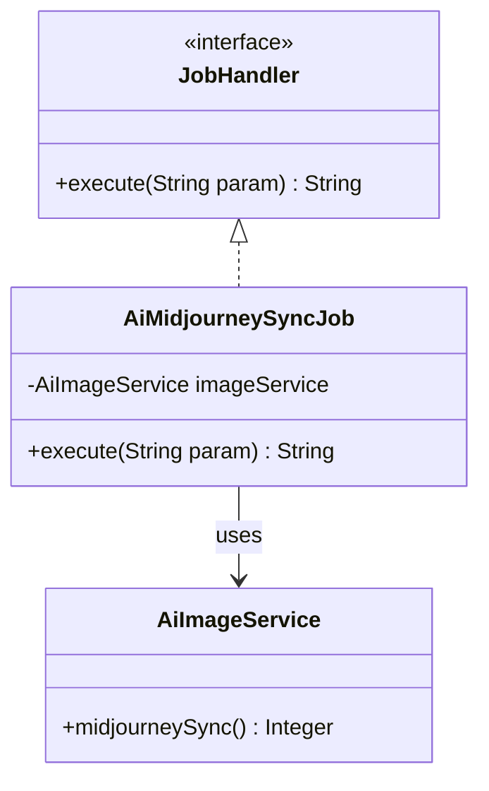
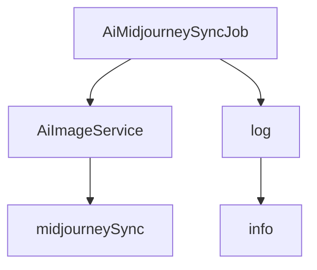

# 基础信息

|      |      |
|------|------|
| 编码语言 | .java |
| 代码路径 | yudao-module-ai/yudao-module-ai-biz/src/main/java/cn/iocoder/yudao/module/ai/job/image/AiMidjourneySyncJob.java |
| 包名 | cn.iocoder.yudao.module.ai.job.image |
| 依赖项 | ['cn.iocoder.yudao.framework.quartz.core.handler.JobHandler', 'cn.iocoder.yudao.module.ai.service.image.AiImageService', 'jakarta.annotation.Resource', 'lombok.extern.slf4j.Slf4j', 'org.springframework.stereotype.Component'] |
| 概述说明 | `AiMidjourneySyncJob` 类实现 `JobHandler` 接口，利用 `AiImageService` 服务的 `midjourneySync` 方法同步 Midjourney 数据，记录同步数量并返回结果信息。 |

# 说明

`AiMidjourneySyncJob` 类是一个实现了 `JobHandler` 接口的类，其主要功能是通过调用 `AiImageService` 服务中的 `midjourneySync` 方法来同步 Midjourney 数据。在执行过程中，该类会记录同步的数据数量，并在执行完成后返回同步结果的相关信息。该类的设计旨在处理与 Midjourney 数据同步相关的任务，确保数据能够及时更新并记录同步的状态和数量。

# 类列表 Class Summary

| 名称   | 类型  | 说明 |
|-------|------|-------------|
| AiMidjourneySyncJob | class | `AiMidjourneySyncJob` 类实现了 `JobHandler` 接口，通过 `AiImageService` 服务调用 `midjourneySync` 方法同步 Midjourney 数据，并记录同步数量。执行方法返回同步结果信息。 |

## 类 AiMidjourneySyncJob

|      |      |
|------|------|
| 访问范围 | @Component;@Slf4j;public |
| 类型 | class |
| 名称 | AiMidjourneySyncJob |
| 说明 | `AiMidjourneySyncJob` 类实现了 `JobHandler` 接口，通过 `AiImageService` 服务调用 `midjourneySync` 方法同步 Midjourney 数据，并记录同步数量。执行方法返回同步结果信息。 |

### UML类图

### 描述信息：
该UML类图展示了`AiMidjourneySyncJob`类实现了`JobHandler`接口，并通过依赖关系使用`AiImageService`类来执行Midjourney同步任务。`AiMidjourneySyncJob`类中的`execute`方法调用了`AiImageService`的`midjourneySync`方法，并返回同步结果。

### 内部方法调用关系图

### 描述信息：
该图展示了 `AiMidjourneySyncJob` 类中的方法调用关系。`AiMidjourneySyncJob` 类通过 `imageService` 调用 `midjourneySync` 方法，并使用 `log` 记录执行结果。整个过程实现了 Midjourney 数据的同步操作，并将结果记录在日志中。

### 字段列表 Field List

| 名称  | 类型  | 说明 |
|-------|-------|------|
| imageService | AiImageService | 在代码中，通过@Resource注解将AiImageService实例注入到当前类中，以便使用其提供的图像处理功能。 |

### 方法列表 Method List

| 名称  | 类型  | 说明 |
|-------|-------|------|
| execute | String | 该方法执行时调用imageService的midjourneySync方法获取同步数量，记录日志并返回同步结果信息。 |

