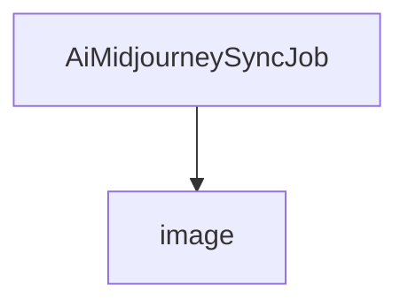

# 基础信息

|      |      |
|------|------|
| 编码语言 | .java |
| 代码路径 | yudao-module-ai/yudao-module-ai-biz/src/main/java/cn/iocoder/yudao/module/ai/job/image |
| 包名 | cn.iocoder.yudao.module.ai.job.image |
| 概述说明 | `AiMidjourneySyncJob` 类实现 `JobHandler` 接口，利用 `AiImageService` 服务的 `midjourneySync` 方法同步 Midjourney 数据，记录同步数量并返回结果信息。 |

# 说明

`AiMidjourneySyncJob` 类是一个实现了 `JobHandler` 接口的类，其主要功能是通过调用 `AiImageService` 服务中的 `midjourneySync` 方法来同步 Midjourney 数据。在执行过程中，该类会记录同步的数据数量，并在执行完成后返回同步结果的相关信息。该类的设计旨在处理与 Midjourney 数据同步相关的任务，确保数据能够及时更新并记录同步的状态和数量。

### 包内部结构视图

### 描述信息：
该Mermaid图展示了`AiMidjourneySyncJob.java`文件与`image`文件夹之间的调用关系。`AiMidjourneySyncJob.java`文件位于`image`文件夹内，表示该文件属于`image`文件夹的一部分。图中清晰地展示了文件与文件夹之间的层级关系。

# 文件列表 File List

| 名称   | 类型  | 说明 |
|-------|------|-------------|
| [AiMidjourneySyncJob.java](AiMidjourneySyncJob.md) | file | `AiMidjourneySyncJob` 类实现 `JobHandler` 接口，利用 `AiImageService` 服务的 `midjourneySync` 方法同步 Midjourney 数据，记录同步数量并返回结果信息。 |

