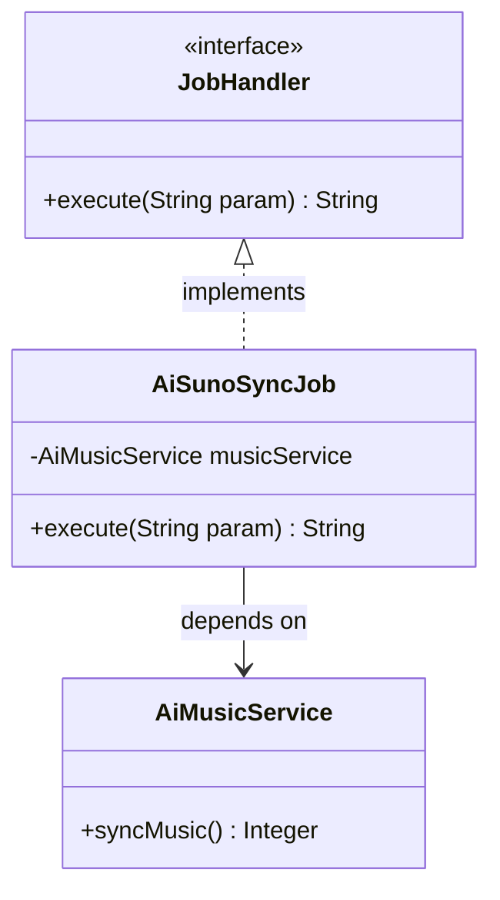
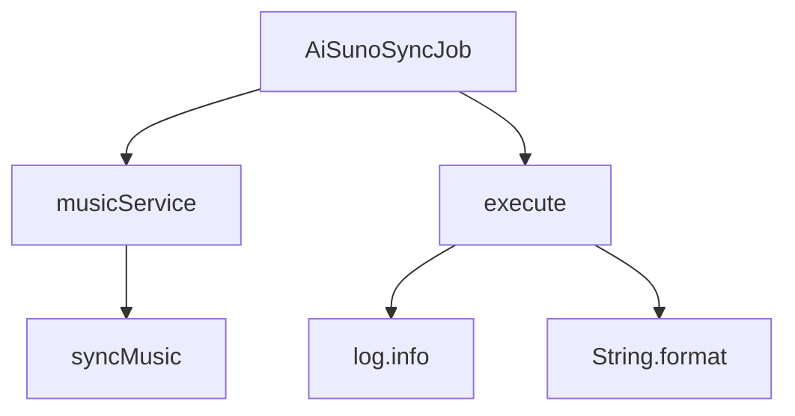

# 基础信息

|      |      |
|------|------|
| 编码语言 | .java |
| 代码路径 | yudao-module-ai/yudao-module-ai-biz/src/main/java/cn/iocoder/yudao/module/ai/job/music/AiSunoSyncJob.java |
| 包名 | cn.iocoder.yudao.module.ai.job.music |
| 依赖项 | ['cn.iocoder.yudao.framework.quartz.core.handler.JobHandler', 'cn.iocoder.yudao.module.ai.service.music.AiMusicService', 'jakarta.annotation.Resource', 'lombok.extern.slf4j.Slf4j', 'org.springframework.stereotype.Component'] |
| 概述说明 | AiSunoSyncJob类实现JobHandler接口，利用AiMusicService的syncMusic方法同步音乐数据，记录并返回同步的音乐数量信息。 |

# 说明

`AiSunoSyncJob` 类是一个实现了 `JobHandler` 接口的类，其主要功能是通过调用 `AiMusicService` 的 `syncMusic` 方法来同步音乐数据。在执行过程中，该类会记录同步的音乐数量，并在执行完成后返回同步的音乐数量信息。这一过程确保了音乐数据的同步操作能够被有效地管理和监控，同时提供了关于同步数量的反馈，以便进一步的处理和分析。

# 类列表 Class Summary

| 名称   | 类型  | 说明 |
|-------|------|-------------|
| AiSunoSyncJob | class | `AiSunoSyncJob` 类实现了 `JobHandler` 接口，通过 `AiMusicService` 的 `syncMusic` 方法同步音乐数据，并记录同步数量。执行后返回同步的音乐数量信息。 |

## 类 AiSunoSyncJob

|      |      |
|------|------|
| 访问范围 | @Component;@Slf4j;public |
| 类型 | class |
| 名称 | AiSunoSyncJob |
| 说明 | `AiSunoSyncJob` 类实现了 `JobHandler` 接口，通过 `AiMusicService` 的 `syncMusic` 方法同步音乐数据，并记录同步数量。执行后返回同步的音乐数量信息。 |

### UML类图

### 描述信息：
该UML类图展示了一个简单的任务处理系统。`AiSunoSyncJob`类实现了`JobHandler`接口，并依赖于`AiMusicService`类来执行音乐同步任务。`AiSunoSyncJob`类中的`execute`方法调用`AiMusicService`的`syncMusic`方法，并返回同步结果。

### 内部方法调用关系图

### 描述信息：
`AiSunoSyncJob` 类通过 `musicService` 调用 `syncMusic` 方法来同步音乐数据。在 `execute` 方法中，首先调用 `syncMusic` 获取同步数量，然后使用 `log.info` 记录日志，并最终通过 `String.format` 返回同步结果。

### 字段列表 Field List

| 名称  | 类型  | 说明 |
|-------|-------|------|
| musicService | AiMusicService | 在代码中，通过@Resource注解将AiMusicService实例注入到当前类的musicService属性中，以便后续使用该服务进行音乐相关操作。 |

### 方法列表 Method List

| 名称  | 类型  | 说明 |
|-------|-------|------|
| execute | String | 该方法重写了execute函数，接收一个字符串参数，调用musicService的syncMusic方法同步音乐数据，并返回同步的音乐数量。同步过程中记录日志信息，显示同步的音乐数量。 |

