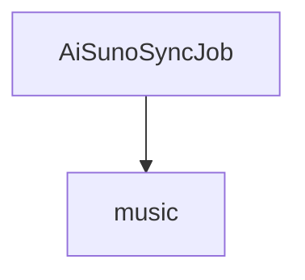

# 基础信息

|      |      |
|------|------|
| 编码语言 | .java |
| 代码路径 | yudao-module-ai/yudao-module-ai-biz/src/main/java/cn/iocoder/yudao/module/ai/job/music |
| 包名 | cn.iocoder.yudao.module.ai.job.music |
| 概述说明 | AiSunoSyncJob类实现JobHandler接口，利用AiMusicService的syncMusic方法同步音乐数据，记录并返回同步的音乐数量信息。 |

# 说明

`AiSunoSyncJob` 类是一个实现了 `JobHandler` 接口的类，其主要功能是通过调用 `AiMusicService` 的 `syncMusic` 方法来同步音乐数据。在执行过程中，该类会记录同步的音乐数量，并在执行完成后返回同步的音乐数量信息。这一过程确保了音乐数据的同步操作能够被有效地管理和监控，同时提供了关于同步数量的反馈，以便进一步的处理和分析。

### 包内部结构视图

### 描述信息：
该Mermaid图展示了`AiSunoSyncJob.java`文件与`music`文件夹之间的调用关系。`AiSunoSyncJob.java`位于`music`文件夹内，表示该文件属于`music`文件夹的一部分。图中清晰地展示了文件与文件夹之间的层级关系。

# 文件列表 File List

| 名称   | 类型  | 说明 |
|-------|------|-------------|
| [AiSunoSyncJob.java](AiSunoSyncJob.md) | file | AiSunoSyncJob类实现JobHandler接口，利用AiMusicService的syncMusic方法同步音乐数据，记录并返回同步的音乐数量信息。 |

