# 基础信息

|      |      |
|------|------|
| 编码语言 | .java |
| 代码路径 | yudao-module-ai/yudao-module-ai-biz/src/main/java/cn/iocoder/yudao/module/ai/service/chat/AiChatConversationServiceImpl.java |
| 包名 | cn.iocoder.yudao.module.ai.service.chat |
| 依赖项 | ['cn.hutool.core.collection.CollUtil', 'cn.hutool.core.lang.Assert', 'cn.hutool.core.util.ObjUtil', 'cn.hutool.core.util.ObjectUtil', 'cn.iocoder.yudao.framework.common.pojo.PageResult', 'cn.iocoder.yudao.framework.common.util.object.BeanUtils', 'cn.iocoder.yudao.module.ai.controller.admin.chat.vo.conversation.AiChatConversationCreateMyReqVO', 'cn.iocoder.yudao.module.ai.controller.admin.chat.vo.conversation.AiChatConversationPageReqVO', 'cn.iocoder.yudao.module.ai.controller.admin.chat.vo.conversation.AiChatConversationUpdateMyReqVO', 'cn.iocoder.yudao.module.ai.dal.dataobject.chat.AiChatConversationDO', 'cn.iocoder.yudao.module.ai.dal.dataobject.model.AiChatModelDO', 'cn.iocoder.yudao.module.ai.dal.dataobject.model.AiChatRoleDO', 'cn.iocoder.yudao.module.ai.dal.mysql.chat.AiChatConversationMapper', 'cn.iocoder.yudao.module.ai.service.knowledge.AiKnowledgeService', 'cn.iocoder.yudao.module.ai.service.model.AiChatModelService', 'cn.iocoder.yudao.module.ai.service.model.AiChatRoleService', 'jakarta.annotation.Resource', 'lombok.extern.slf4j.Slf4j', 'org.springframework.stereotype.Service', 'org.springframework.validation.annotation.Validated', 'java.time.LocalDateTime', 'java.util.List', 'java.util.Objects', 'cn.iocoder.yudao.framework.common.exception.util.ServiceExceptionUtil.exception', 'cn.iocoder.yudao.framework.common.util.collection.CollectionUtils.convertList', 'cn.iocoder.yudao.module.ai.enums.ErrorCodeConstants.CHAT_CONVERSATION_MODEL_ERROR', 'cn.iocoder.yudao.module.ai.enums.ErrorCodeConstants.CHAT_CONVERSATION_NOT_EXISTS'] |
| 概述说明 | AiChatConversationServiceImpl类实现AiChatConversationService接口，提供创建、更新、查询和删除聊天对话功能，校验角色、模型和知识库确保对话有效性。支持用户和管理员操作，包括创建、更新、获取对话列表、删除对话，并提供分页查询和按用户ID删除未置顶对话功能。 |

# 说明

AiChatConversationServiceImpl类实现了AiChatConversationService接口，提供了全面的聊天对话管理功能。该类支持创建、更新、查询和删除聊天对话的操作，确保对话的有效性通过校验角色、模型和知识库来实现。功能覆盖了用户和管理员的操作需求，包括创建新的对话、更新现有对话的信息、获取对话列表以及删除对话等。此外，该类还提供了分页查询功能，便于用户和管理员浏览大量对话记录。特别地，AiChatConversationServiceImpl还支持根据用户ID删除未置顶的对话，这一功能有助于维护对话列表的整洁和相关性。通过这些功能，AiChatConversationServiceImpl类有效地支持了聊天对话的管理和维护，确保了系统的灵活性和用户的操作便利性。

# 类列表 Class Summary

| 名称   | 类型  | 说明 |
|-------|------|-------------|
| AiChatConversationServiceImpl | class | AiChatConversationServiceImpl类实现了AiChatConversationService接口，提供了创建、更新、查询和删除聊天对话的功能。通过校验角色、模型和知识库，确保对话的有效性。支持用户和管理员操作，包括创建对话、更新对话信息、获取对话列表、删除对话等。还提供了分页查询和根据用户ID删除未置顶对话的功能。 |

## 类 AiChatConversationServiceImpl

|      |      |
|------|------|
| 访问范围 | @Service;@Validated;@Slf4j;public |
| 类型 | class |
| 名称 | AiChatConversationServiceImpl |
| 说明 | AiChatConversationServiceImpl类实现了AiChatConversationService接口，提供了创建、更新、查询和删除聊天对话的功能。通过校验角色、模型和知识库，确保对话的有效性。支持用户和管理员操作，包括创建对话、更新对话信息、获取对话列表、删除对话等。还提供了分页查询和根据用户ID删除未置顶对话的功能。 |

### UML类图

```mermaid
classDiagram
    class AiChatConversationServiceImpl {
        -AiChatConversationMapper chatConversationMapper
        -AiChatModelService chatModalService
        -AiChatRoleService chatRoleService
        -AiKnowledgeService knowledgeService
        +Long createChatConversationMy(AiChatConversationCreateMyReqVO createReqVO, Long userId)
        +void updateChatConversationMy(AiChatConversationUpdateMyReqVO updateReqVO, Long userId)
        +List~AiChatConversationDO~ getChatConversationListByUserId(Long userId)
        +AiChatConversationDO getChatConversation(Long id)
        +void deleteChatConversationMy(Long id, Long userId)
        +void deleteChatConversationByAdmin(Long id)
        -void validateChatModel(AiChatModelDO model)
        -AiChatConversationDO validateChatConversationExists(Long id)
        +void deleteChatConversationMyByUnpinned(Long userId)
        +PageResult~AiChatConversationDO~ getChatConversationPage(AiChatConversationPageReqVO pageReqVO)
    }

    class AiChatConversationService {
        <<interface>>
        +Long createChatConversationMy(AiChatConversationCreateMyReqVO createReqVO, Long userId)
        +void updateChatConversationMy(AiChatConversationUpdateMyReqVO updateReqVO, Long userId)
        +List~AiChatConversationDO~ getChatConversationListByUserId(Long userId)
        +AiChatConversationDO getChatConversation(Long id)
        +void deleteChatConversationMy(Long id, Long userId)
        +void deleteChatConversationByAdmin(Long id)
        +void deleteChatConversationMyByUnpinned(Long userId)
        +PageResult~AiChatConversationDO~ getChatConversationPage(AiChatConversationPageReqVO pageReqVO)
    }

    class AiChatConversationMapper {
        +void insert(AiChatConversationDO conversation)
        +void updateById(AiChatConversationDO updateObj)
        +List~AiChatConversationDO~ selectListByUserId(Long userId)
        +AiChatConversationDO selectById(Long id)
        +void deleteById(Long id)
        +List~AiChatConversationDO~ selectListByUserIdAndPinned(Long userId, Boolean pinned)
        +void deleteBatchIds(List~Long~ ids)
        +PageResult~AiChatConversationDO~ selectChatConversationPage(AiChatConversationPageReqVO pageReqVO)
    }

    class AiChatModelService {
        +AiChatModelDO validateChatModel(Long modelId)
        +AiChatModelDO getRequiredDefaultChatModel()
    }

    class AiChatRoleService {
        +AiChatRoleDO validateChatRole(Long roleId)
    }

    class AiKnowledgeService {
        +void validateKnowledgeExists(Long knowledgeId)
    }

    class AiChatConversationDO {
        +Long id
        +Long userId
        +Boolean pinned
        +Long modelId
        +String model
        +Long knowledgeId
        +Double temperature
        +Integer maxTokens
        +Integer maxContexts
        +String title
        +Long roleId
        +String systemMessage
        +LocalDateTime pinnedTime
    }

    class AiChatConversationCreateMyReqVO {
        +Long roleId
        +Long knowledgeId
    }

    class AiChatConversationUpdateMyReqVO {
        +Long id
        +Long modelId
        +Long knowledgeId
        +Boolean pinned
    }

    class AiChatConversationPageReqVO {
        +PageParam pageParam
    }

    class PageResult~T~ {
        +List~T~ list
        +Long total
    }

    AiChatConversationServiceImpl ..|> AiChatConversationService : implements
    AiChatConversationServiceImpl --> AiChatConversationMapper : depends
    AiChatConversationServiceImpl --> AiChatModelService : depends
    AiChatConversationServiceImpl --> AiChatRoleService : depends
    AiChatConversationServiceImpl --> AiKnowledgeService : depends
    AiChatConversationServiceImpl --> AiChatConversationDO : creates
    AiChatConversationServiceImpl --> AiChatConversationCreateMyReqVO : uses
    AiChatConversationServiceImpl --> AiChatConversationUpdateMyReqVO : uses
    AiChatConversationServiceImpl --> AiChatConversationPageReqVO : uses
    AiChatConversationServiceImpl --> PageResult~AiChatConversationDO~ : returns
```

### 描述：
该UML类图展示了`AiChatConversationServiceImpl`类与其依赖的接口、服务和数据对象之间的关系。`AiChatConversationServiceImpl`实现了`AiChatConversationService`接口，并依赖于`AiChatConversationMapper`、`AiChatModelService`、`AiChatRoleService`和`AiKnowledgeService`等服务类。它还创建和使用了多个数据对象，如`AiChatConversationDO`、`AiChatConversationCreateMyReqVO`等。

### 内部方法调用关系图

```mermaid
graph TD
    AiChatConversationServiceImpl --> chatConversationMapper
    AiChatConversationServiceImpl --> chatModalService
    AiChatConversationServiceImpl --> chatRoleService
    AiChatConversationServiceImpl --> knowledgeService
    createChatConversationMy --> chatRoleService.validateChatRole
    createChatConversationMy --> chatModalService.validateChatModel
    createChatConversationMy --> chatModalService.getRequiredDefaultChatModel
    createChatConversationMy --> validateChatModel
    createChatConversationMy --> knowledgeService.validateKnowledgeExists
    createChatConversationMy --> chatConversationMapper.insert
    updateChatConversationMy --> validateChatConversationExists
    updateChatConversationMy --> chatModalService.validateChatModel
    updateChatConversationMy --> knowledgeService.validateKnowledgeExists
    updateChatConversationMy --> chatConversationMapper.updateById
    getChatConversationListByUserId --> chatConversationMapper.selectListByUserId
    getChatConversation --> chatConversationMapper.selectById
    deleteChatConversationMy --> validateChatConversationExists
    deleteChatConversationMy --> chatConversationMapper.deleteById
    deleteChatConversationByAdmin --> validateChatConversationExists
    deleteChatConversationByAdmin --> chatConversationMapper.deleteById
    deleteChatConversationMyByUnpinned --> chatConversationMapper.selectListByUserIdAndPinned
    deleteChatConversationMyByUnpinned --> chatConversationMapper.deleteBatchIds
    getChatConversationPage --> chatConversationMapper.selectChatConversationPage
```

### 描述信息：
该图展示了`AiChatConversationServiceImpl`类中各个方法之间的调用关系。`AiChatConversationServiceImpl`类依赖于`chatConversationMapper`、`chatModalService`、`chatRoleService`和`knowledgeService`等组件。主要方法如`createChatConversationMy`和`updateChatConversationMy`通过调用这些组件的方法来完成聊天对话的创建和更新操作。其他方法如`deleteChatConversationMy`和`getChatConversationPage`则用于删除和分页查询聊天对话。

### 字段列表 Field List

| 名称  | 类型  | 说明 |
|-------|-------|------|
| chatConversationMapper | AiChatConversationMapper | 在代码中，使用@Resource注解注入了一个名为chatConversationMapper的AiChatConversationMapper实例。 |
| chatRoleService | AiChatRoleService | 在代码中，通过@Resource注解将AiChatRoleService注入到当前类中，以便使用其功能。 |
| knowledgeService | AiKnowledgeService | 在代码中，通过@Resource注解将AiKnowledgeService实例注入到当前类中，以便调用其提供的知识服务功能。 |
| chatModalService | AiChatModelService | 在代码中，通过@Resource注解将AiChatModelService注入为chatModalService，用于实现相关功能。 |

### 方法列表 Method List

| 名称  | 类型  | 说明 |
|-------|-------|------|
| getChatConversationPage | PageResult<AiChatConversationDO> | 该方法通过调用`chatConversationMapper.selectChatConversationPage`方法，根据传入的`AiChatConversationPageReqVO`参数，返回分页查询的`AiChatConversationDO`结果。 |
| validateChatConversationExists | AiChatConversationDO | 该方法通过ID查询聊天对话记录，若记录不存在则抛出异常，存在则返回该记录。 |
| getChatConversationListByUserId | List<AiChatConversationDO> | 该方法通过用户ID获取聊天对话列表，调用chatConversationMapper的selectListByUserId方法返回对应的AiChatConversationDO对象列表。 |
| validateChatModel | void | 该方法用于验证聊天模型的有效性，检查模型的温度、最大令牌数和最大上下文数是否全部非空。若任一参数为空，则抛出聊天模型错误异常。 |
| deleteChatConversationMyByUnpinned | void | 该方法用于删除用户未置顶的聊天对话。首先根据用户ID查询未置顶的对话列表，若列表为空则直接返回；否则批量删除这些对话。 |
| deleteChatConversationMy | void | 该方法用于删除指定用户的聊天对话。首先校验对话是否存在且属于该用户，若不存在或不匹配则抛出异常；若校验通过，则通过Mapper删除该对话。 |
| getChatConversation | AiChatConversationDO | 该方法通过传入的ID从数据库中获取对应的聊天会话数据，并返回一个AiChatConversationDO对象。具体实现是通过调用chatConversationMapper的selectById方法来查询数据。 |
| updateChatConversationMy | void | 该方法用于更新用户聊天对话信息。首先校验对话是否存在且属于当前用户，然后根据请求参数校验模型和知识库是否存在。最后更新对话信息，包括置顶时间和模型信息，并保存到数据库。 |
| deleteChatConversationByAdmin | void | 该方法用于管理员删除聊天对话。首先校验对话是否存在，若不存在则抛出异常；若存在则通过Mapper删除指定ID的对话。 |
| createChatConversationMy | Long | 该方法用于创建用户聊天对话，首先根据请求参数获取聊天角色和模型，若未指定角色则使用默认模型。接着校验知识库是否存在。然后创建聊天对话对象，设置用户ID、模型ID、知识库ID等属性，并根据角色设置标题和系统消息。最后将对话对象插入数据库并返回其ID。 |

