# 基础信息

|      |      |
|------|------|
| 编码语言 | .java |
| 代码路径 | yudao-module-ai/yudao-module-ai-biz/src/main/java/cn/iocoder/yudao/module/ai/service/chat/AiChatMessageServiceImpl.java |
| 包名 | cn.iocoder.yudao.module.ai.service.chat |
| 依赖项 | ['cn.hutool.core.collection.CollUtil', 'cn.hutool.core.util.ObjUtil', 'cn.hutool.core.util.StrUtil', 'cn.iocoder.yudao.framework.ai.core.enums.AiPlatformEnum', 'cn.iocoder.yudao.framework.ai.core.util.AiUtils', 'cn.iocoder.yudao.framework.common.pojo.CommonResult', 'cn.iocoder.yudao.framework.common.pojo.PageResult', 'cn.iocoder.yudao.framework.common.util.object.BeanUtils', 'cn.iocoder.yudao.framework.tenant.core.util.TenantUtils', 'cn.iocoder.yudao.module.ai.controller.admin.chat.vo.message.AiChatMessagePageReqVO', 'cn.iocoder.yudao.module.ai.controller.admin.chat.vo.message.AiChatMessageSendReqVO', 'cn.iocoder.yudao.module.ai.controller.admin.chat.vo.message.AiChatMessageSendRespVO', 'cn.iocoder.yudao.module.ai.controller.admin.knowledge.vo.segment.AiKnowledgeSegmentSearchReqVO', 'cn.iocoder.yudao.module.ai.dal.dataobject.chat.AiChatConversationDO', 'cn.iocoder.yudao.module.ai.dal.dataobject.chat.AiChatMessageDO', 'cn.iocoder.yudao.module.ai.dal.dataobject.knowledge.AiKnowledgeSegmentDO', 'cn.iocoder.yudao.module.ai.dal.dataobject.model.AiChatModelDO', 'cn.iocoder.yudao.module.ai.dal.mysql.chat.AiChatMessageMapper', 'cn.iocoder.yudao.module.ai.enums.AiChatRoleEnum', 'cn.iocoder.yudao.module.ai.enums.ErrorCodeConstants', 'cn.iocoder.yudao.module.ai.service.knowledge.AiKnowledgeSegmentService', 'cn.iocoder.yudao.module.ai.service.model.AiApiKeyService', 'cn.iocoder.yudao.module.ai.service.model.AiChatModelService', 'jakarta.annotation.Resource', 'lombok.extern.slf4j.Slf4j', 'org.springframework.ai.chat.messages.Message', 'org.springframework.ai.chat.messages.MessageType', 'org.springframework.ai.chat.messages.SystemMessage', 'org.springframework.ai.chat.messages.UserMessage', 'org.springframework.ai.chat.model.ChatModel', 'org.springframework.ai.chat.model.ChatResponse', 'org.springframework.ai.chat.model.StreamingChatModel', 'org.springframework.ai.chat.prompt.ChatOptions', 'org.springframework.ai.chat.prompt.Prompt', 'org.springframework.ai.chat.prompt.PromptTemplate', 'org.springframework.stereotype.Service', 'org.springframework.transaction.annotation.Transactional', 'reactor.core.publisher.Flux', 'java.time.LocalDateTime', 'java.util', 'cn.iocoder.yudao.framework.common.exception.util.ServiceExceptionUtil.exception', 'cn.iocoder.yudao.framework.common.pojo.CommonResult.error', 'cn.iocoder.yudao.framework.common.pojo.CommonResult.success', 'cn.iocoder.yudao.framework.common.util.collection.CollectionUtils.convertList', 'cn.iocoder.yudao.module.ai.enums.ErrorCodeConstants.CHAT_CONVERSATION_NOT_EXISTS', 'cn.iocoder.yudao.module.ai.enums.ErrorCodeConstants.CHAT_MESSAGE_NOT_EXIST'] |
| 概述说明 | AiChatMessageServiceImpl类实现了AiChatMessageService接口，负责处理聊天消息的发送、查询和删除操作。它通过校验对话和模型，插入用户和助手的消息，召回相关段落并构建Prompt进行模型调用，支持流式返回和批量删除消息，同时提供消息列表查询、分页查询和消息计数等功能。 |

# 说明

AiChatMessageServiceImpl类实现了AiChatMessageService接口，主要负责处理聊天消息的相关操作。该类通过校验对话和模型，确保消息的合法性和有效性。在消息处理过程中，它能够插入用户和助手的消息，并召回相关段落以构建Prompt，进而调用模型进行响应。此外，该类支持流式返回消息，使得消息的传输更加高效和实时。在消息管理方面，AiChatMessageServiceImpl提供了批量删除消息的功能，方便用户对不需要的消息进行清理。同时，该类还提供了消息列表查询、分页查询和消息计数等功能，使用户能够方便地查看和管理聊天记录。通过这些功能，AiChatMessageServiceImpl类为用户提供了一个全面且高效的聊天消息处理解决方案。

# 类列表 Class Summary

| 名称   | 类型  | 说明 |
|-------|------|-------------|
| AiChatMessageServiceImpl | class | AiChatMessageServiceImpl类实现了AiChatMessageService接口，主要处理聊天消息的发送、查询和删除操作。通过校验对话和模型，插入用户和助手的消息，召回相关段落并构建Prompt进行模型调用，支持流式返回和批量删除消息。还提供了消息列表查询、分页查询和消息计数等功能。 |

## 类 AiChatMessageServiceImpl

|      |      |
|------|------|
| 访问范围 | @Service;@Slf4j;public |
| 类型 | class |
| 名称 | AiChatMessageServiceImpl |
| 说明 | AiChatMessageServiceImpl类实现了AiChatMessageService接口，主要处理聊天消息的发送、查询和删除操作。通过校验对话和模型，插入用户和助手的消息，召回相关段落并构建Prompt进行模型调用，支持流式返回和批量删除消息。还提供了消息列表查询、分页查询和消息计数等功能。 |

### UML类图

以下是根据您提供的信息生成的Mermaid格式的UML类图：

```mermaid
classDiagram
    class AiChatMessageServiceImpl {
        -AiChatMessageMapper chatMessageMapper
        -AiChatConversationService chatConversationService
        -AiChatModelService chatModalService
        -AiApiKeyService apiKeyService
        -AiKnowledgeSegmentService knowledgeSegmentService
        +sendMessage(AiChatMessageSendReqVO sendReqVO, Long userId) AiChatMessageSendRespVO
        +sendChatMessageStream(AiChatMessageSendReqVO sendReqVO, Long userId) Flux~CommonResult~AiChatMessageSendRespVO~~
        +getChatMessageListByConversationId(Long conversationId) List~AiChatMessageDO~
        +deleteChatMessage(Long id, Long userId) void
        +deleteChatMessageByConversationId(Long conversationId, Long userId) void
        +deleteChatMessageByAdmin(Long id) void
        +getChatMessageCountMap(Collection~Long~ conversationIds) Map~Long, Integer~
        +getChatMessagePage(AiChatMessagePageReqVO pageReqVO) PageResult~AiChatMessageDO~
        -recallSegment(String content, Long knowledgeId) List~AiKnowledgeSegmentDO~
        -buildPrompt(AiChatConversationDO conversation, List~AiChatMessageDO~ messages, List~AiKnowledgeSegmentDO~ segmentList, AiChatModelDO model, AiChatMessageSendReqVO sendReqVO) Prompt
        -filterContextMessages(List~AiChatMessageDO~ messages, AiChatConversationDO conversation, AiChatMessageSendReqVO sendReqVO) List~AiChatMessageDO~
        -createChatMessage(Long conversationId, Long replyId, AiChatModelDO model, Long userId, Long roleId, MessageType messageType, String content, Boolean useContext) AiChatMessageDO
    }

    class AiChatMessageService {
        <<interface>>
        +sendMessage(AiChatMessageSendReqVO sendReqVO, Long userId) AiChatMessageSendRespVO
        +sendChatMessageStream(AiChatMessageSendReqVO sendReqVO, Long userId) Flux~CommonResult~AiChatMessageSendRespVO~~
        +getChatMessageListByConversationId(Long conversationId) List~AiChatMessageDO~
        +deleteChatMessage(Long id, Long userId) void
        +deleteChatMessageByConversationId(Long conversationId, Long userId) void
        +deleteChatMessageByAdmin(Long id) void
        +getChatMessageCountMap(Collection~Long~ conversationIds) Map~Long, Integer~
        +getChatMessagePage(AiChatMessagePageReqVO pageReqVO) PageResult~AiChatMessageDO~
    }

    class AiChatMessageMapper {
        +selectListByConversationId(Long conversationId) List~AiChatMessageDO~
        +insert(AiChatMessageDO message) void
        +updateById(AiChatMessageDO message) void
        +deleteById(Long id) void
        +deleteBatchIds(List~Long~ ids) void
        +selectCountMapByConversationId(Collection~Long~ conversationIds) Map~Long, Integer~
        +selectPage(AiChatMessagePageReqVO pageReqVO) PageResult~AiChatMessageDO~
    }

    class AiChatConversationService {
        +validateChatConversationExists(Long conversationId) AiChatConversationDO
    }

    class AiChatModelService {
        +validateChatModel(Long modelId) AiChatModelDO
    }

    class AiApiKeyService {
        +getChatModel(Long keyId) ChatModel
    }

    class AiKnowledgeSegmentService {
        +similaritySearch(AiKnowledgeSegmentSearchReqVO searchReqVO) List~AiKnowledgeSegmentDO~
    }

    class AiChatMessageDO {
        +Long id
        +Long conversationId
        +Long replyId
        +String model
        +Long modelId
        +Long userId
        +Long roleId
        +String type
        +String content
        +Boolean useContext
        +LocalDateTime createTime
    }

    class AiChatMessageSendReqVO {
        +Long conversationId
        +String content
        +Boolean useContext
    }

    class AiChatMessageSendRespVO {
        +Message send
        +Message receive
    }

    class AiChatMessagePageReqVO {
        +Long conversationId
        +Integer pageNo
        +Integer pageSize
    }

    class AiKnowledgeSegmentDO {
        +Long id
        +Long knowledgeId
        +String content
    }

    class AiChatConversationDO {
        +Long id
        +Long userId
        +Long modelId
        +Long roleId
        +String systemMessage
        +Integer maxContexts
        +Double temperature
        +Integer maxTokens
    }

    class AiChatModelDO {
        +Long id
        +String model
        +String platform
    }

    class Prompt {
        +List~Message~ messages
        +ChatOptions chatOptions
    }

    class ChatModel {
        +call(Prompt prompt) ChatResponse
        +stream(Prompt prompt) Flux~ChatResponse~
    }

    class ChatResponse {
        +Result result
    }

    class Result {
        +Output output
    }

    class Output {
        +String content
    }

    class Message {
        +String type
        +String content
    }

    class SystemMessage {
        +String content
    }

    class UserMessage {
        +String content
    }

    class PromptTemplate {
        +String template
        +createMessage(Map~String, Object~ variables) Message
    }

    class ChatOptions {
        +String platform
        +String model
        +Double temperature
        +Integer maxTokens
    }

    AiChatMessageServiceImpl --|> AiChatMessageService : implements
    AiChatMessageServiceImpl --> AiChatMessageMapper : uses
    AiChatMessageServiceImpl --> AiChatConversationService : uses
    AiChatMessageServiceImpl --> AiChatModelService : uses
    AiChatMessageServiceImpl --> AiApiKeyService : uses
    AiChatMessageServiceImpl --> AiKnowledgeSegmentService : uses
    AiChatMessageMapper --> AiChatMessageDO : uses
    AiChatConversationService --> AiChatConversationDO : uses
    AiChatModelService --> AiChatModelDO : uses
    AiApiKeyService --> ChatModel : uses
    AiKnowledgeSegmentService --> AiKnowledgeSegmentDO : uses
    Prompt --> Message : contains
    Prompt --> ChatOptions : contains
    ChatModel --> ChatResponse : returns
    ChatResponse --> Result : contains
    Result --> Output : contains
    PromptTemplate --> Message : creates
```

### 描述信息：
该UML类图展示了`AiChatMessageServiceImpl`类与其依赖的其他类之间的关系。`AiChatMessageServiceImpl`实现了`AiChatMessageService`接口，并依赖于多个服务类（如`AiChatMessageMapper`、`AiChatConversationService`等）来完成消息的发送、删除、查询等操作。图中还展示了各个类的属性和方法，以及它们之间的关联关系。

### 内部方法调用关系图

```mermaid
graph TD
    AiChatMessageServiceImpl --> chatConversationService
    AiChatMessageServiceImpl --> chatModalService
    AiChatMessageServiceImpl --> apiKeyService
    AiChatMessageServiceImpl --> knowledgeSegmentService
    AiChatMessageServiceImpl --> chatMessageMapper
    AiChatMessageServiceImpl --> createChatMessage
    AiChatMessageServiceImpl --> recallSegment
    AiChatMessageServiceImpl --> buildPrompt
    AiChatMessageServiceImpl --> filterContextMessages
    AiChatMessageServiceImpl --> getChatMessageListByConversationId
    AiChatMessageServiceImpl --> deleteChatMessage
    AiChatMessageServiceImpl --> deleteChatMessageByConversationId
    AiChatMessageServiceImpl --> deleteChatMessageByAdmin
    AiChatMessageServiceImpl --> getChatMessageCountMap
    AiChatMessageServiceImpl --> getChatMessagePage
    chatConversationService --> validateChatConversationExists
    chatModalService --> validateChatModel
    apiKeyService --> getChatModel
    knowledgeSegmentService --> similaritySearch
    chatMessageMapper --> selectListByConversationId
    chatMessageMapper --> insert
    chatMessageMapper --> updateById
    chatMessageMapper --> deleteById
    chatMessageMapper --> deleteBatchIds
    chatMessageMapper --> selectCountMapByConversationId
    chatMessageMapper --> selectPage
```

### 描述信息：
该图展示了`AiChatMessageServiceImpl`类中各个方法之间的调用关系。`AiChatMessageServiceImpl`依赖于多个服务类（如`chatConversationService`、`chatModalService`等）和`chatMessageMapper`来执行数据库操作。主要方法如`sendMessage`和`sendChatMessageStream`通过调用其他方法来验证对话、插入消息、召回段落、构建提示等。

### 字段列表 Field List

| 名称  | 类型  | 说明 |
|-------|-------|------|
| knowledgeSegmentService | AiKnowledgeSegmentService | 在代码中，通过@Resource注解注入了AiKnowledgeSegmentService服务，用于处理与知识片段相关的业务逻辑。 |
| apiKeyService | AiApiKeyService | 在代码中，通过@Resource注解将AiApiKeyService实例注入到当前类中，以便使用其提供的功能。 |
| chatModalService | AiChatModelService | 在代码中，通过@Resource注解将AiChatModelService注入到chatModalService变量中，用于实现AI聊天模型的相关功能。 |
| chatConversationService | AiChatConversationService | 概要说明：该代码片段展示了在Java类中通过@Resource注解注入了一个名为chatConversationService的AiChatConversationService实例，用于实现聊天对话服务功能。 |
| chatMessageMapper | AiChatMessageMapper | 在代码中，通过@Resource注解将AiChatMessageMapper实例注入到当前类中，以便后续使用该映射器进行数据库操作。 |

### 方法列表 Method List

| 名称  | 类型  | 说明 |
|-------|-------|------|
| deleteChatMessageByAdmin | void | 该方法用于管理员删除聊天消息。首先校验消息是否存在，若不存在则抛出异常；若存在则执行删除操作。 |
| deleteChatMessage | void | 该方法用于删除聊天消息，首先通过ID校验消息是否存在且属于指定用户，若校验失败则抛出异常；若校验通过，则执行删除操作。 |
| getChatMessageListByConversationId | List<AiChatMessageDO> | 该方法通过传入的会话ID，调用chatMessageMapper的selectListByConversationId方法，返回与该会话ID相关的聊天消息列表。 |
| getChatMessageCountMap | Map<Long, Integer> | 该方法通过传入的会话ID集合，调用chatMessageMapper的selectCountMapByConversationId方法，返回一个以会话ID为键、消息数量为值的映射表。 |
| createChatMessage | AiChatMessageDO | 该方法用于创建聊天消息对象，设置对话ID、回复ID、模型信息、用户ID、角色ID、消息类型、内容和上下文使用标志，并插入数据库，返回创建的消息对象。 |
| buildPrompt | Prompt | 该方法用于构建AI聊天提示信息，包括召回内容消息、系统角色设定、历史消息和用户新发送消息，最终生成包含消息列表和聊天选项的Prompt对象。 |
| getChatMessagePage | PageResult<AiChatMessageDO> | 该方法 `getChatMessagePage` 接收一个 `AiChatMessagePageReqVO` 对象作为参数，调用 `chatMessageMapper.selectPage` 方法进行分页查询，并返回 `PageResult<AiChatMessageDO>` 类型的结果。 |
| sendMessage | AiChatMessageSendRespVO | 该方法用于发送聊天消息，首先校验对话和模型的有效性，然后插入用户发送的消息和助手接收的消息，召回相关段落并构建Prompt，调用模型生成响应，最后更新助手消息内容并返回响应结果。 |
| deleteChatMessageByConversationId | void | 该方法通过对话ID和用户ID删除聊天消息。首先校验消息是否存在且属于该用户，若不存在或不属于则抛出异常。校验通过后，批量删除符合条件的消息。 |
| sendChatMessageStream | Flux<CommonResult<AiChatMessageSendRespVO>> | 该方法用于流式发送聊天消息。首先校验对话和模型是否存在，然后插入用户发送的消息和助手接收的消息。接着召回相关段落并构建Prompt，调用流式模型进行响应。最后将流式结果返回，并在完成或出错时更新消息内容。 |
| recallSegment | List<AiKnowledgeSegmentDO> | 该方法`recallSegment`用于根据内容`content`和知识ID`knowledgeId`检索相似的知识片段。如果`knowledgeId`为空，返回空列表；否则调用`knowledgeSegmentService.similaritySearch`方法进行相似性搜索，传入包含`knowledgeId`和`content`的请求对象。 |
| filterContextMessages | List<AiChatMessageDO> | 该方法用于过滤上下文消息，根据会话的最大上下文数量和是否使用上下文进行判断。若未设置最大上下文或不使用上下文，则返回空列表。否则，从消息列表末尾开始遍历，筛选出符合条件的用户消息和助手消息，直到达到最大上下文数量。最后反转列表并返回。 |

