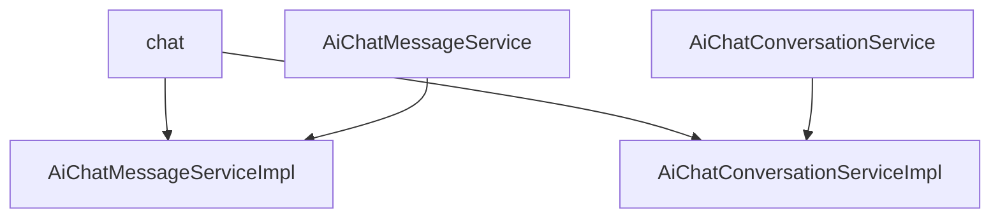

# 基础信息

|      |      |
|------|------|
| 编码语言 | .java |
| 代码路径 | yudao-module-ai/yudao-module-ai-biz/src/main/java/cn/iocoder/yudao/module/ai/service/chat |
| 包名 | cn.iocoder.yudao.module.ai.service.chat |
| 概述说明 | AiChatMessageServiceImpl类实现AiChatMessageService接口，处理聊天消息，校验对话和模型，插入用户和助手消息，召回段落构建Prompt，调用模型响应，支持流式返回和批量删除消息，提供消息列表查询、分页查询和计数功能。AiChatConversationServiceImpl类实现AiChatConversationService接口，管理聊天对话，支持创建、更新、查询和删除对话，校验角色、模型和知识库，提供分页查询和按用户ID删除未置顶对话功能，确保对话有效性和系统灵活性。 |

# 说明

AiChatMessageServiceImpl类和AiChatConversationServiceImpl类分别实现了AiChatMessageService和AiChatConversationService接口，提供了全面的聊天消息和对话管理功能。

AiChatMessageServiceImpl类主要负责处理聊天消息的相关操作。它通过校验对话和模型，确保消息的合法性和有效性。在消息处理过程中，该类能够插入用户和助手的消息，并召回相关段落以构建Prompt，进而调用模型进行响应。此外，该类支持流式返回消息，使得消息的传输更加高效和实时。在消息管理方面，AiChatMessageServiceImpl提供了批量删除消息的功能，方便用户对不需要的消息进行清理。同时，该类还提供了消息列表查询、分页查询和消息计数等功能，使用户能够方便地查看和管理聊天记录。通过这些功能，AiChatMessageServiceImpl类为用户提供了一个全面且高效的聊天消息处理解决方案。

AiChatConversationServiceImpl类则提供了全面的聊天对话管理功能。该类支持创建、更新、查询和删除聊天对话的操作，确保对话的有效性通过校验角色、模型和知识库来实现。功能覆盖了用户和管理员的操作需求，包括创建新的对话、更新现有对话的信息、获取对话列表以及删除对话等。此外，该类还提供了分页查询功能，便于用户和管理员浏览大量对话记录。特别地，AiChatConversationServiceImpl还支持根据用户ID删除未置顶的对话，这一功能有助于维护对话列表的整洁和相关性。通过这些功能，AiChatConversationServiceImpl类有效地支持了聊天对话的管理和维护，确保了系统的灵活性和用户的操作便利性。

综上所述，这两个类共同构成了一个完整的聊天系统，分别负责消息和对话的管理，提供了高效、灵活且用户友好的操作体验。

### 包内部结构视图

### 描述信息：
该Mermaid图展示了`chat`文件夹下的服务接口与实现类之间的调用关系。`AiChatMessageService`和`AiChatConversationService`是接口，分别由`AiChatMessageServiceImpl`和`AiChatConversationServiceImpl`实现。图中清晰地展示了接口与实现类之间的依赖关系。

# 文件列表 File List

| 名称   | 类型  | 说明 |
|-------|------|-------------|
| [AiChatConversationService.java](AiChatConversationService.md) | file | 请提供需要总结的具体内容，以便我为您生成一个简洁的概要说明。 |
| [AiChatConversationServiceImpl.java](AiChatConversationServiceImpl.md) | file | AiChatConversationServiceImpl类实现AiChatConversationService接口，提供创建、更新、查询和删除聊天对话功能，校验角色、模型和知识库确保对话有效性。支持用户和管理员操作，包括创建、更新、获取对话列表、删除对话，并提供分页查询和按用户ID删除未置顶对话功能。 |
| [AiChatMessageService.java](AiChatMessageService.md) | file | 请提供需要处理的总结描述内容，以便我为您生成不超过100字的概要说明。 |
| [AiChatMessageServiceImpl.java](AiChatMessageServiceImpl.md) | file | AiChatMessageServiceImpl类实现了AiChatMessageService接口，负责处理聊天消息的发送、查询和删除操作。它通过校验对话和模型，插入用户和助手的消息，召回相关段落并构建Prompt进行模型调用，支持流式返回和批量删除消息，同时提供消息列表查询、分页查询和消息计数等功能。 |

