# 基础信息

|      |      |
|------|------|
| 编码语言 | .java |
| 代码路径 | yudao-module-ai/yudao-module-ai-biz/src/main/java/cn/iocoder/yudao/module/ai/service/image/AiImageServiceImpl.java |
| 包名 | cn.iocoder.yudao.module.ai.service.image |
| 依赖项 | ['cn.hutool.core.bean.BeanUtil', 'cn.hutool.core.codec.Base64', 'cn.hutool.core.collection.CollUtil', 'cn.hutool.core.map.MapUtil', 'cn.hutool.core.util.ObjUtil', 'cn.hutool.core.util.StrUtil', 'cn.hutool.extra.spring.SpringUtil', 'cn.hutool.http.HttpUtil', 'cn.iocoder.yudao.framework.ai.core.enums.AiPlatformEnum', 'cn.iocoder.yudao.framework.ai.core.model.midjourney.api.MidjourneyApi', 'cn.iocoder.yudao.framework.common.pojo.PageResult', 'cn.iocoder.yudao.framework.common.util.object.BeanUtils', 'cn.iocoder.yudao.module.ai.controller.admin.image.vo', 'cn.iocoder.yudao.module.ai.controller.admin.image.vo.midjourney.AiMidjourneyActionReqVO', 'cn.iocoder.yudao.module.ai.controller.admin.image.vo.midjourney.AiMidjourneyImagineReqVO', 'cn.iocoder.yudao.module.ai.dal.dataobject.image.AiImageDO', 'cn.iocoder.yudao.module.ai.dal.mysql.image.AiImageMapper', 'cn.iocoder.yudao.module.ai.enums.image.AiImageStatusEnum', 'cn.iocoder.yudao.module.ai.service.model.AiApiKeyService', 'cn.iocoder.yudao.module.infra.api.file.FileApi', 'com.alibaba.cloud.ai.tongyi.image.TongYiImagesOptions', 'jakarta.annotation.Resource', 'lombok.extern.slf4j.Slf4j', 'org.springframework.ai.image.ImageModel', 'org.springframework.ai.image.ImageOptions', 'org.springframework.ai.image.ImagePrompt', 'org.springframework.ai.image.ImageResponse', 'org.springframework.ai.openai.OpenAiImageOptions', 'org.springframework.ai.qianfan.QianFanImageOptions', 'org.springframework.ai.stabilityai.api.StabilityAiImageOptions', 'org.springframework.ai.zhipuai.ZhiPuAiImageOptions', 'org.springframework.scheduling.annotation.Async', 'org.springframework.stereotype.Service', 'org.springframework.transaction.annotation.Transactional', 'java.time.LocalDateTime', 'java.util.Collections', 'java.util.List', 'java.util.Map', 'cn.iocoder.yudao.framework.common.exception.util.ServiceExceptionUtil.exception', 'cn.iocoder.yudao.framework.common.util.collection.CollectionUtils.convertMap', 'cn.iocoder.yudao.framework.common.util.collection.CollectionUtils.convertSet', 'cn.iocoder.yudao.module.ai.enums.ErrorCodeConstants'] |
| 概述说明 | AiImageServiceImpl类实现AiImageService接口，提供图像管理功能，包括分页查询、获取、绘制和删除图像。绘制图像时，通过异步任务调用AI平台API生成图像，上传至文件服务并更新数据库状态。支持Midjourney平台的图像生成、状态同步和回调处理，确保任务状态和图像结果的实时更新。 |

# 说明

AiImageServiceImpl类实现了AiImageService接口，提供了全面的图像管理功能。这些功能包括分页查询、获取图像、绘制图像以及删除图像等操作。在绘制图像的过程中，系统通过异步任务调用不同AI平台的API来生成图像。生成的图像结果随后会被上传至文件服务，并更新数据库中的状态信息，以确保数据的实时性和一致性。此外，AiImageServiceImpl类还特别支持Midjourney平台的图像生成、状态同步和回调处理功能。通过这些功能，系统能够实时更新任务状态和图像结果，确保用户能够及时获取最新的图像生成进展和结果。整体上，AiImageServiceImpl类通过集成多种AI平台的API和文件服务，提供了一个高效、可靠的图像管理解决方案。

# 类列表 Class Summary

| 名称   | 类型  | 说明 |
|-------|------|-------------|
| AiImageServiceImpl | class | AiImageServiceImpl类实现了AiImageService接口，提供了图像管理功能，包括分页查询、获取图像、绘制图像、删除图像等操作。绘制图像时，通过异步任务调用不同AI平台的API生成图像，并将结果上传至文件服务，更新数据库状态。此外，还支持Midjourney平台的图像生成、状态同步和回调处理，确保任务状态和图像结果的实时更新。 |

## 类 AiImageServiceImpl

|      |      |
|------|------|
| 访问范围 | @Service;@Slf4j;public |
| 类型 | class |
| 名称 | AiImageServiceImpl |
| 说明 | AiImageServiceImpl类实现了AiImageService接口，提供了图像管理功能，包括分页查询、获取图像、绘制图像、删除图像等操作。绘制图像时，通过异步任务调用不同AI平台的API生成图像，并将结果上传至文件服务，更新数据库状态。此外，还支持Midjourney平台的图像生成、状态同步和回调处理，确保任务状态和图像结果的实时更新。 |

### UML类图

```mermaid
classDiagram
    class AiImageServiceImpl {
        -AiImageMapper imageMapper
        -FileApi fileApi
        -AiApiKeyService apiKeyService
        +getImagePageMy(Long userId, AiImagePageReqVO pageReqVO) PageResult~AiImageDO~
        +getImagePagePublic(AiImagePublicPageReqVO pageReqVO) PageResult~AiImageDO~
        +getImage(Long id) AiImageDO
        +getImageList(List~Long~ ids) List~AiImageDO~
        +drawImage(Long userId, AiImageDrawReqVO drawReqVO) Long
        +executeDrawImage(AiImageDO image, AiImageDrawReqVO req) void
        +deleteImageMy(Long id, Long userId) void
        +getImagePage(AiImagePageReqVO pageReqVO) PageResult~AiImageDO~
        +updateImage(AiImageUpdateReqVO updateReqVO) void
        +deleteImage(Long id) void
        +midjourneyImagine(Long userId, AiMidjourneyImagineReqVO reqVO) Long
        +midjourneySync() Integer
        +midjourneyNotify(MidjourneyApi.Notify notify) void
        +midjourneyAction(Long userId, AiMidjourneyActionReqVO reqVO) Long
        -validateImageExists(Long id) AiImageDO
        -buildImageOptions(AiImageDrawReqVO draw) ImageOptions
        -updateMidjourneyStatus(AiImageDO image, MidjourneyApi.Notify notify) void
        -getSelf() AiImageServiceImpl
    }

    class AiImageService {
        <<interface>>
        +getImagePageMy(Long userId, AiImagePageReqVO pageReqVO) PageResult~AiImageDO~
        +getImagePagePublic(AiImagePublicPageReqVO pageReqVO) PageResult~AiImageDO~
        +getImage(Long id) AiImageDO
        +getImageList(List~Long~ ids) List~AiImageDO~
        +drawImage(Long userId, AiImageDrawReqVO drawReqVO) Long
        +deleteImageMy(Long id, Long userId) void
        +getImagePage(AiImagePageReqVO pageReqVO) PageResult~AiImageDO~
        +updateImage(AiImageUpdateReqVO updateReqVO) void
        +deleteImage(Long id) void
        +midjourneyImagine(Long userId, AiMidjourneyImagineReqVO reqVO) Long
        +midjourneySync() Integer
        +midjourneyNotify(MidjourneyApi.Notify notify) void
        +midjourneyAction(Long userId, AiMidjourneyActionReqVO reqVO) Long
    }

    class AiImageMapper {
        +selectPageMy(Long userId, AiImagePageReqVO pageReqVO) PageResult~AiImageDO~
        +selectPage(AiImagePublicPageReqVO pageReqVO) PageResult~AiImageDO~
        +selectById(Long id) AiImageDO
        +selectBatchIds(List~Long~ ids) List~AiImageDO~
        +insert(AiImageDO image) void
        +updateById(AiImageDO image) void
        +deleteById(Long id) void
        +selectListByStatusAndPlatform(Integer status, String platform) List~AiImageDO~
        +selectByTaskId(String taskId) AiImageDO
    }

    class FileApi {
        +createFile(byte[] fileContent) String
    }

    class AiApiKeyService {
        +getImageModel(String platform) ImageModel
        +getMidjourneyApi() MidjourneyApi
    }

    class ImageModel {
        +call(ImagePrompt prompt) ImageResponse
    }

    class MidjourneyApi {
        +imagine(ImagineRequest request) SubmitResponse
        +getTaskList(Set~String~ taskIds) List~Notify~
        +action(ActionRequest request) SubmitResponse
    }

    class AiImageDO {
        -Long id
        -Long userId
        -String picUrl
        -Integer status
        -String taskId
        -Map~String, Object~ options
        -LocalDateTime finishTime
        -String errorMessage
        -String prompt
        -String platform
        -String model
        -Integer width
        -Integer height
        -List~Button~ buttons
    }

    class ImageOptions {
        <<interface>>
    }

    class OpenAiImageOptions {
        +withModel(String model) OpenAiImageOptions
        +withHeight(Integer height) OpenAiImageOptions
        +withWidth(Integer width) OpenAiImageOptions
        +withStyle(String style) OpenAiImageOptions
        +withResponseFormat(String format) OpenAiImageOptions
    }

    class StabilityAiImageOptions {
        +withModel(String model) StabilityAiImageOptions
        +withHeight(Integer height) StabilityAiImageOptions
        +withWidth(Integer width) StabilityAiImageOptions
        +withSeed(Long seed) StabilityAiImageOptions
        +withCfgScale(Float scale) StabilityAiImageOptions
        +withSteps(Integer steps) StabilityAiImageOptions
        +withSampler(String sampler) StabilityAiImageOptions
        +withStylePreset(String stylePreset) StabilityAiImageOptions
        +withClipGuidancePreset(String clipGuidancePreset) StabilityAiImageOptions
    }

    class TongYiImagesOptions {
        +withModel(String model) TongYiImagesOptions
        +withN(Integer n) TongYiImagesOptions
        +withHeight(Integer height) TongYiImagesOptions
        +withWidth(Integer width) TongYiImagesOptions
    }

    class QianFanImageOptions {
        +withModel(String model) QianFanImageOptions
        +withN(Integer n) QianFanImageOptions
        +withHeight(Integer height) QianFanImageOptions
        +withWidth(Integer width) QianFanImageOptions
    }

    class ZhiPuAiImageOptions {
        +withModel(String model) ZhiPuAiImageOptions
    }

    class ImageResponse {
        -ImageResult result
    }

    class ImageResult {
        -String b64Json
        -String url
    }

    class MidjourneyApi.Notify {
        -String id
        -String status
        -String imageUrl
        -String failReason
        -List~Button~ buttons
    }

    class MidjourneyApi.Button {
        -String customId
    }

    class MidjourneyApi.SubmitResponse {
        -String code
        -String description
        -String result
    }

    class MidjourneyApi.ImagineRequest {
        -List~String~ base64Array
        -String prompt
        -String state
    }

    class MidjourneyApi.ActionRequest {
        -String customId
        -String taskId
        -String state
    }

    AiImageServiceImpl ..|> AiImageService : implements
    AiImageServiceImpl --> AiImageMapper : uses
    AiImageServiceImpl --> FileApi : uses
    AiImageServiceImpl --> AiApiKeyService : uses
    AiApiKeyService --> ImageModel : uses
    AiApiKeyService --> MidjourneyApi : uses
    ImageModel --> ImageResponse : returns
    MidjourneyApi --> MidjourneyApi.Notify : returns
    MidjourneyApi --> MidjourneyApi.SubmitResponse : returns
    MidjourneyApi --> MidjourneyApi.ImagineRequest : uses
    MidjourneyApi --> MidjourneyApi.ActionRequest : uses
    ImageOptions <|.. OpenAiImageOptions : implements
    ImageOptions <|.. StabilityAiImageOptions : implements
    ImageOptions <|.. TongYiImagesOptions : implements
    ImageOptions <|.. QianFanImageOptions : implements
    ImageOptions <|.. ZhiPuAiImageOptions : implements
```

### 描述信息：
该UML类图展示了`AiImageServiceImpl`类与其相关接口和依赖类之间的关系。`AiImageServiceImpl`实现了`AiImageService`接口，并依赖于`AiImageMapper`、`FileApi`和`AiApiKeyService`等类。`AiApiKeyService`进一步依赖于`ImageModel`和`MidjourneyApi`，用于处理图像生成和Midjourney任务。类图中还展示了多个图像选项类的继承关系，如`OpenAiImageOptions`、`StabilityAiImageOptions`等，它们都实现了`ImageOptions`接口。

### 内部方法调用关系图

```mermaid
graph TD
    AiImageServiceImpl --> getImagePageMy
    AiImageServiceImpl --> getImagePagePublic
    AiImageServiceImpl --> getImage
    AiImageServiceImpl --> getImageList
    AiImageServiceImpl --> drawImage
    AiImageServiceImpl --> executeDrawImage
    AiImageServiceImpl --> buildImageOptions
    AiImageServiceImpl --> deleteImageMy
    AiImageServiceImpl --> getImagePage
    AiImageServiceImpl --> updateImage
    AiImageServiceImpl --> deleteImage
    AiImageServiceImpl --> validateImageExists
    AiImageServiceImpl --> midjourneyImagine
    AiImageServiceImpl --> midjourneySync
    AiImageServiceImpl --> midjourneyNotify
    AiImageServiceImpl --> updateMidjourneyStatus
    AiImageServiceImpl --> midjourneyAction
    AiImageServiceImpl --> getSelf

    drawImage --> executeDrawImage
    executeDrawImage --> buildImageOptions
    executeDrawImage --> fileApi.createFile
    executeDrawImage --> imageMapper.updateById
    midjourneyImagine --> midjourneyApi.imagine
    midjourneyImagine --> imageMapper.insert
    midjourneyImagine --> imageMapper.updateById
    midjourneySync --> midjourneyApi.getTaskList
    midjourneySync --> updateMidjourneyStatus
    midjourneyNotify --> updateMidjourneyStatus
    midjourneyAction --> midjourneyApi.action
    midjourneyAction --> imageMapper.insert
```

### 描述信息：
该图展示了`AiImageServiceImpl`类中各个方法之间的调用关系。`drawImage`方法调用`executeDrawImage`来异步处理图像生成任务，`executeDrawImage`进一步调用`buildImageOptions`来构建图像请求。`midjourneyImagine`、`midjourneySync`、`midjourneyNotify`和`midjourneyAction`方法处理与Midjourney平台相关的任务，并通过`updateMidjourneyStatus`更新任务状态。

### 字段列表 Field List

| 名称  | 类型  | 说明 |
|-------|-------|------|
| apiKeyService | AiApiKeyService | 在代码中，通过@Resource注解将AiApiKeyService注入到当前类中，以便使用其功能。 |
| imageMapper | AiImageMapper | 在代码中，通过@Resource注解注入了一个名为imageMapper的AiImageMapper对象，用于访问和操作图像数据。 |
| fileApi | FileApi | 在代码中，使用了@Resource注解将FileApi接口注入到当前类中，以便调用其相关功能。 |

### 方法列表 Method List

| 名称  | 类型  | 说明 |
|-------|-------|------|
| updateImage | void | 该方法用于更新图像信息，首先校验图像是否存在，然后通过映射器更新图像的发布状态。 |
| validateImageExists | AiImageDO | 该方法通过ID查询图片是否存在，若不存在则抛出异常，存在则返回图片对象。 |
| deleteImage | void | 该方法用于删除指定ID的图片，首先校验图片是否存在，然后通过imageMapper删除该图片。 |
| getImage | AiImageDO | 该方法通过传入的ID参数，调用imageMapper的selectById方法，从数据库中查询并返回对应的AiImageDO对象。 |
| getSelf | AiImageServiceImpl | 该方法通过SpringUtil工具类获取当前类的Spring Bean实例，返回类型为私有类AiImageServiceImpl。 |
| deleteImageMy | void | 该方法用于删除指定用户ID下的图片记录。首先校验图片是否存在，若存在且用户ID匹配，则删除该图片记录；否则抛出异常提示图片不存在。 |
| getImageList | List<AiImageDO> | 该方法用于根据ID列表获取图像数据列表。如果ID列表为空，则返回空列表；否则，调用`imageMapper.selectBatchIds(ids)`方法查询并返回对应的图像数据列表。 |
| midjourneyNotify | void | 该方法用于处理Midjourney API的回调通知。首先，通过任务ID查询对应的图像记录，若不存在则记录警告并返回。若存在，则根据通知内容更新图像的状态。 |
| getImagePage | PageResult<AiImageDO> | 该方法 `getImagePage` 接受一个 `AiImagePageReqVO` 类型的参数 `pageReqVO`，并调用 `imageMapper.selectPage` 方法进行分页查询，返回 `PageResult<AiImageDO>` 类型的结果。 |
| executeDrawImage | void | 该方法异步执行图像生成任务，首先构建请求并调用API生成图像，然后将生成的图像上传至文件服务并获取文件路径，最后更新数据库中的图像状态和相关信息。若过程中发生异常，则记录错误信息并更新图像状态为失败。 |
| getImagePagePublic | PageResult<AiImageDO> | 该方法 `getImagePagePublic` 接受一个 `AiImagePublicPageReqVO` 类型的参数 `pageReqVO`，并调用 `imageMapper.selectPage` 方法返回一个 `PageResult<AiImageDO>` 类型的分页结果，用于获取公开的AI图像数据。 |
| getImagePageMy | PageResult<AiImageDO> | 该方法 `getImagePageMy` 接受用户ID和分页请求参数，调用 `imageMapper.selectPageMy` 方法查询用户相关的图片分页数据，并返回分页结果 `PageResult<AiImageDO>`。 |
| midjourneyAction | Long | 该方法处理用户通过Midjourney API执行图像操作请求。首先验证图像和自定义ID是否存在且匹配用户ID，然后调用Midjourney Proxy提交任务。若任务提交失败，根据错误码抛出异常；成功则创建新的图像记录并返回其ID。 |
| updateMidjourneyStatus | void | 该方法用于更新Midjourney任务状态。首先根据通知状态转换任务状态并记录完成时间，若状态为成功或失败则更新相应状态和时间。其次，尝试下载并上传图片，若失败则保留原图片地址。最后，更新数据库中的图片状态、图片地址、按钮信息和错误信息。 |
| midjourneySync | Integer | 该方法用于同步Midjourney平台上的任务进展。首先获取状态为“进行中”的图片列表，若列表为空则返回0。接着调用Midjourney Proxy获取任务进展，并将任务列表转换为映射。然后逐个处理图片，更新任务状态，若任务进展不存在则记录错误并跳过。最后返回成功更新的任务数量。 |
| midjourneyImagine | Long | 该方法用于处理Midjourney图像生成请求。首先，将请求数据保存到数据库并设置初始状态。接着，调用Midjourney API提交任务，处理可能的失败情况并抛出异常。若任务提交成功，则更新数据库中的任务ID和参数，并返回图像ID。整个过程在事务中进行，确保数据一致性。 |
| buildImageOptions | ImageOptions | 该方法根据传入的AI平台类型构建图像生成选项。对于OpenAI平台，设置模型、高度、宽度、风格和响应格式；对于Stable Diffusion平台，设置模型、高度、宽度、种子、比例、步骤、采样器、风格预设和剪辑引导预设；对于TongYi、YiYan和ZhiPu平台，分别设置模型、高度和宽度。如果平台不支持，抛出异常。 |
| drawImage | Long | 该方法用于处理用户请求绘制AI图像。首先，将请求数据转换为数据库对象并保存，设置用户ID、公开状态为私有、状态为进行中。然后，异步执行图像绘制任务，前端可通过返回的图像ID轮询结果。最终返回图像ID以供后续查询。 |

