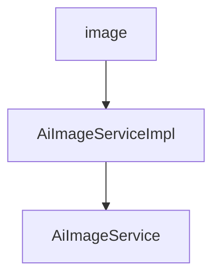

# 基础信息

|      |      |
|------|------|
| 编码语言 | .java |
| 代码路径 | yudao-module-ai/yudao-module-ai-biz/src/main/java/cn/iocoder/yudao/module/ai/service/image |
| 包名 | cn.iocoder.yudao.module.ai.service.image |
| 概述说明 | AiImageServiceImpl类实现了AiImageService接口，提供图像管理功能，包括分页查询、获取、绘制和删除图像。绘制图像时，系统通过异步任务调用不同AI平台API生成图像，并将结果上传至文件服务，更新数据库状态以确保数据实时性和一致性。特别支持Midjourney平台的图像生成、状态同步和回调处理，实时更新任务状态和图像结果，确保用户及时获取最新进展。整体上，AiImageServiceImpl类通过集成多种AI平台API和文件服务，提供高效可靠的图像管理解决方案。 |

# 说明

AiImageServiceImpl类实现了AiImageService接口，提供了全面的图像管理功能。这些功能包括分页查询、获取图像、绘制图像以及删除图像等操作。在绘制图像的过程中，系统通过异步任务调用不同AI平台的API来生成图像。生成的图像结果随后会被上传至文件服务，并更新数据库中的状态信息，以确保数据的实时性和一致性。此外，AiImageServiceImpl类还特别支持Midjourney平台的图像生成、状态同步和回调处理功能。通过这些功能，系统能够实时更新任务状态和图像结果，确保用户能够及时获取最新的图像生成进展和结果。整体上，AiImageServiceImpl类通过集成多种AI平台的API和文件服务，提供了一个高效、可靠的图像管理解决方案。

### 包内部结构视图

### 描述信息：
该Mermaid图展示了`image`文件夹中的`AiImageServiceImpl`类与`AiImageService`接口之间的调用关系。`AiImageServiceImpl`实现了`AiImageService`接口，表示服务层的具体实现依赖于接口定义。

# 文件列表 File List

| 名称   | 类型  | 说明 |
|-------|------|-------------|
| [AiImageService.java](AiImageService.md) | file | 请提供需要总结的具体内容，以便我为您生成一个不超过100字的概要说明。 |
| [AiImageServiceImpl.java](AiImageServiceImpl.md) | file | AiImageServiceImpl类实现AiImageService接口，提供图像管理功能，包括分页查询、获取、绘制和删除图像。绘制图像时，通过异步任务调用AI平台API生成图像，上传至文件服务并更新数据库状态。支持Midjourney平台的图像生成、状态同步和回调处理，确保任务状态和图像结果的实时更新。 |

