# 基础信息

|      |      |
|------|------|
| 编码语言 | .java |
| 代码路径 | yudao-module-ai/yudao-module-ai-biz/src/main/java/cn/iocoder/yudao/module/ai/service/knowledge/AiKnowledgeDocumentServiceImpl.java |
| 包名 | cn.iocoder.yudao.module.ai.service.knowledge |
| 依赖项 | ['cn.hutool.core.collection.CollUtil', 'cn.hutool.http.HttpUtil', 'cn.iocoder.yudao.framework.common.enums.CommonStatusEnum', 'cn.iocoder.yudao.framework.common.pojo.PageResult', 'cn.iocoder.yudao.framework.common.util.collection.CollectionUtils', 'cn.iocoder.yudao.framework.common.util.object.BeanUtils', 'cn.iocoder.yudao.module.ai.controller.admin.knowledge.vo.document.AiKnowledgeDocumentPageReqVO', 'cn.iocoder.yudao.module.ai.controller.admin.knowledge.vo.document.AiKnowledgeDocumentUpdateReqVO', 'cn.iocoder.yudao.module.ai.controller.admin.knowledge.vo.knowledge.AiKnowledgeDocumentCreateReqVO', 'cn.iocoder.yudao.module.ai.dal.dataobject.knowledge.AiKnowledgeDocumentDO', 'cn.iocoder.yudao.module.ai.dal.dataobject.knowledge.AiKnowledgeSegmentDO', 'cn.iocoder.yudao.module.ai.dal.mysql.knowledge.AiKnowledgeDocumentMapper', 'cn.iocoder.yudao.module.ai.dal.mysql.knowledge.AiKnowledgeSegmentMapper', 'cn.iocoder.yudao.module.ai.enums.knowledge.AiKnowledgeDocumentStatusEnum', 'jakarta.annotation.Resource', 'lombok.extern.slf4j.Slf4j', 'org.springframework.ai.document.Document', 'org.springframework.ai.reader.tika.TikaDocumentReader', 'org.springframework.ai.tokenizer.TokenCountEstimator', 'org.springframework.ai.transformer.splitter.TokenTextSplitter', 'org.springframework.ai.vectorstore.VectorStore', 'org.springframework.core.io.ByteArrayResource', 'org.springframework.stereotype.Service', 'org.springframework.transaction.annotation.Transactional', 'java.util.List', 'cn.iocoder.yudao.framework.common.exception.util.ServiceExceptionUtil.exception', 'cn.iocoder.yudao.module.ai.enums.ErrorCodeConstants.KNOWLEDGE_DOCUMENT_NOT_EXISTS'] |
| 概述说明 | AiKnowledgeDocumentServiceImpl类实现AiKnowledgeDocumentService接口，提供知识文档的创建、分页查询和更新功能。创建文档时下载并解析内容，计算token和字数后入库，分段并向量化存储。分页查询和更新通过documentMapper实现，下载文件使用HttpUtil工具类，异常时记录日志并抛出运行时异常。 |

# 说明

AiKnowledgeDocumentServiceImpl类实现了AiKnowledgeDocumentService接口，主要负责知识文档的创建、分页查询和更新功能。在创建文档时，首先通过HttpUtil工具类下载文档内容，并进行解析。解析完成后，系统会计算文档的token数量和字数，并将这些信息存储到数据库中。接着，文档内容会被文本分段器进行分段处理，分段后的内容同样会入库，并进行向量化存储，以便后续的检索和分析。分页查询功能通过documentMapper实现，允许用户按需获取文档列表。更新功能也通过documentMapper实现，确保文档内容能够及时更新。如果在下载文件过程中出现异常，系统会记录日志并抛出运行时异常，以便开发人员及时处理问题。整体上，该类提供了完整的知识文档管理功能，涵盖了从文档创建到查询和更新的全流程。

# 类列表 Class Summary

| 名称   | 类型  | 说明 |
|-------|------|-------------|
| AiKnowledgeDocumentServiceImpl | class | AiKnowledgeDocumentServiceImpl类实现了AiKnowledgeDocumentService接口，提供知识文档的创建、分页查询和更新功能。创建文档时，首先下载并解析文档内容，计算token和字数后入库；接着使用文本分段器对文档进行分段，分段内容入库并进行向量化存储。分页查询和更新功能分别通过documentMapper实现。下载文件时使用HttpUtil工具类，异常时记录日志并抛出运行时异常。 |

## 类 AiKnowledgeDocumentServiceImpl

|      |      |
|------|------|
| 访问范围 | @Service;@Slf4j;public |
| 类型 | class |
| 名称 | AiKnowledgeDocumentServiceImpl |
| 说明 | AiKnowledgeDocumentServiceImpl类实现了AiKnowledgeDocumentService接口，提供知识文档的创建、分页查询和更新功能。创建文档时，首先下载并解析文档内容，计算token和字数后入库；接着使用文本分段器对文档进行分段，分段内容入库并进行向量化存储。分页查询和更新功能分别通过documentMapper实现。下载文件时使用HttpUtil工具类，异常时记录日志并抛出运行时异常。 |

### UML类图

```mermaid
classDiagram
    class AiKnowledgeDocumentServiceImpl {
        -AiKnowledgeDocumentMapper documentMapper
        -AiKnowledgeSegmentMapper segmentMapper
        -TokenCountEstimator tokenCountEstimator
        -AiKnowledgeService knowledgeService
        +createKnowledgeDocument(AiKnowledgeDocumentCreateReqVO createReqVO) Long
        +getKnowledgeDocumentPage(AiKnowledgeDocumentPageReqVO pageReqVO) PageResult~AiKnowledgeDocumentDO~
        +updateKnowledgeDocument(AiKnowledgeDocumentUpdateReqVO reqVO) void
        -validateKnowledgeDocumentExists(Long id) AiKnowledgeDocumentDO
        -downloadFile(String url) Resource
    }

    class AiKnowledgeDocumentService {
        <<interface>>
        +createKnowledgeDocument(AiKnowledgeDocumentCreateReqVO createReqVO) Long
        +getKnowledgeDocumentPage(AiKnowledgeDocumentPageReqVO pageReqVO) PageResult~AiKnowledgeDocumentDO~
        +updateKnowledgeDocument(AiKnowledgeDocumentUpdateReqVO reqVO) void
    }

    class AiKnowledgeDocumentMapper {
        +insert(AiKnowledgeDocumentDO documentDO) void
        +selectPage(AiKnowledgeDocumentPageReqVO pageReqVO) PageResult~AiKnowledgeDocumentDO~
        +updateById(AiKnowledgeDocumentDO document) void
        +selectById(Long id) AiKnowledgeDocumentDO
    }

    class AiKnowledgeSegmentMapper {
        +insertBatch(List~AiKnowledgeSegmentDO~ segmentDOList) void
    }

    class TokenCountEstimator {
        +estimate(String content) int
    }

    class AiKnowledgeService {
        +getVectorStoreById(Long knowledgeId) VectorStore
    }

    class VectorStore {
        +add(List~Document~ segments) void
    }

    class TikaDocumentReader {
        +get() List~Document~
    }

    class Document {
        +getContent() String
        +getMetadata() Map~String, Object~
    }

    class AiKnowledgeDocumentDO {
        +setTokens(int tokens) AiKnowledgeDocumentDO
        +setWordCount(int wordCount) AiKnowledgeDocumentDO
        +setStatus(int status) AiKnowledgeDocumentDO
        +setSliceStatus(int sliceStatus) AiKnowledgeDocumentDO
        +getId() Long
    }

    class AiKnowledgeSegmentDO {
        +setContent(String content) AiKnowledgeSegmentDO
        +setDocumentId(Long documentId) AiKnowledgeSegmentDO
        +setKnowledgeId(Long knowledgeId) AiKnowledgeDocumentDO
        +setVectorId(String vectorId) AiKnowledgeDocumentDO
        +setTokens(int tokens) AiKnowledgeDocumentDO
        +setWordCount(int wordCount) AiKnowledgeDocumentDO
        +setStatus(int status) AiKnowledgeDocumentDO
    }

    class TokenTextSplitter {
        +apply(List~Document~ documents) List~Document~
    }

    AiKnowledgeDocumentServiceImpl ..|> AiKnowledgeDocumentService : implements
    AiKnowledgeDocumentServiceImpl --> AiKnowledgeDocumentMapper : uses
    AiKnowledgeDocumentServiceImpl --> AiKnowledgeSegmentMapper : uses
    AiKnowledgeDocumentServiceImpl --> TokenCountEstimator : uses
    AiKnowledgeDocumentServiceImpl --> AiKnowledgeService : uses
    AiKnowledgeService --> VectorStore : uses
    AiKnowledgeDocumentServiceImpl --> TikaDocumentReader : uses
    AiKnowledgeDocumentServiceImpl --> Document : uses
    AiKnowledgeDocumentServiceImpl --> TokenTextSplitter : uses
    AiKnowledgeDocumentServiceImpl --> AiKnowledgeDocumentDO : uses
    AiKnowledgeDocumentServiceImpl --> AiKnowledgeSegmentDO : uses
```

### 描述信息：
该UML类图展示了`AiKnowledgeDocumentServiceImpl`类与其依赖的接口和类之间的关系。`AiKnowledgeDocumentServiceImpl`实现了`AiKnowledgeDocumentService`接口，并依赖于多个Mapper类、服务类和工具类来完成文档的创建、分页查询和更新操作。图中还展示了类之间的依赖关系，如`AiKnowledgeDocumentServiceImpl`使用`AiKnowledgeDocumentMapper`和`AiKnowledgeSegmentMapper`进行数据持久化操作。

### 内部方法调用关系图

```mermaid
graph TD
    AiKnowledgeDocumentServiceImpl --> AiKnowledgeDocumentMapper
    AiKnowledgeDocumentServiceImpl --> AiKnowledgeSegmentMapper
    AiKnowledgeDocumentServiceImpl --> TokenCountEstimator
    AiKnowledgeDocumentServiceImpl --> AiKnowledgeService
    AiKnowledgeDocumentServiceImpl --> TikaDocumentReader
    AiKnowledgeDocumentServiceImpl --> TokenTextSplitter
    AiKnowledgeDocumentServiceImpl --> VectorStore
    AiKnowledgeDocumentServiceImpl --> HttpUtil
    AiKnowledgeDocumentServiceImpl --> BeanUtils
    AiKnowledgeDocumentServiceImpl --> CollectionUtils
    AiKnowledgeDocumentServiceImpl --> CommonStatusEnum
    AiKnowledgeDocumentServiceImpl --> AiKnowledgeDocumentStatusEnum
    AiKnowledgeDocumentServiceImpl --> AiKnowledgeDocumentDO
    AiKnowledgeDocumentServiceImpl --> AiKnowledgeSegmentDO
    AiKnowledgeDocumentServiceImpl --> Document
    AiKnowledgeDocumentServiceImpl --> ByteArrayResource
    AiKnowledgeDocumentServiceImpl --> RuntimeException
    AiKnowledgeDocumentServiceImpl --> log
    AiKnowledgeDocumentServiceImpl --> validateKnowledgeDocumentExists
    AiKnowledgeDocumentServiceImpl --> downloadFile
    AiKnowledgeDocumentServiceImpl --> createKnowledgeDocument
    AiKnowledgeDocumentServiceImpl --> getKnowledgeDocumentPage
    AiKnowledgeDocumentServiceImpl --> updateKnowledgeDocument
```

### 描述信息：
该图展示了`AiKnowledgeDocumentServiceImpl`类中各个方法之间的调用关系。`createKnowledgeDocument`方法调用了多个外部服务和方法，如`AiKnowledgeService`、`TokenCountEstimator`、`TikaDocumentReader`等，用于处理文档的创建、分段和向量化存储。`getKnowledgeDocumentPage`和`updateKnowledgeDocument`方法则分别用于分页查询和更新文档信息。

### 字段列表 Field List

| 名称  | 类型  | 说明 |
|-------|-------|------|
| knowledgeService | AiKnowledgeService | 在代码中，通过@Resource注解注入了一个名为knowledgeService的AiKnowledgeService实例，用于访问和操作AI知识服务。 |
| segmentMapper | AiKnowledgeSegmentMapper | 在代码中，通过@Resource注解注入了一个名为segmentMapper的AiKnowledgeSegmentMapper对象，用于数据访问和操作。 |
| documentMapper | AiKnowledgeDocumentMapper | 在代码中，使用@Resource注解将AiKnowledgeDocumentMapper类型的documentMapper对象注入到当前类中，以便后续操作和调用。 |
| tokenCountEstimator | TokenCountEstimator | 该代码片段展示了一个私有成员变量`tokenCountEstimator`，其类型为`TokenCountEstimator`，并通过`@Resource`注解进行依赖注入。 |

### 方法列表 Method List

| 名称  | 类型  | 说明 |
|-------|-------|------|
| validateKnowledgeDocumentExists | AiKnowledgeDocumentDO | 该方法通过ID查询知识文档，若文档不存在则抛出异常，存在则返回文档对象。 |
| updateKnowledgeDocument | void | 该方法用于更新知识文档，首先校验文档是否存在，然后将请求对象转换为文档实体并更新数据库中的记录。 |
| downloadFile | org.springframework.core.io.Resource | 该方法通过HTTP下载指定URL的文件内容，将其转换为字节数组并封装为Resource对象返回。若下载失败，记录错误日志并抛出运行时异常。 |
| getKnowledgeDocumentPage | PageResult<AiKnowledgeDocumentDO> | 该方法通过传入的请求参数`pageReqVO`调用`documentMapper.selectPage`方法，返回分页查询结果`PageResult<AiKnowledgeDocumentDO>`，用于获取知识文档的分页数据。 |
| createKnowledgeDocument | Long | 该方法用于创建知识文档，首先校验并获取向量存储实例，下载文档并记录入库。接着构造文本分段器，对文档进行分段并将分段内容入库。最后对分段内容进行向量化并存储到向量库中，返回文档ID。 |

