# 基础信息

|      |      |
|------|------|
| 编码语言 | .java |
| 代码路径 | yudao-module-ai/yudao-module-ai-biz/src/main/java/cn/iocoder/yudao/module/ai/service/knowledge/AiKnowledgeSegmentServiceImpl.java |
| 包名 | cn.iocoder.yudao.module.ai.service.knowledge |
| 依赖项 | ['cn.hutool.core.collection.CollUtil', 'cn.hutool.core.collection.ListUtil', 'cn.iocoder.yudao.framework.common.enums.CommonStatusEnum', 'cn.iocoder.yudao.framework.common.pojo.PageResult', 'cn.iocoder.yudao.framework.common.util.object.BeanUtils', 'cn.iocoder.yudao.module.ai.controller.admin.knowledge.vo.segment.AiKnowledgeSegmentPageReqVO', 'cn.iocoder.yudao.module.ai.controller.admin.knowledge.vo.segment.AiKnowledgeSegmentSearchReqVO', 'cn.iocoder.yudao.module.ai.controller.admin.knowledge.vo.segment.AiKnowledgeSegmentUpdateReqVO', 'cn.iocoder.yudao.module.ai.controller.admin.knowledge.vo.segment.AiKnowledgeSegmentUpdateStatusReqVO', 'cn.iocoder.yudao.module.ai.dal.dataobject.knowledge.AiKnowledgeDO', 'cn.iocoder.yudao.module.ai.dal.dataobject.knowledge.AiKnowledgeSegmentDO', 'cn.iocoder.yudao.module.ai.dal.dataobject.model.AiChatModelDO', 'cn.iocoder.yudao.module.ai.dal.mysql.knowledge.AiKnowledgeSegmentMapper', 'cn.iocoder.yudao.module.ai.service.model.AiApiKeyService', 'cn.iocoder.yudao.module.ai.service.model.AiChatModelService', 'jakarta.annotation.Resource', 'lombok.extern.slf4j.Slf4j', 'org.springframework.ai.document.Document', 'org.springframework.ai.vectorstore.SearchRequest', 'org.springframework.ai.vectorstore.VectorStore', 'org.springframework.ai.vectorstore.filter.FilterExpressionBuilder', 'org.springframework.stereotype.Service', 'java.util.List', 'java.util.Objects', 'cn.iocoder.yudao.framework.common.exception.util.ServiceExceptionUtil.exception', 'cn.iocoder.yudao.module.ai.enums.ErrorCodeConstants.KNOWLEDGE_SEGMENT_NOT_EXISTS'] |
| 概述说明 | AiKnowledgeSegmentServiceImpl类实现AiKnowledgeSegmentService接口，提供知识段落的增删改查功能。依赖AiKnowledgeSegmentMapper、AiKnowledgeService、AiChatModelService和AiApiKeyService，实现段落页面查询、更新、状态修改及相似性搜索。更新涉及向量存储删除与重新向量化，状态修改调整向量存储，相似性搜索通过向量检索和段落召回返回相关段落信息。 |

# 说明

AiKnowledgeSegmentServiceImpl类实现了AiKnowledgeSegmentService接口，提供了对知识段落的增删改查功能。该类通过调用多个依赖服务来完成其功能，包括AiKnowledgeSegmentMapper、AiKnowledgeService、AiChatModelService和AiApiKeyService。这些服务共同支持了段落的页面查询、更新、状态修改以及相似性搜索等操作。

在更新操作中，涉及到了向量存储的删除与重新向量化，确保段落内容的更新能够反映在向量存储中。状态修改操作则根据段落的启用或禁用状态来调整向量存储，以保持数据的一致性和有效性。

相似性搜索功能通过向量检索和段落召回实现，确保能够返回与查询内容相关的段落信息。这一功能依赖于向量存储中的段落向量，通过计算向量之间的相似度来找到最相关的段落。

总体而言，AiKnowledgeSegmentServiceImpl类通过整合多个服务，提供了全面的知识段落管理功能，包括段落的增删改查、状态管理以及相似性搜索，确保了知识段落的高效管理和检索。

# 类列表 Class Summary

| 名称   | 类型  | 说明 |
|-------|------|-------------|
| AiKnowledgeSegmentServiceImpl | class | AiKnowledgeSegmentServiceImpl类实现了AiKnowledgeSegmentService接口，提供了知识段落的增删改查功能。通过调用AiKnowledgeSegmentMapper、AiKnowledgeService、AiChatModelService和AiApiKeyService等依赖服务，实现了段落的页面查询、更新、状态修改及相似性搜索。更新操作涉及向量存储的删除与重新向量化，状态修改则根据启用或禁用状态调整向量存储。相似性搜索通过向量检索和段落召回实现，确保返回相关段落信息。 |

## 类 AiKnowledgeSegmentServiceImpl

|      |      |
|------|------|
| 访问范围 | @Service;@Slf4j;public |
| 类型 | class |
| 名称 | AiKnowledgeSegmentServiceImpl |
| 说明 | AiKnowledgeSegmentServiceImpl类实现了AiKnowledgeSegmentService接口，提供了知识段落的增删改查功能。通过调用AiKnowledgeSegmentMapper、AiKnowledgeService、AiChatModelService和AiApiKeyService等依赖服务，实现了段落的页面查询、更新、状态修改及相似性搜索。更新操作涉及向量存储的删除与重新向量化，状态修改则根据启用或禁用状态调整向量存储。相似性搜索通过向量检索和段落召回实现，确保返回相关段落信息。 |

### UML类图

```mermaid
classDiagram
    class AiKnowledgeSegmentServiceImpl {
        +getKnowledgeSegmentPage(AiKnowledgeSegmentPageReqVO pageReqVO) PageResult~AiKnowledgeSegmentDO~
        +updateKnowledgeSegment(AiKnowledgeSegmentUpdateReqVO reqVO) void
        +updateKnowledgeSegmentStatus(AiKnowledgeSegmentUpdateStatusReqVO reqVO) void
        +similaritySearch(AiKnowledgeSegmentSearchReqVO reqVO) List~AiKnowledgeSegmentDO~
        -validateKnowledgeSegmentExists(Long id) AiKnowledgeSegmentDO
    }

    class AiKnowledgeSegmentService {
        +getKnowledgeSegmentPage(AiKnowledgeSegmentPageReqVO pageReqVO) PageResult~AiKnowledgeSegmentDO~
        +updateKnowledgeSegment(AiKnowledgeSegmentUpdateReqVO reqVO) void
        +updateKnowledgeSegmentStatus(AiKnowledgeSegmentUpdateStatusReqVO reqVO) void
        +similaritySearch(AiKnowledgeSegmentSearchReqVO reqVO) List~AiKnowledgeSegmentDO~
    }

    class AiKnowledgeSegmentMapper {
        +selectPage(AiKnowledgeSegmentPageReqVO pageReqVO) PageResult~AiKnowledgeSegmentDO~
        +updateById(AiKnowledgeSegmentDO knowledgeSegment) void
        +selectListByVectorIds(List~String~ vectorIds) List~AiKnowledgeSegmentDO~
        +selectById(Long id) AiKnowledgeSegmentDO
    }

    class AiKnowledgeService {
        +getVectorStoreById(Long knowledgeId) VectorStore
        +validateKnowledgeExists(Long knowledgeId) AiKnowledgeDO
    }

    class AiChatModelService {
        +validateChatModel(Long modelId) AiChatModelDO
    }

    class AiApiKeyService {
        +getOrCreateVectorStore(String keyId) VectorStore
    }

    class VectorStore {
        +delete(List~String~ vectorIds) void
        +add(List~Document~ documents) void
        +similaritySearch(SearchRequest searchRequest) List~Document~
    }

    class Document {
        +String id
        +String content
        +Map~String, Object~ metadata
    }

    class AiKnowledgeSegmentDO {
        +Long id
        +String content
        +String vectorId
        +Long knowledgeId
    }

    class AiKnowledgeDO {
        +Long id
        +Long modelId
        +Integer topK
        +Double similarityThreshold
    }

    class AiChatModelDO {
        +Long id
        +String keyId
    }

    class AiKnowledgeSegmentPageReqVO {
        +Long knowledgeId
        +Integer pageNo
        +Integer pageSize
    }

    class AiKnowledgeSegmentUpdateReqVO {
        +Long id
        +String content
    }

    class AiKnowledgeSegmentUpdateStatusReqVO {
        +Long id
        +Integer status
    }

    class AiKnowledgeSegmentSearchReqVO {
        +Long knowledgeId
        +String content
    }

    class PageResult~T~ {
        +List~T~ data
        +Integer total
    }

    class CommonStatusEnum {
        +Integer ENABLE
        +Integer DISABLE
    }

    class FilterExpressionBuilder {
        +eq(String field, Object value) FilterExpression
    }

    class SearchRequest {
        +String query
        +Integer topK
        +Double similarityThreshold
        +FilterExpression filterExpression
    }

    AiKnowledgeSegmentServiceImpl <|.. AiKnowledgeSegmentService : implements
    AiKnowledgeSegmentServiceImpl --> AiKnowledgeSegmentMapper : uses
    AiKnowledgeSegmentServiceImpl --> AiKnowledgeService : uses
    AiKnowledgeSegmentServiceImpl --> AiChatModelService : uses
    AiKnowledgeSegmentServiceImpl --> AiApiKeyService : uses
    AiKnowledgeService --> VectorStore : uses
    AiApiKeyService --> VectorStore : uses
    VectorStore --> Document : uses
    AiKnowledgeSegmentDO <-- AiKnowledgeSegmentMapper : returns
    AiKnowledgeDO <-- AiKnowledgeService : returns
    AiChatModelDO <-- AiChatModelService : returns
    Document <-- VectorStore : returns
    PageResult~AiKnowledgeSegmentDO~ <-- AiKnowledgeSegmentMapper : returns
    List~AiKnowledgeSegmentDO~ <-- AiKnowledgeSegmentMapper : returns
    List~Document~ <-- VectorStore : returns
```

### 描述信息：
该UML类图展示了`AiKnowledgeSegmentServiceImpl`类与其依赖的其他类之间的关系。`AiKnowledgeSegmentServiceImpl`实现了`AiKnowledgeSegmentService`接口，并依赖于`AiKnowledgeSegmentMapper`、`AiKnowledgeService`、`AiChatModelService`和`AiApiKeyService`等类。`VectorStore`类用于管理文档的向量存储，`Document`类表示文档对象。整个类图展示了服务层与数据访问层之间的交互关系。

### 内部方法调用关系图

### 描述信息：
该图展示了`AiKnowledgeSegmentServiceImpl`类中各个方法之间的调用关系。`AiKnowledgeSegmentServiceImpl`依赖于`segmentMapper`、`knowledgeService`、`chatModelService`和`apiKeyService`来执行不同的操作。主要方法包括`getKnowledgeSegmentPage`、`updateKnowledgeSegment`、`updateKnowledgeSegmentStatus`和`similaritySearch`，这些方法通过调用其他服务和方法来完成知识段落的查询、更新、状态管理和相似性搜索等功能。

### 字段列表 Field List

| 名称  | 类型  | 说明 |
|-------|-------|------|
| apiKeyService | AiApiKeyService | 在代码中，通过@Resource注解将AiApiKeyService注入到当前类中，以便使用其功能。 |
| segmentMapper | AiKnowledgeSegmentMapper | 在代码中，使用@Resource注解注入了一个名为segmentMapper的AiKnowledgeSegmentMapper对象，用于数据访问操作。 |
| chatModelService | AiChatModelService | 在代码中，通过@Resource注解将AiChatModelService注入到当前类中，以便使用其功能。 |
| knowledgeService | AiKnowledgeService | 在代码中，通过@Resource注解注入了一个名为knowledgeService的AiKnowledgeService实例，用于访问和操作AI知识相关服务。 |

### 方法列表 Method List

| 名称  | 类型  | 说明 |
|-------|-------|------|
| getKnowledgeSegmentPage | PageResult<AiKnowledgeSegmentDO> | 该方法 `getKnowledgeSegmentPage` 接收一个 `AiKnowledgeSegmentPageReqVO` 类型的请求参数 `pageReqVO`，并调用 `segmentMapper.selectPage` 方法返回一个 `PageResult<AiKnowledgeSegmentDO>` 类型的分页结果。 |
| validateKnowledgeSegmentExists | AiKnowledgeSegmentDO | 该方法通过ID查询知识片段，若不存在则抛出异常，存在则返回该知识片段对象。 |
| updateKnowledgeSegment | void | 该方法用于更新知识段落。首先校验段落是否存在，接着获取知识库向量实例并删除原向量，然后重新向量化新内容并更新段落内容。 |
| similaritySearch | List<AiKnowledgeSegmentDO> | 该方法通过校验知识库和模型存在性，获取向量存储实例，进行向量检索并根据相似度阈值和知识ID过滤文档，最后根据检索结果召回相关段落。 |
| updateKnowledgeSegmentStatus | void | 该方法用于更新知识段落状态。首先校验段落是否存在，获取知识库向量实例。若状态为启用，则重新向量化并更新向量ID；若状态为禁用，则删除向量并清空向量ID。最后更新段落状态。 |

