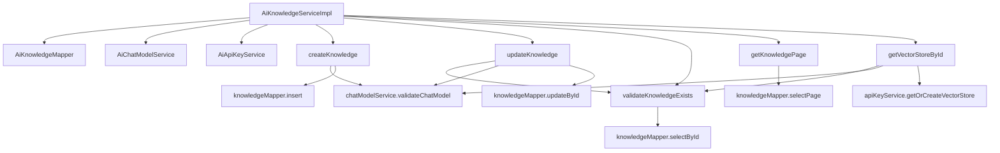

# 基础信息

|      |      |
|------|------|
| 编码语言 | .java |
| 代码路径 | yudao-module-ai/yudao-module-ai-biz/src/main/java/cn/iocoder/yudao/module/ai/service/knowledge/AiKnowledgeServiceImpl.java |
| 包名 | cn.iocoder.yudao.module.ai.service.knowledge |
| 依赖项 | ['cn.hutool.core.util.ObjUtil', 'cn.iocoder.yudao.framework.common.enums.CommonStatusEnum', 'cn.iocoder.yudao.framework.common.pojo.PageResult', 'cn.iocoder.yudao.framework.common.util.object.BeanUtils', 'cn.iocoder.yudao.module.ai.controller.admin.knowledge.vo.knowledge.AiKnowledgeCreateReqVO', 'cn.iocoder.yudao.module.ai.controller.admin.knowledge.vo.knowledge.AiKnowledgePageReqVO', 'cn.iocoder.yudao.module.ai.controller.admin.knowledge.vo.knowledge.AiKnowledgeUpdateReqVO', 'cn.iocoder.yudao.module.ai.dal.dataobject.knowledge.AiKnowledgeDO', 'cn.iocoder.yudao.module.ai.dal.dataobject.model.AiChatModelDO', 'cn.iocoder.yudao.module.ai.dal.mysql.knowledge.AiKnowledgeMapper', 'cn.iocoder.yudao.module.ai.service.model.AiApiKeyService', 'cn.iocoder.yudao.module.ai.service.model.AiChatModelService', 'jakarta.annotation.Resource', 'lombok.extern.slf4j.Slf4j', 'org.springframework.ai.vectorstore.VectorStore', 'org.springframework.stereotype.Service', 'cn.iocoder.yudao.framework.common.exception.util.ServiceExceptionUtil.exception', 'cn.iocoder.yudao.module.ai.enums.ErrorCodeConstants.KNOWLEDGE_NOT_EXISTS'] |
| 概述说明 | AiKnowledgeServiceImpl类实现AiKnowledgeService接口，提供知识库的创建、更新、校验和分页查询功能。依赖AiKnowledgeMapper、AiChatModelService和AiApiKeyService。主要方法包括创建和更新知识库时校验模型配置及数据操作，校验知识库存在性，分页查询知识库，以及根据ID获取或创建VectorStore对象。 |

# 说明

AiKnowledgeServiceImpl类实现了AiKnowledgeService接口，提供了知识库的创建、更新、校验和分页查询功能。该类通过依赖注入的方式使用了AiKnowledgeMapper、AiChatModelService和AiApiKeyService等组件。其主要功能包括：在创建知识库时，首先会校验模型配置，确保配置正确后插入相关数据；在更新知识库时，会先校验知识库的存在性以及模型配置，确认无误后再更新数据；此外，该类还提供了校验知识库是否存在的功能，确保知识库的唯一性和有效性；分页查询功能则用于按需获取知识库的列表，支持分页展示；最后，该类还提供了根据ID获取或创建VectorStore对象的功能，用于处理与向量存储相关的操作。通过这些方法，AiKnowledgeServiceImpl类实现了对知识库的全面管理，确保了知识库的创建、更新、查询等操作的准确性和高效性。

# 类列表 Class Summary

| 名称   | 类型  | 说明 |
|-------|------|-------------|
| AiKnowledgeServiceImpl | class | AiKnowledgeServiceImpl类实现了AiKnowledgeService接口，提供知识库的创建、更新、校验和分页查询功能。通过依赖注入使用AiKnowledgeMapper、AiChatModelService和AiApiKeyService。主要方法包括创建知识库时校验模型配置并插入数据，更新知识库时校验存在性和模型配置并更新数据，校验知识库是否存在，分页查询知识库，以及根据ID获取或创建VectorStore对象。 |

## 类 AiKnowledgeServiceImpl

|      |      |
|------|------|
| 访问范围 | @Service;@Slf4j;public |
| 类型 | class |
| 名称 | AiKnowledgeServiceImpl |
| 说明 | AiKnowledgeServiceImpl类实现了AiKnowledgeService接口，提供知识库的创建、更新、校验和分页查询功能。通过依赖注入使用AiKnowledgeMapper、AiChatModelService和AiApiKeyService。主要方法包括创建知识库时校验模型配置并插入数据，更新知识库时校验存在性和模型配置并更新数据，校验知识库是否存在，分页查询知识库，以及根据ID获取或创建VectorStore对象。 |

### UML类图

```mermaid
classDiagram
    class AiKnowledgeServiceImpl {
        -AiKnowledgeMapper knowledgeMapper
        -AiChatModelService chatModelService
        -AiApiKeyService apiKeyService
        +createKnowledge(AiKnowledgeCreateReqVO createReqVO, Long userId) Long
        +updateKnowledge(AiKnowledgeUpdateReqVO updateReqVO, Long userId) void
        +validateKnowledgeExists(Long id) AiKnowledgeDO
        +getKnowledgePage(Long userId, AiKnowledgePageReqVO pageReqVO) PageResult~AiKnowledgeDO~
        +getVectorStoreById(Long id) VectorStore
    }

    class AiKnowledgeService {
        <<interface>>
        +createKnowledge(AiKnowledgeCreateReqVO createReqVO, Long userId) Long
        +updateKnowledge(AiKnowledgeUpdateReqVO updateReqVO, Long userId) void
        +validateKnowledgeExists(Long id) AiKnowledgeDO
        +getKnowledgePage(Long userId, AiKnowledgePageReqVO pageReqVO) PageResult~AiKnowledgeDO~
        +getVectorStoreById(Long id) VectorStore
    }

    class AiKnowledgeMapper {
        +insert(AiKnowledgeDO knowledgeBase) void
        +updateById(AiKnowledgeDO updateDO) void
        +selectById(Long id) AiKnowledgeDO
        +selectPage(Long userId, AiKnowledgePageReqVO pageReqVO) PageResult~AiKnowledgeDO~
    }

    class AiChatModelService {
        +validateChatModel(Long modelId) AiChatModelDO
    }

    class AiApiKeyService {
        +getOrCreateVectorStore(Long keyId) VectorStore
    }

    class AiKnowledgeDO {
        +Long id
        +String model
        +Long userId
        +Integer status
    }

    class AiChatModelDO {
        +Long modelId
        +String model
        +Long keyId
    }

    class VectorStore {
        +Long id
        +String name
    }

    class AiKnowledgeCreateReqVO {
        +Long modelId
    }

    class AiKnowledgeUpdateReqVO {
        +Long id
        +Long modelId
    }

    class AiKnowledgePageReqVO {
        +Long userId
    }

    class PageResult~T~ {
        +List~T~ items
        +Long total
    }

    AiKnowledgeServiceImpl ..|> AiKnowledgeService : implements
    AiKnowledgeServiceImpl --> AiKnowledgeMapper : depends
    AiKnowledgeServiceImpl --> AiChatModelService : depends
    AiKnowledgeServiceImpl --> AiApiKeyService : depends
    AiKnowledgeMapper --> AiKnowledgeDO : uses
    AiChatModelService --> AiChatModelDO : uses
    AiApiKeyService --> VectorStore : uses
    AiKnowledgeCreateReqVO --> AiKnowledgeDO : creates
    AiKnowledgeUpdateReqVO --> AiKnowledgeDO : updates
    AiKnowledgePageReqVO --> AiKnowledgeDO : queries
    PageResult~AiKnowledgeDO~ --> AiKnowledgeDO : contains
```

### 描述信息：
该UML类图展示了`AiKnowledgeServiceImpl`类及其相关依赖和接口实现关系。`AiKnowledgeServiceImpl`实现了`AiKnowledgeService`接口，并依赖于`AiKnowledgeMapper`、`AiChatModelService`和`AiApiKeyService`。类图中还包含了数据对象类如`AiKnowledgeDO`、`AiChatModelDO`和`VectorStore`，以及请求对象类如`AiKnowledgeCreateReqVO`和`AiKnowledgeUpdateReqVO`。

### 内部方法调用关系图

### 描述信息：
该图展示了`AiKnowledgeServiceImpl`类中各个方法之间的调用关系。`AiKnowledgeServiceImpl`依赖于`AiKnowledgeMapper`、`AiChatModelService`和`AiApiKeyService`来执行数据库操作和模型验证。主要方法如`createKnowledge`、`updateKnowledge`、`validateKnowledgeExists`等通过调用这些服务来完成知识库的创建、更新和验证。

### 字段列表 Field List

| 名称  | 类型  | 说明 |
|-------|-------|------|
| apiKeyService | AiApiKeyService | 在代码中，通过@Resource注解将AiApiKeyService注入到当前类中，以便使用其提供的功能和服务。 |
| chatModelService | AiChatModelService | 在代码中，通过@Resource注解将AiChatModelService注入到当前类中，以便使用其提供的功能。 |
| knowledgeMapper | AiKnowledgeMapper | 在代码中，通过@Resource注解将AiKnowledgeMapper类型的knowledgeMapper对象注入到当前类中，以便后续使用该对象进行数据库操作或数据访问。 |

### 方法列表 Method List

| 名称  | 类型  | 说明 |
|-------|-------|------|
| getKnowledgePage | PageResult<AiKnowledgeDO> | 该方法用于获取用户的知识库分页数据，接收用户ID和分页请求参数，调用`knowledgeMapper.selectPage`方法并返回分页结果。 |
| createKnowledge | Long | 该方法用于创建知识库，首先校验模型配置，然后插入知识库数据，设置模型、用户ID和状态，最后返回知识库ID。 |
| validateKnowledgeExists | AiKnowledgeDO | 该方法用于验证指定ID的知识是否存在。首先通过ID查询知识库，若查询结果为空，则抛出知识不存在的异常；否则返回查询到的知识对象。 |
| getVectorStoreById | VectorStore | 该方法通过ID获取VectorStore对象，首先验证知识库是否存在，然后验证聊天模型，最后根据模型密钥ID创建或获取VectorStore对象。 |
| updateKnowledge | void | 该方法用于更新知识库信息。首先校验知识库是否存在及用户权限，然后校验模型配置。最后将请求数据转换为知识库对象并更新模型信息，最终保存更新后的知识库数据。 |

