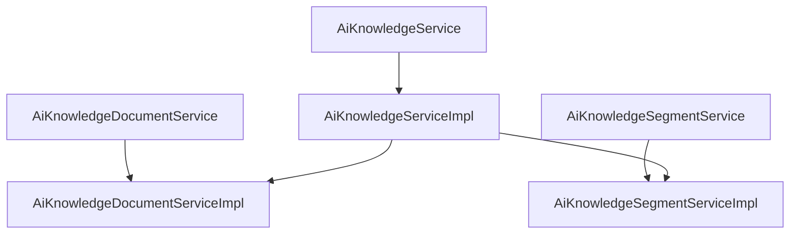

# 基础信息

|      |      |
|------|------|
| 编码语言 | .java |
| 代码路径 | yudao-module-ai/yudao-module-ai-biz/src/main/java/cn/iocoder/yudao/module/ai/service/knowledge |
| 包名 | cn.iocoder.yudao.module.ai.service.knowledge |
| 概述说明 | AiKnowledgeDocumentServiceImpl类实现了AiKnowledgeDocumentService接口，负责知识文档的创建、分页查询和更新功能。创建文档时，通过HttpUtil下载并解析文档内容，计算token数量和字数后存储到数据库，分段处理内容并进行向量化存储。分页查询和更新功能通过documentMapper实现，异常时记录日志并抛出运行时异常。AiKnowledgeServiceImpl类实现了AiKnowledgeService接口，提供知识库的创建、更新、校验和分页查询功能，依赖AiKnowledgeMapper等组件，确保知识库的唯一性和有效性，支持分页展示和VectorStore对象处理。AiKnowledgeSegmentServiceImpl类实现了AiKnowledgeSegmentService接口，提供知识段落的增删改查功能，依赖多个服务支持段落管理、状态修改和相似性搜索，确保段落内容更新和向量存储一致性。 |

# 说明

AiKnowledgeDocumentServiceImpl类实现了AiKnowledgeDocumentService接口，主要负责知识文档的创建、分页查询和更新功能。在创建文档时，系统首先通过HttpUtil工具类下载文档内容并进行解析，随后计算文档的token数量和字数，并将这些信息存储到数据库中。文档内容经过文本分段器处理后分段入库，并进行向量化存储，以便后续检索和分析。分页查询功能通过documentMapper实现，允许用户按需获取文档列表。更新功能同样通过documentMapper实现，确保文档内容能够及时更新。如果在下载文件过程中出现异常，系统会记录日志并抛出运行时异常，以便开发人员及时处理问题。整体上，该类提供了完整的知识文档管理功能，涵盖了从文档创建到查询和更新的全流程。

AiKnowledgeServiceImpl类实现了AiKnowledgeService接口，提供了知识库的创建、更新、校验和分页查询功能。该类通过依赖注入的方式使用了AiKnowledgeMapper、AiChatModelService和AiApiKeyService等组件。其主要功能包括：在创建知识库时，首先校验模型配置，确保配置正确后插入相关数据；在更新知识库时，先校验知识库的存在性及模型配置，确认无误后再更新数据；此外，该类还提供了校验知识库是否存在的功能，确保知识库的唯一性和有效性；分页查询功能用于按需获取知识库列表，支持分页展示；最后，该类还提供了根据ID获取或创建VectorStore对象的功能，用于处理与向量存储相关的操作。通过这些方法，AiKnowledgeServiceImpl类实现了对知识库的全面管理，确保了知识库的创建、更新、查询等操作的准确性和高效性。

AiKnowledgeSegmentServiceImpl类实现了AiKnowledgeSegmentService接口，提供了对知识段落的增删改查功能。该类通过调用多个依赖服务来完成其功能，包括AiKnowledgeSegmentMapper、AiKnowledgeService、AiChatModelService和AiApiKeyService。这些服务共同支持段落的页面查询、更新、状态修改以及相似性搜索等操作。在更新操作中，涉及向量存储的删除与重新向量化，确保段落内容的更新能够反映在向量存储中。状态修改操作则根据段落的启用或禁用状态来调整向量存储，以保持数据的一致性和有效性。相似性搜索功能通过向量检索和段落召回实现，确保能够返回与查询内容相关的段落信息。这一功能依赖于向量存储中的段落向量，通过计算向量之间的相似度来找到最相关的段落。总体而言，AiKnowledgeSegmentServiceImpl类通过整合多个服务，提供了全面的知识段落管理功能，包括段落的增删改查、状态管理以及相似性搜索，确保了知识段落的高效管理和检索。

### 包内部结构视图

### 描述信息：
该图展示了`AiKnowledgeService`、`AiKnowledgeDocumentService`和`AiKnowledgeSegmentService`三个接口与其实现类之间的调用关系。`AiKnowledgeServiceImpl`依赖于`AiKnowledgeDocumentServiceImpl`和`AiKnowledgeSegmentServiceImpl`来实现其功能。

# 文件列表 File List

| 名称   | 类型  | 说明 |
|-------|------|-------------|
| [AiKnowledgeDocumentService.java](AiKnowledgeDocumentService.md) | file | 请提供需要总结的具体信息内容，以便我为您生成概要说明。 |
| [AiKnowledgeSegmentServiceImpl.java](AiKnowledgeSegmentServiceImpl.md) | file | AiKnowledgeSegmentServiceImpl类实现AiKnowledgeSegmentService接口，提供知识段落的增删改查功能。依赖AiKnowledgeSegmentMapper、AiKnowledgeService、AiChatModelService和AiApiKeyService，实现段落页面查询、更新、状态修改及相似性搜索。更新涉及向量存储删除与重新向量化，状态修改调整向量存储，相似性搜索通过向量检索和段落召回返回相关段落信息。 |
| [AiKnowledgeServiceImpl.java](AiKnowledgeServiceImpl.md) | file | AiKnowledgeServiceImpl类实现AiKnowledgeService接口，提供知识库的创建、更新、校验和分页查询功能。依赖AiKnowledgeMapper、AiChatModelService和AiApiKeyService。主要方法包括创建和更新知识库时校验模型配置及数据操作，校验知识库存在性，分页查询知识库，以及根据ID获取或创建VectorStore对象。 |
| [AiKnowledgeService.java](AiKnowledgeService.md) | file | 请提供需要总结的具体信息内容，以便我为您生成一个简洁的概要说明。 |
| [AiKnowledgeSegmentService.java](AiKnowledgeSegmentService.md) | file | 请提供需要总结的具体内容，以便我为您生成一个不超过100字的概要说明。 |
| [AiKnowledgeDocumentServiceImpl.java](AiKnowledgeDocumentServiceImpl.md) | file | AiKnowledgeDocumentServiceImpl类实现AiKnowledgeDocumentService接口，提供知识文档的创建、分页查询和更新功能。创建文档时下载并解析内容，计算token和字数后入库，分段并向量化存储。分页查询和更新通过documentMapper实现，下载文件使用HttpUtil工具类，异常时记录日志并抛出运行时异常。 |

