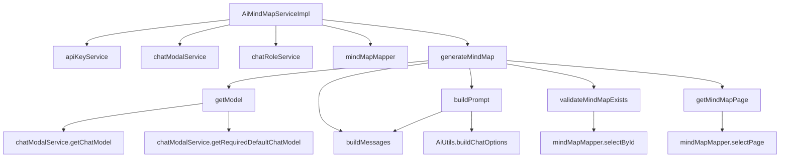

# 基础信息

|      |      |
|------|------|
| 编码语言 | .java |
| 代码路径 | yudao-module-ai/yudao-module-ai-biz/src/main/java/cn/iocoder/yudao/module/ai/service/mindmap/AiMindMapServiceImpl.java |
| 包名 | cn.iocoder.yudao.module.ai.service.mindmap |
| 依赖项 | ['cn.hutool.core.collection.CollUtil', 'cn.hutool.core.lang.Assert', 'cn.hutool.core.util.StrUtil', 'cn.iocoder.yudao.framework.ai.core.enums.AiPlatformEnum', 'cn.iocoder.yudao.framework.ai.core.util.AiUtils', 'cn.iocoder.yudao.framework.common.pojo.CommonResult', 'cn.iocoder.yudao.framework.common.pojo.PageResult', 'cn.iocoder.yudao.framework.common.util.object.BeanUtils', 'cn.iocoder.yudao.framework.tenant.core.util.TenantUtils', 'cn.iocoder.yudao.module.ai.controller.admin.mindmap.vo.AiMindMapGenerateReqVO', 'cn.iocoder.yudao.module.ai.controller.admin.mindmap.vo.AiMindMapPageReqVO', 'cn.iocoder.yudao.module.ai.dal.dataobject.mindmap.AiMindMapDO', 'cn.iocoder.yudao.module.ai.dal.dataobject.model.AiChatModelDO', 'cn.iocoder.yudao.module.ai.dal.dataobject.model.AiChatRoleDO', 'cn.iocoder.yudao.module.ai.dal.mysql.mindmap.AiMindMapMapper', 'cn.iocoder.yudao.module.ai.enums.AiChatRoleEnum', 'cn.iocoder.yudao.module.ai.enums.ErrorCodeConstants', 'cn.iocoder.yudao.module.ai.service.model.AiApiKeyService', 'cn.iocoder.yudao.module.ai.service.model.AiChatModelService', 'cn.iocoder.yudao.module.ai.service.model.AiChatRoleService', 'jakarta.annotation.Resource', 'lombok.extern.slf4j.Slf4j', 'org.springframework.ai.chat.messages.Message', 'org.springframework.ai.chat.messages.SystemMessage', 'org.springframework.ai.chat.messages.UserMessage', 'org.springframework.ai.chat.model.ChatModel', 'org.springframework.ai.chat.model.ChatResponse', 'org.springframework.ai.chat.prompt.ChatOptions', 'org.springframework.ai.chat.prompt.Prompt', 'org.springframework.stereotype.Service', 'reactor.core.publisher.Flux', 'java.util.ArrayList', 'java.util.List', 'cn.iocoder.yudao.framework.common.exception.util.ServiceExceptionUtil.exception', 'cn.iocoder.yudao.framework.common.pojo.CommonResult.error', 'cn.iocoder.yudao.framework.common.pojo.CommonResult.success', 'cn.iocoder.yudao.module.ai.enums.ErrorCodeConstants.MIND_MAP_NOT_EXISTS'] |
| 概述说明 | AiMindMapServiceImpl类实现AiMindMapService接口，提供生成、删除和获取思维导图分页功能。生成思维导图涉及获取模型和角色设定、校验平台、插入信息、构建Prompt、流式调用及更新内容或错误。删除思维导图需校验存在性后执行。获取分页直接返回结果。 |

# 说明

AiMindMapServiceImpl类实现了AiMindMapService接口，提供了生成思维导图、删除思维导图和获取思维导图分页的核心功能。在生成思维导图的过程中，首先会获取导图模型和角色设定消息，接着对平台进行校验，确保操作的有效性。校验通过后，系统会插入思维导图的相关信息，并构建Prompt进行流式调用。最后，系统会根据调用结果更新生成的内容或记录错误信息。删除思维导图时，系统会先校验思维导图的存在性，确认存在后再执行删除操作。获取思维导图分页的功能则直接返回分页结果，无需复杂的处理流程。这些功能共同构成了AiMindMapServiceImpl类的核心服务，为用户提供了完整的思维导图管理能力。

# 类列表 Class Summary

| 名称   | 类型  | 说明 |
|-------|------|-------------|
| AiMindMapServiceImpl | class | AiMindMapServiceImpl类实现了AiMindMapService接口，主要功能包括生成思维导图、删除思维导图和获取思维导图分页。生成思维导图时，首先获取导图模型和角色设定消息，校验平台后插入思维导图信息，构建Prompt并进行流式调用，最后更新生成内容或错误信息。删除思维导图时校验存在性后删除。获取思维导图分页则直接返回分页结果。 |

## 类 AiMindMapServiceImpl

|      |      |
|------|------|
| 访问范围 | @Service;@Slf4j;public |
| 类型 | class |
| 名称 | AiMindMapServiceImpl |
| 说明 | AiMindMapServiceImpl类实现了AiMindMapService接口，主要功能包括生成思维导图、删除思维导图和获取思维导图分页。生成思维导图时，首先获取导图模型和角色设定消息，校验平台后插入思维导图信息，构建Prompt并进行流式调用，最后更新生成内容或错误信息。删除思维导图时校验存在性后删除。获取思维导图分页则直接返回分页结果。 |

### UML类图

```mermaid
classDiagram
    class AiMindMapServiceImpl {
        -AiApiKeyService apiKeyService
        -AiChatModelService chatModalService
        -AiChatRoleService chatRoleService
        -AiMindMapMapper mindMapMapper
        +generateMindMap(AiMindMapGenerateReqVO generateReqVO, Long userId) Flux~CommonResult~String~~
        +deleteMindMap(Long id) void
        +getMindMapPage(AiMindMapPageReqVO pageReqVO) PageResult~AiMindMapDO~
        -buildPrompt(AiMindMapGenerateReqVO generateReqVO, AiChatModelDO model, String systemMessage) Prompt
        -buildMessages(AiMindMapGenerateReqVO generateReqVO, String systemMessage) List~Message~
        -getModel(AiChatRoleDO role) AiChatModelDO
        -validateMindMapExists(Long id) void
    }

    class AiMindMapService {
        <<interface>>
        +generateMindMap(AiMindMapGenerateReqVO generateReqVO, Long userId) Flux~CommonResult~String~~
        +deleteMindMap(Long id) void
        +getMindMapPage(AiMindMapPageReqVO pageReqVO) PageResult~AiMindMapDO~
    }

    class AiApiKeyService {
        +getChatModel(Long keyId) ChatModel
    }

    class AiChatModelService {
        +getChatModel(Long modelId) AiChatModelDO
        +getRequiredDefaultChatModel() AiChatModelDO
    }

    class AiChatRoleService {
        +getChatRoleListByName(String name) List~AiChatRoleDO~
    }

    class AiMindMapMapper {
        +insert(AiMindMapDO mindMapDO) void
        +updateById(AiMindMapDO mindMapDO) void
        +selectById(Long id) AiMindMapDO
        +selectPage(AiMindMapPageReqVO pageReqVO) PageResult~AiMindMapDO~
        +deleteById(Long id) void
    }

    class AiMindMapDO {
        +Long id
        +Long userId
        +String model
        +String platform
        +String generatedContent
        +String errorMessage
    }

    class AiChatRoleDO {
        +Long modelId
        +String systemMessage
    }

    class AiChatModelDO {
        +String platform
        +String model
        +Double temperature
        +Integer maxTokens
        +Long keyId
    }

    class AiMindMapGenerateReqVO {
        +String prompt
    }

    class AiMindMapPageReqVO {
        +String prompt
    }

    class ChatModel {
        +stream(Prompt prompt) Flux~ChatResponse~
    }

    class Prompt {
        +List~Message~ chatMessages
        +ChatOptions options
    }

    class ChatResponse {
        +ChatResult result
    }

    class ChatResult {
        +ChatOutput output
    }

    class ChatOutput {
        +String content
    }

    class ChatOptions {
        +String platform
        +String model
        +Double temperature
        +Integer maxTokens
    }

    class Message {
        <<interface>>
    }

    class SystemMessage {
        +String content
    }

    class UserMessage {
        +String content
    }

    class PageResult~T~ {
        +List~T~ list
        +Long total
    }

    class CommonResult~T~ {
        +T data
        +String message
        +Integer code
    }

    AiMindMapServiceImpl ..|> AiMindMapService : implements
    AiMindMapServiceImpl --> AiApiKeyService : depends
    AiMindMapServiceImpl --> AiChatModelService : depends
    AiMindMapServiceImpl --> AiChatRoleService : depends
    AiMindMapServiceImpl --> AiMindMapMapper : depends
    AiMindMapServiceImpl --> AiMindMapDO : creates
    AiMindMapServiceImpl --> AiMindMapGenerateReqVO : uses
    AiMindMapServiceImpl --> AiMindMapPageReqVO : uses
    AiMindMapServiceImpl --> ChatModel : uses
    AiMindMapServiceImpl --> Prompt : creates
    AiMindMapServiceImpl --> ChatResponse : uses
    AiMindMapServiceImpl --> ChatResult : uses
    AiMindMapServiceImpl --> ChatOutput : uses
    AiMindMapServiceImpl --> ChatOptions : uses
    AiMindMapServiceImpl --> Message : uses
    AiMindMapServiceImpl --> SystemMessage : creates
    AiMindMapServiceImpl --> UserMessage : creates
    AiMindMapServiceImpl --> PageResult~AiMindMapDO~ : returns
    AiMindMapServiceImpl --> CommonResult~String~ : returns
    AiChatRoleService --> AiChatRoleDO : returns
    AiChatModelService --> AiChatModelDO : returns
    AiApiKeyService --> ChatModel : returns
    AiMindMapMapper --> AiMindMapDO : returns
    Prompt --> Message : contains
    Prompt --> ChatOptions : contains
    ChatResponse --> ChatResult : contains
    ChatResult --> ChatOutput : contains
    SystemMessage ..|> Message : implements
    UserMessage ..|> Message : implements
```

### 描述信息：
该UML类图展示了`AiMindMapServiceImpl`类与其依赖的多个服务、数据对象和接口之间的关系。`AiMindMapServiceImpl`实现了`AiMindMapService`接口，并通过依赖注入使用了`AiApiKeyService`、`AiChatModelService`、`AiChatRoleService`和`AiMindMapMapper`等服务。类图中还展示了`AiMindMapServiceImpl`如何创建和使用`AiMindMapDO`、`AiMindMapGenerateReqVO`、`Prompt`、`ChatResponse`等数据对象，并通过`Flux`流式处理返回结果。

### 内部方法调用关系图

### 描述信息：
该图展示了`AiMindMapServiceImpl`类中各个方法之间的调用关系。`generateMindMap`方法调用了`getModel`、`buildPrompt`、`buildMessages`等方法，而`buildPrompt`又依赖于`buildMessages`和`AiUtils.buildChatOptions`。此外，`validateMindMapExists`和`getMindMapPage`方法分别调用了`mindMapMapper`的相关方法。整体调用关系清晰，展示了服务类中各个方法的依赖关系。

### 字段列表 Field List

| 名称  | 类型  | 说明 |
|-------|-------|------|
| chatRoleService | AiChatRoleService | 在代码中，通过@Resource注解将AiChatRoleService注入到当前类中，以便使用其功能。 |
| mindMapMapper | AiMindMapMapper | 在代码中，通过@Resource注解注入了一个名为mindMapMapper的AiMindMapMapper对象，用于访问和操作相关数据。 |
| chatModalService | AiChatModelService | 在代码中，通过@Resource注解注入了一个名为chatModalService的AiChatModelService实例，用于实现相关功能。 |
| apiKeyService | AiApiKeyService | 在代码中，通过@Resource注解注入了一个名为apiKeyService的AiApiKeyService实例，用于管理和操作API密钥相关的服务。 |

### 方法列表 Method List

| 名称  | 类型  | 说明 |
|-------|-------|------|
| deleteMindMap | void | 该方法用于删除指定ID的思维导图。首先校验思维导图是否存在，然后通过mapper接口删除对应ID的记录。 |
| validateMindMapExists | void | 该方法用于验证思维导图是否存在，通过传入的ID查询数据库，若未找到对应记录则抛出异常提示思维导图不存在。 |
| buildPrompt | Prompt | 该方法用于构建AI对话提示，首先根据请求和系统消息生成消息列表，然后根据平台、模型、温度参数和最大令牌数构建选项对象，最后返回包含消息列表和选项的提示对象。 |
| buildMessages | List<Message> | 该方法用于构建消息列表，首先检查并添加系统消息（如果存在），然后添加用户输入的消息，最终返回包含这两部分消息的列表。 |
| getModel | AiChatModelDO | 该方法通过角色对象获取对应的AI聊天模型。若角色或其模型ID为空，或无法获取模型，则返回默认的聊天模型。若最终仍无法获取模型，则抛出异常提示无法获取模型。 |
| getMindMapPage | PageResult<AiMindMapDO> | 该方法 `getMindMapPage` 接受一个 `AiMindMapPageReqVO` 类型的参数 `pageReqVO`，并返回一个 `PageResult<AiMindMapDO>` 类型的结果。方法通过调用 `mindMapMapper.selectPage(pageReqVO)` 来实现分页查询功能。 |
| generateMindMap | Flux<CommonResult<String>> | 该方法用于生成思维导图，首先获取思维导图助手角色和模型，校验平台后插入思维导图信息。接着构建Prompt并调用模型进行流式响应，将结果逐步返回并更新导图内容。若发生错误，记录错误信息并返回错误响应。 |

