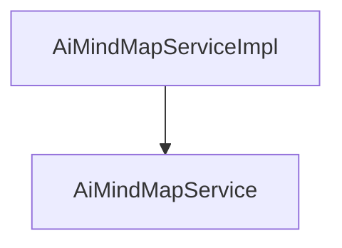

# 基础信息

|      |      |
|------|------|
| 编码语言 | .java |
| 代码路径 | yudao-module-ai/yudao-module-ai-biz/src/main/java/cn/iocoder/yudao/module/ai/service/mindmap |
| 包名 | cn.iocoder.yudao.module.ai.service.mindmap |
| 概述说明 | AiMindMapServiceImpl类实现了AiMindMapService接口，提供生成、删除和获取思维导图分页功能。生成思维导图时，系统校验平台有效性后插入导图信息并构建Prompt进行流式调用，最后更新内容或记录错误。删除思维导图前校验存在性。获取分页功能直接返回结果。这些功能构成了完整的思维导图管理服务。 |

# 说明

AiMindMapServiceImpl类实现了AiMindMapService接口，提供了生成思维导图、删除思维导图和获取思维导图分页的核心功能。在生成思维导图的过程中，系统首先会获取导图模型和角色设定消息，接着对平台进行校验，确保操作的有效性。校验通过后，系统会插入思维导图的相关信息，并构建Prompt进行流式调用。最后，系统会根据调用结果更新生成的内容或记录错误信息。删除思维导图时，系统会先校验思维导图的存在性，确认存在后再执行删除操作。获取思维导图分页的功能则直接返回分页结果，无需复杂的处理流程。这些功能共同构成了AiMindMapServiceImpl类的核心服务，为用户提供了完整的思维导图管理能力。

### 包内部结构视图

### 描述信息：
该图展示了`AiMindMapServiceImpl`类与`AiMindMapService`接口之间的调用关系。`AiMindMapServiceImpl`实现了`AiMindMapService`接口，表示`AiMindMapServiceImpl`类中的方法是对`AiMindMapService`接口中定义的方法的具体实现。

# 文件列表 File List

| 名称   | 类型  | 说明 |
|-------|------|-------------|
| [AiMindMapService.java](AiMindMapService.md) | file | 请提供需要总结的具体内容，以便我为您生成一个简洁的概要说明。 |
| [AiMindMapServiceImpl.java](AiMindMapServiceImpl.md) | file | AiMindMapServiceImpl类实现AiMindMapService接口，提供生成、删除和获取思维导图分页功能。生成思维导图涉及获取模型和角色设定、校验平台、插入信息、构建Prompt、流式调用及更新内容或错误。删除思维导图需校验存在性后执行。获取分页直接返回结果。 |

