# 基础信息

|      |      |
|------|------|
| 编码语言 | .java |
| 代码路径 | yudao-module-ai/yudao-module-ai-biz/src/main/java/cn/iocoder/yudao/module/ai/service/model/AiApiKeyServiceImpl.java |
| 包名 | cn.iocoder.yudao.module.ai.service.model |
| 依赖项 | ['cn.iocoder.yudao.framework.ai.core.enums.AiPlatformEnum', 'cn.iocoder.yudao.framework.ai.core.factory.AiModelFactory', 'cn.iocoder.yudao.framework.ai.core.model.midjourney.api.MidjourneyApi', 'cn.iocoder.yudao.framework.ai.core.model.suno.api.SunoApi', 'cn.iocoder.yudao.framework.common.enums.CommonStatusEnum', 'cn.iocoder.yudao.framework.common.pojo.PageResult', 'cn.iocoder.yudao.framework.common.util.object.BeanUtils', 'cn.iocoder.yudao.module.ai.controller.admin.model.vo.apikey.AiApiKeyPageReqVO', 'cn.iocoder.yudao.module.ai.controller.admin.model.vo.apikey.AiApiKeySaveReqVO', 'cn.iocoder.yudao.module.ai.dal.dataobject.model.AiApiKeyDO', 'cn.iocoder.yudao.module.ai.dal.mysql.model.AiApiKeyMapper', 'jakarta.annotation.Resource', 'org.springframework.ai.chat.model.ChatModel', 'org.springframework.ai.embedding.EmbeddingModel', 'org.springframework.ai.image.ImageModel', 'org.springframework.ai.vectorstore.VectorStore', 'org.springframework.stereotype.Service', 'org.springframework.validation.annotation.Validated', 'java.util.List', 'cn.iocoder.yudao.framework.common.exception.util.ServiceExceptionUtil.exception', 'cn.iocoder.yudao.module.ai.enums.ErrorCodeConstants'] |
| 概述说明 | AiApiKeyServiceImpl类实现AiApiKeyService接口，提供API密钥的创建、更新、删除、查询及验证功能，集成Spring AI支持获取多种模型（如ChatModel、ImageModel等）。通过AiApiKeyMapper进行数据库操作，AiModelFactory用于创建或获取模型实例。 |

# 说明

AiApiKeyServiceImpl类实现了AiApiKeyService接口，提供了全面的API密钥管理功能，包括创建、更新、删除、查询和验证API密钥。该类与Spring AI框架集成，支持多种AI模型的获取，如ChatModel、ImageModel、MidjourneyApi、SunoApi、EmbeddingModel和VectorStore等。通过这些模型，用户可以进行自然语言处理、图像生成、嵌入模型操作以及向量存储等任务。AiApiKeyServiceImpl类通过AiApiKeyMapper与数据库进行交互，执行数据的增删改查操作。此外，AiModelFactory类负责创建或获取模型实例，确保模型的高效管理和使用。整体设计旨在提供一个灵活且可扩展的API密钥管理系统，支持多种AI模型的操作，满足不同应用场景的需求。

# 类列表 Class Summary

| 名称   | 类型  | 说明 |
|-------|------|-------------|
| AiApiKeyServiceImpl | class | AiApiKeyServiceImpl类实现了AiApiKeyService接口，提供了API密钥的创建、更新、删除、查询及验证功能，并与Spring AI集成，支持获取ChatModel、ImageModel、MidjourneyApi、SunoApi、EmbeddingModel和VectorStore等模型。通过AiApiKeyMapper进行数据库操作，AiModelFactory用于创建或获取模型实例。 |

## 类 AiApiKeyServiceImpl

|      |      |
|------|------|
| 访问范围 | @Service;@Validated;public |
| 类型 | class |
| 名称 | AiApiKeyServiceImpl |
| 说明 | AiApiKeyServiceImpl类实现了AiApiKeyService接口，提供了API密钥的创建、更新、删除、查询及验证功能，并与Spring AI集成，支持获取ChatModel、ImageModel、MidjourneyApi、SunoApi、EmbeddingModel和VectorStore等模型。通过AiApiKeyMapper进行数据库操作，AiModelFactory用于创建或获取模型实例。 |

### UML类图

```mermaid
classDiagram
    class AiApiKeyService {
        <<interface>>
        +createApiKey(AiApiKeySaveReqVO createReqVO) Long
        +updateApiKey(AiApiKeySaveReqVO updateReqVO) void
        +deleteApiKey(Long id) void
        +getApiKey(Long id) AiApiKeyDO
        +validateApiKey(Long id) AiApiKeyDO
        +getApiKeyPage(AiApiKeyPageReqVO pageReqVO) PageResult~AiApiKeyDO~
        +getApiKeyList() List~AiApiKeyDO~
        +getChatModel(Long id) ChatModel
        +getImageModel(AiPlatformEnum platform) ImageModel
        +getMidjourneyApi() MidjourneyApi
        +getSunoApi() SunoApi
        +getEmbeddingModel(Long id) EmbeddingModel
        +getOrCreateVectorStore(Long id) VectorStore
    }

    class AiApiKeyServiceImpl {
        -apiKeyMapper : AiApiKeyMapper
        -modelFactory : AiModelFactory
        +createApiKey(AiApiKeySaveReqVO createReqVO) Long
        +updateApiKey(AiApiKeySaveReqVO updateReqVO) void
        +deleteApiKey(Long id) void
        +getApiKey(Long id) AiApiKeyDO
        +validateApiKey(Long id) AiApiKeyDO
        +getApiKeyPage(AiApiKeyPageReqVO pageReqVO) PageResult~AiApiKeyDO~
        +getApiKeyList() List~AiApiKeyDO~
        +getChatModel(Long id) ChatModel
        +getImageModel(AiPlatformEnum platform) ImageModel
        +getMidjourneyApi() MidjourneyApi
        +getSunoApi() SunoApi
        +getEmbeddingModel(Long id) EmbeddingModel
        +getOrCreateVectorStore(Long id) VectorStore
        -validateApiKeyExists(Long id) AiApiKeyDO
    }

    class AiApiKeyMapper {
        +insert(AiApiKeyDO apiKey) void
        +updateById(AiApiKeyDO updateObj) void
        +deleteById(Long id) void
        +selectById(Long id) AiApiKeyDO
        +selectPage(AiApiKeyPageReqVO pageReqVO) PageResult~AiApiKeyDO~
        +selectList() List~AiApiKeyDO~
        +selectFirstByPlatformAndStatus(String platform, Integer status) AiApiKeyDO
    }

    class AiModelFactory {
        +getOrCreateChatModel(AiPlatformEnum platform, String apiKey, String url) ChatModel
        +getOrCreateImageModel(AiPlatformEnum platform, String apiKey, String url) ImageModel
        +getOrCreateMidjourneyApi(String apiKey, String url) MidjourneyApi
        +getOrCreateSunoApi(String apiKey, String url) SunoApi
        +getOrCreateEmbeddingModel(AiPlatformEnum platform, String apiKey, String url) EmbeddingModel
        +getOrCreateVectorStore(EmbeddingModel embeddingModel, AiPlatformEnum platform, String apiKey, String url) VectorStore
    }

    class AiApiKeyDO {
        -id : Long
        -platform : String
        -apiKey : String
        -url : String
        -status : Integer
        +getId() Long
        +getPlatform() String
        +getApiKey() String
        +getUrl() String
        +getStatus() Integer
    }

    class AiApiKeySaveReqVO {
        -id : Long
        -platform : String
        -apiKey : String
        -url : String
        +getId() Long
        +getPlatform() String
        +getApiKey() String
        +getUrl() String
    }

    class AiApiKeyPageReqVO {
        -pageNo : Integer
        -pageSize : Integer
        +getPageNo() Integer
        +getPageSize() Integer
    }

    class CommonStatusEnum {
        <<enumeration>>
        +ENABLE : Integer
        +DISABLE : Integer
        +isDisable(Integer status) Boolean
    }

    class AiPlatformEnum {
        <<enumeration>>
        +MIDJOURNEY : String
        +SUNO : String
        +validatePlatform(String platform) AiPlatformEnum
    }

    class ChatModel {
        +chat(String message) String
    }

    class ImageModel {
        +generateImage(String prompt) String
    }

    class MidjourneyApi {
        +generateImage(String prompt) String
    }

    class SunoApi {
        +generateAudio(String prompt) String
    }

    class EmbeddingModel {
        +embed(String text) List~Double~
    }

    class VectorStore {
        +storeEmbedding(List~Double~ embedding) void
        +retrieveEmbedding(Long id) List~Double~
    }

    AiApiKeyServiceImpl <|.. AiApiKeyService
    AiApiKeyServiceImpl --> AiApiKeyMapper
    AiApiKeyServiceImpl --> AiModelFactory
    AiApiKeyServiceImpl --> AiApiKeyDO
    AiApiKeyServiceImpl --> AiApiKeySaveReqVO
    AiApiKeyServiceImpl --> AiApiKeyPageReqVO
    AiApiKeyServiceImpl --> CommonStatusEnum
    AiApiKeyServiceImpl --> AiPlatformEnum
    AiApiKeyServiceImpl --> ChatModel
    AiApiKeyServiceImpl --> ImageModel
    AiApiKeyServiceImpl --> MidjourneyApi
    AiApiKeyServiceImpl --> SunoApi
    AiApiKeyServiceImpl --> EmbeddingModel
    AiApiKeyServiceImpl --> VectorStore
```

### 描述信息：
该UML类图展示了`AiApiKeyServiceImpl`类及其相关依赖关系。`AiApiKeyServiceImpl`实现了`AiApiKeyService`接口，并依赖于`AiApiKeyMapper`和`AiModelFactory`类来执行数据库操作和模型创建。类图中还包含了多个枚举类、数据对象类以及模型类，展示了系统的复杂性和模块化设计。

### 内部方法调用关系图

```mermaid
graph TD
    AiApiKeyServiceImpl --> createApiKey
    AiApiKeyServiceImpl --> updateApiKey
    AiApiKeyServiceImpl --> deleteApiKey
    AiApiKeyServiceImpl --> validateApiKeyExists
    AiApiKeyServiceImpl --> getApiKey
    AiApiKeyServiceImpl --> validateApiKey
    AiApiKeyServiceImpl --> getApiKeyPage
    AiApiKeyServiceImpl --> getApiKeyList
    AiApiKeyServiceImpl --> getChatModel
    AiApiKeyServiceImpl --> getImageModel
    AiApiKeyServiceImpl --> getMidjourneyApi
    AiApiKeyServiceImpl --> getSunoApi
    AiApiKeyServiceImpl --> getEmbeddingModel
    AiApiKeyServiceImpl --> getOrCreateVectorStore

    createApiKey --> apiKeyMapper.insert
    updateApiKey --> validateApiKeyExists
    updateApiKey --> apiKeyMapper.updateById
    deleteApiKey --> validateApiKeyExists
    deleteApiKey --> apiKeyMapper.deleteById
    validateApiKeyExists --> apiKeyMapper.selectById
    getApiKey --> apiKeyMapper.selectById
    validateApiKey --> validateApiKeyExists
    getApiKeyPage --> apiKeyMapper.selectPage
    getApiKeyList --> apiKeyMapper.selectList
    getChatModel --> validateApiKey
    getChatModel --> modelFactory.getOrCreateChatModel
    getImageModel --> apiKeyMapper.selectFirstByPlatformAndStatus
    getImageModel --> modelFactory.getOrCreateImageModel
    getMidjourneyApi --> apiKeyMapper.selectFirstByPlatformAndStatus
    getMidjourneyApi --> modelFactory.getOrCreateMidjourneyApi
    getSunoApi --> apiKeyMapper.selectFirstByPlatformAndStatus
    getSunoApi --> modelFactory.getOrCreateSunoApi
    getEmbeddingModel --> validateApiKey
    getEmbeddingModel --> modelFactory.getOrCreateEmbeddingModel
    getOrCreateVectorStore --> validateApiKey
    getOrCreateVectorStore --> getEmbeddingModel
    getOrCreateVectorStore --> modelFactory.getOrCreateVectorStore
```

### 描述信息：
该图展示了`AiApiKeyServiceImpl`类中各个方法之间的调用关系。`AiApiKeyServiceImpl`类通过调用`apiKeyMapper`和`modelFactory`的方法来实现对API密钥的管理和模型的操作。主要方法包括创建、更新、删除API密钥，以及获取不同类型的AI模型（如ChatModel、ImageModel等）。

### 字段列表 Field List

| 名称  | 类型  | 说明 |
|-------|-------|------|
| modelFactory | AiModelFactory | 在代码中，通过@Resource注解注入了一个名为modelFactory的AiModelFactory私有实例。 |
| apiKeyMapper | AiApiKeyMapper | 在代码中，通过@Resource注解注入了一个名为apiKeyMapper的AiApiKeyMapper对象，用于管理和操作API密钥相关的数据。 |

### 方法列表 Method List

| 名称  | 类型  | 说明 |
|-------|-------|------|
| getApiKeyPage | PageResult<AiApiKeyDO> | 该方法通过调用`apiKeyMapper.selectPage`方法，根据传入的`AiApiKeyPageReqVO`对象参数，返回一个包含`AiApiKeyDO`对象的分页结果`PageResult`。 |
| validateApiKeyExists | AiApiKeyDO | 该方法通过ID查询API密钥是否存在，若不存在则抛出异常，存在则返回对应的API密钥对象。 |
| updateApiKey | void | 该方法用于更新API密钥，首先校验密钥是否存在，然后将请求对象转换为数据库对象并更新到数据库中。 |
| getApiKey | AiApiKeyDO | 该方法通过传入的ID参数，调用apiKeyMapper的selectById方法，从数据库中查询并返回对应的AiApiKeyDO对象。 |
| deleteApiKey | void | 该方法用于删除API密钥，首先校验密钥是否存在，然后通过`apiKeyMapper.deleteById(id)`删除指定ID的密钥。 |
| getApiKeyList | List<AiApiKeyDO> | 该方法重写了获取API密钥列表的功能，通过调用apiKeyMapper的selectList方法返回AiApiKeyDO对象的列表。 |
| validateApiKey | AiApiKeyDO | 该方法用于验证API密钥的有效性，首先检查指定ID的API密钥是否存在，然后判断其状态是否为禁用状态，若禁用则抛出异常，否则返回该API密钥对象。 |
| getEmbeddingModel | EmbeddingModel | 该方法通过验证API密钥获取平台信息，并利用模型工厂创建或获取嵌入模型，返回基于指定平台、API密钥和URL的嵌入模型实例。 |
| getChatModel | ChatModel | 该方法通过验证API密钥获取聊天模型，首先验证API密钥的有效性，然后确定平台类型，最后通过模型工厂获取或创建对应平台的聊天模型。 |
| createApiKey | Long | 该方法用于创建API密钥，接收一个AiApiKeySaveReqVO对象作为参数，将其转换为AiApiKeyDO对象并插入数据库，最后返回生成的API密钥的ID。 |
| getImageModel | ImageModel | 该方法根据传入的平台枚举获取对应的图像模型。首先查询数据库中该平台的有效API密钥，若未找到则抛出异常。找到后，通过模型工厂获取或创建图像模型，并返回该模型。 |
| getMidjourneyApi | MidjourneyApi | 该方法用于获取Midjourney API实例。首先从数据库查询启用的Midjourney平台API密钥，若未找到则抛出异常；若找到则使用密钥和URL通过模型工厂创建或获取Midjourney API实例并返回。 |
| getSunoApi | SunoApi | 该方法用于获取SunoApi实例。首先通过apiKeyMapper查询启用的Suno平台API密钥，若未找到则抛出异常。找到后，使用modelFactory获取或创建SunoApi实例，传入API密钥和URL。 |
| getOrCreateVectorStore | VectorStore | 该方法通过验证API密钥和平台，创建或获取一个VectorStore对象。首先验证API密钥，然后确认平台类型，最后调用模型工厂方法生成或获取VectorStore对象，使用嵌入模型、平台信息、API密钥和URL作为参数。 |

