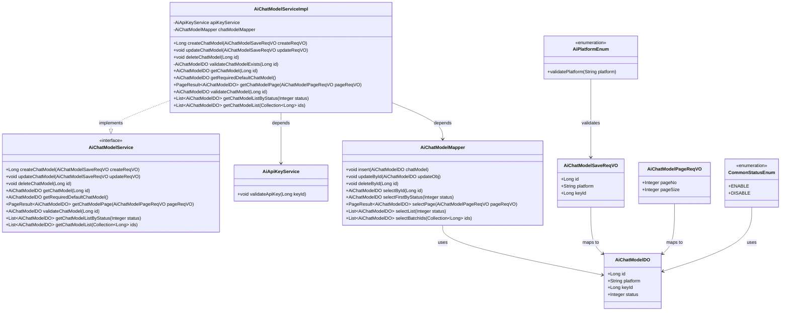

# 基础信息

|      |      |
|------|------|
| 编码语言 | .java |
| 代码路径 | yudao-module-ai/yudao-module-ai-biz/src/main/java/cn/iocoder/yudao/module/ai/service/model/AiChatModelServiceImpl.java |
| 包名 | cn.iocoder.yudao.module.ai.service.model |
| 依赖项 | ['cn.iocoder.yudao.framework.ai.core.enums.AiPlatformEnum', 'cn.iocoder.yudao.framework.common.enums.CommonStatusEnum', 'cn.iocoder.yudao.framework.common.pojo.PageResult', 'cn.iocoder.yudao.framework.common.util.object.BeanUtils', 'cn.iocoder.yudao.module.ai.controller.admin.model.vo.chatModel.AiChatModelPageReqVO', 'cn.iocoder.yudao.module.ai.controller.admin.model.vo.chatModel.AiChatModelSaveReqVO', 'cn.iocoder.yudao.module.ai.dal.dataobject.model.AiChatModelDO', 'cn.iocoder.yudao.module.ai.dal.mysql.model.AiChatModelMapper', 'jakarta.annotation.Resource', 'org.springframework.stereotype.Service', 'org.springframework.validation.annotation.Validated', 'java.util.Collection', 'java.util.List', 'cn.iocoder.yudao.framework.common.exception.util.ServiceExceptionUtil.exception', 'cn.iocoder.yudao.module.ai.enums.ErrorCodeConstants'] |
| 概述说明 | AiChatModelServiceImpl类实现AiChatModelService接口，提供创建、更新、删除、查询聊天模型功能。通过校验平台和API密钥确保数据有效性，支持插入、更新、删除操作，并提供按ID、分页、状态等多种查询方式。所有操作通过chatModelMapper与数据库交互，确保数据一致性和完整性。 |

# 说明

AiChatModelServiceImpl类实现了AiChatModelService接口，提供了对聊天模型的创建、更新、删除和查询等核心功能。该类通过校验平台和API密钥来确保数据的有效性，防止无效或非法数据的操作。在数据操作方面，支持插入、更新和删除等操作，并通过chatModelMapper与数据库进行交互，确保数据的一致性和完整性。此外，该类还提供了多种查询方式，包括按ID查询、分页查询以及按状态查询等，以满足不同场景下的需求。通过这些功能，AiChatModelServiceImpl类能够有效地管理和维护聊天模型数据，确保系统的稳定运行和数据的安全性。

# 类列表 Class Summary

| 名称   | 类型  | 说明 |
|-------|------|-------------|
| AiChatModelServiceImpl | class | AiChatModelServiceImpl类实现了AiChatModelService接口，提供了创建、更新、删除、查询聊天模型的功能。通过校验平台和API密钥，确保数据有效性。支持插入、更新、删除操作，并提供多种查询方式，如按ID查询、分页查询、按状态查询等。所有操作均通过chatModelMapper与数据库交互，确保数据一致性和完整性。 |

## 类 AiChatModelServiceImpl

|      |      |
|------|------|
| 访问范围 | @Service;@Validated;public |
| 类型 | class |
| 名称 | AiChatModelServiceImpl |
| 说明 | AiChatModelServiceImpl类实现了AiChatModelService接口，提供了创建、更新、删除、查询聊天模型的功能。通过校验平台和API密钥，确保数据有效性。支持插入、更新、删除操作，并提供多种查询方式，如按ID查询、分页查询、按状态查询等。所有操作均通过chatModelMapper与数据库交互，确保数据一致性和完整性。 |

### UML类图

### 描述信息：
该UML类图展示了`AiChatModelServiceImpl`类及其相关依赖和实现关系。`AiChatModelServiceImpl`实现了`AiChatModelService`接口，并依赖于`AiApiKeyService`和`AiChatModelMapper`类。`AiChatModelMapper`类与`AiChatModelDO`类关联，用于数据库操作。`AiChatModelSaveReqVO`和`AiChatModelPageReqVO`类用于数据传输和映射。`CommonStatusEnum`和`AiPlatformEnum`枚举类用于状态和平台验证。

### 内部方法调用关系图

```mermaid
graph TD
    AiChatModelServiceImpl --> apiKeyService
    AiChatModelServiceImpl --> chatModelMapper
    AiChatModelServiceImpl --> AiPlatformEnum
    AiChatModelServiceImpl --> BeanUtils
    AiChatModelServiceImpl --> CommonStatusEnum
    AiChatModelServiceImpl --> exception

    createChatModel --> AiPlatformEnum.validatePlatform
    createChatModel --> apiKeyService.validateApiKey
    createChatModel --> BeanUtils.toBean
    createChatModel --> chatModelMapper.insert

    updateChatModel --> validateChatModelExists
    updateChatModel --> AiPlatformEnum.validatePlatform
    updateChatModel --> apiKeyService.validateApiKey
    updateChatModel --> BeanUtils.toBean
    updateChatModel --> chatModelMapper.updateById

    deleteChatModel --> validateChatModelExists
    deleteChatModel --> chatModelMapper.deleteById

    validateChatModelExists --> chatModelMapper.selectById
    validateChatModelExists --> exception

    getChatModel --> chatModelMapper.selectById

    getRequiredDefaultChatModel --> chatModelMapper.selectFirstByStatus
    getRequiredDefaultChatModel --> exception

    getChatModelPage --> chatModelMapper.selectPage

    validateChatModel --> validateChatModelExists
    validateChatModel --> CommonStatusEnum.isDisable
    validateChatModel --> exception

    getChatModelListByStatus --> chatModelMapper.selectList

    getChatModelList --> chatModelMapper.selectBatchIds
```

### 描述信息：
该图展示了`AiChatModelServiceImpl`类中各个方法之间的调用关系。`AiChatModelServiceImpl`依赖于`apiKeyService`和`chatModelMapper`进行数据校验和操作。主要方法如`createChatModel`、`updateChatModel`和`deleteChatModel`都调用了`validateChatModelExists`进行数据校验，并通过`chatModelMapper`进行数据库操作。

### 字段列表 Field List

| 名称  | 类型  | 说明 |
|-------|-------|------|
| apiKeyService | AiApiKeyService | 在代码中，通过@Resource注解将AiApiKeyService注入到当前类中，以便使用其提供的API密钥管理功能。 |
| chatModelMapper | AiChatModelMapper | 在代码中，使用@Resource注解注入了一个名为chatModelMapper的AiChatModelMapper实例，用于依赖注入和对象管理。 |

### 方法列表 Method List

| 名称  | 类型  | 说明 |
|-------|-------|------|
| validateChatModelExists | AiChatModelDO | 该方法通过ID验证聊天模型是否存在，若不存在则抛出异常，存在则返回模型对象。 |
| getChatModelListByStatus | List<AiChatModelDO> | 该方法通过传入状态参数，调用chatModelMapper的selectList方法，返回对应状态的AiChatModelDO对象列表。 |
| deleteChatModel | void | 该方法用于删除聊天模型，首先校验模型是否存在，然后通过`chatModelMapper`根据ID删除对应模型。 |
| getChatModelList | List<AiChatModelDO> | 该方法通过传入的ID集合，调用`chatModelMapper`的`selectBatchIds`方法，返回对应的`AiChatModelDO`对象列表。 |
| updateChatModel | void | 该方法用于更新聊天模型，首先校验模型是否存在、平台是否有效及API密钥是否合法，然后将请求对象转换为数据库对象并更新。 |
| validateChatModel | AiChatModelDO | 该方法用于验证聊天模型的有效性，首先检查模型是否存在，若存在则进一步检查模型状态是否为禁用状态，若禁用则抛出异常，否则返回该模型。 |
| getRequiredDefaultChatModel | AiChatModelDO | 该方法通过查询数据库获取第一个状态为“启用”的聊天模型，若未找到则抛出异常，提示默认聊天模型不存在，最终返回找到的模型对象。 |
| createChatModel | Long | 该方法用于创建聊天模型，首先校验平台和API密钥的有效性，然后将请求数据转换为数据库对象并插入到数据库中，最后返回新创建模型的ID。 |
| getChatModel | AiChatModelDO | 该方法通过传入的ID从数据库中获取对应的聊天模型数据，并返回该数据对象。具体实现是通过调用chatModelMapper的selectById方法，根据ID查询并返回AiChatModelDO对象。 |
| getChatModelPage | PageResult<AiChatModelDO> | 该方法 `getChatModelPage` 接收 `AiChatModelPageReqVO` 参数，调用 `chatModelMapper.selectPage` 方法查询分页数据，并返回 `PageResult<AiChatModelDO>` 类型的结果。 |

