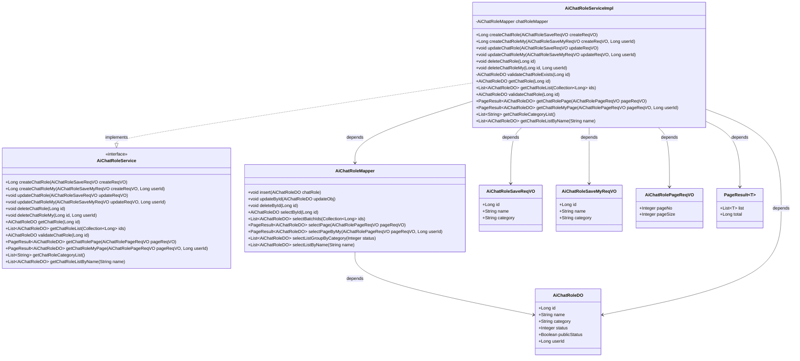

# 基础信息

|      |      |
|------|------|
| 编码语言 | .java |
| 代码路径 | yudao-module-ai/yudao-module-ai-biz/src/main/java/cn/iocoder/yudao/module/ai/service/model/AiChatRoleServiceImpl.java |
| 包名 | cn.iocoder.yudao.module.ai.service.model |
| 依赖项 | ['cn.hutool.core.collection.CollUtil', 'cn.hutool.core.util.ObjectUtil', 'cn.hutool.core.util.StrUtil', 'cn.iocoder.yudao.framework.common.enums.CommonStatusEnum', 'cn.iocoder.yudao.framework.common.pojo.PageResult', 'cn.iocoder.yudao.framework.common.util.object.BeanUtils', 'cn.iocoder.yudao.module.ai.controller.admin.model.vo.chatRole.AiChatRolePageReqVO', 'cn.iocoder.yudao.module.ai.controller.admin.model.vo.chatRole.AiChatRoleSaveMyReqVO', 'cn.iocoder.yudao.module.ai.controller.admin.model.vo.chatRole.AiChatRoleSaveReqVO', 'cn.iocoder.yudao.module.ai.dal.dataobject.model.AiChatRoleDO', 'cn.iocoder.yudao.module.ai.dal.mysql.model.AiChatRoleMapper', 'jakarta.annotation.Resource', 'lombok.extern.slf4j.Slf4j', 'org.springframework.stereotype.Service', 'java.util.Collection', 'java.util.Collections', 'java.util.List', 'cn.iocoder.yudao.framework.common.exception.util.ServiceExceptionUtil.exception', 'cn.iocoder.yudao.framework.common.util.collection.CollectionUtils.convertList', 'cn.iocoder.yudao.module.ai.enums.ErrorCodeConstants'] |
| 概述说明 | AiChatRoleServiceImpl类实现AiChatRoleService接口，提供聊天角色的创建、更新、删除和查询功能。通过chatRoleMapper与数据库交互，支持按ID、用户ID、名称等条件操作角色，并包含角色存在性校验和状态管理。 |

# 说明

AiChatRoleServiceImpl类是一个实现了AiChatRoleService接口的服务类，主要负责处理与聊天角色相关的业务逻辑。该类提供了创建、更新、删除和查询聊天角色的功能，能够满足对聊天角色的基本操作需求。通过与chatRoleMapper的交互，该类能够直接与数据库进行通信，执行数据的增删改查操作。在查询功能方面，AiChatRoleServiceImpl支持根据角色ID、用户ID以及角色名称等多种条件进行角色检索，确保用户能够灵活地获取所需信息。此外，该类还包含了角色存在性校验的功能，确保在进行更新或删除操作时，目标角色确实存在于数据库中，从而避免无效操作。同时，AiChatRoleServiceImpl还具备角色状态管理的能力，能够对聊天角色的状态进行有效控制和管理，确保角色在使用过程中的合理性和有效性。通过这些功能，AiChatRoleServiceImpl为聊天角色的管理提供了一个全面且可靠的解决方案。

# 类列表 Class Summary

| 名称   | 类型  | 说明 |
|-------|------|-------------|
| AiChatRoleServiceImpl | class | AiChatRoleServiceImpl类实现了AiChatRoleService接口，提供了创建、更新、删除、查询聊天角色等功能。通过chatRoleMapper与数据库交互，支持根据ID、用户ID、名称等条件进行角色操作，并包含角色存在性校验和状态管理。 |

## 类 AiChatRoleServiceImpl

|      |      |
|------|------|
| 访问范围 | @Service;@Slf4j;public |
| 类型 | class |
| 名称 | AiChatRoleServiceImpl |
| 说明 | AiChatRoleServiceImpl类实现了AiChatRoleService接口，提供了创建、更新、删除、查询聊天角色等功能。通过chatRoleMapper与数据库交互，支持根据ID、用户ID、名称等条件进行角色操作，并包含角色存在性校验和状态管理。 |

### UML类图

### 描述信息：
该UML类图展示了`AiChatRoleServiceImpl`类与其相关接口和依赖类之间的关系。`AiChatRoleServiceImpl`实现了`AiChatRoleService`接口，并依赖于`AiChatRoleMapper`来操作`AiChatRoleDO`数据对象。类图中还包含了请求对象（如`AiChatRoleSaveReqVO`）和分页结果对象（如`PageResult`）等辅助类。

### 内部方法调用关系图

```mermaid
graph TD
    AiChatRoleServiceImpl --> createChatRole
    AiChatRoleServiceImpl --> createChatRoleMy
    AiChatRoleServiceImpl --> updateChatRole
    AiChatRoleServiceImpl --> updateChatRoleMy
    AiChatRoleServiceImpl --> deleteChatRole
    AiChatRoleServiceImpl --> deleteChatRoleMy
    AiChatRoleServiceImpl --> validateChatRoleExists
    AiChatRoleServiceImpl --> getChatRole
    AiChatRoleServiceImpl --> getChatRoleList
    AiChatRoleServiceImpl --> validateChatRole
    AiChatRoleServiceImpl --> getChatRolePage
    AiChatRoleServiceImpl --> getChatRoleMyPage
    AiChatRoleServiceImpl --> getChatRoleCategoryList
    AiChatRoleServiceImpl --> getChatRoleListByName

    createChatRole --> chatRoleMapper.insert
    createChatRoleMy --> chatRoleMapper.insert
    updateChatRole --> validateChatRoleExists
    updateChatRole --> chatRoleMapper.updateById
    updateChatRoleMy --> validateChatRoleExists
    updateChatRoleMy --> chatRoleMapper.updateById
    deleteChatRole --> validateChatRoleExists
    deleteChatRole --> chatRoleMapper.deleteById
    deleteChatRoleMy --> validateChatRoleExists
    deleteChatRoleMy --> chatRoleMapper.deleteById
    validateChatRoleExists --> chatRoleMapper.selectById
    getChatRole --> chatRoleMapper.selectById
    getChatRoleList --> chatRoleMapper.selectBatchIds
    validateChatRole --> validateChatRoleExists
    getChatRolePage --> chatRoleMapper.selectPage
    getChatRoleMyPage --> chatRoleMapper.selectPageByMy
    getChatRoleCategoryList --> chatRoleMapper.selectListGroupByCategory
    getChatRoleListByName --> chatRoleMapper.selectListByName
```

### 描述信息：
该图展示了`AiChatRoleServiceImpl`类中各个方法之间的调用关系。主要方法如`createChatRole`、`updateChatRole`、`deleteChatRole`等通过调用`chatRoleMapper`的`insert`、`updateById`、`deleteById`等方法与数据库交互。`validateChatRoleExists`方法被多个方法调用以验证角色是否存在。

### 字段列表 Field List

| 名称  | 类型  | 说明 |
|-------|-------|------|
| chatRoleMapper | AiChatRoleMapper | 在代码中，使用@Resource注解注入了一个名为chatRoleMapper的AiChatRoleMapper实例。 |

### 方法列表 Method List

| 名称  | 类型  | 说明 |
|-------|-------|------|
| validateChatRoleExists | AiChatRoleDO | 该方法通过ID查询聊天角色，若角色不存在则抛出异常，存在则返回角色对象。 |
| createChatRole | Long | 该方法用于创建聊天角色，接收一个AiChatRoleSaveReqVO对象作为参数，将其转换为AiChatRoleDO对象并插入数据库，最后返回新创建角色的ID。 |
| getChatRole | AiChatRoleDO | 该方法通过传入的ID从数据库中查询并返回对应的AiChatRoleDO对象，具体实现调用了chatRoleMapper的selectById方法。 |
| createChatRoleMy | Long | 该方法用于创建用户自定义的AI聊天角色，接收创建请求对象和用户ID，将请求对象转换为数据库实体并设置用户ID、启用状态和非公开状态，插入数据库后返回角色ID。 |
| deleteChatRole | void | 该方法用于删除聊天角色，首先校验角色是否存在，然后通过`chatRoleMapper`的`deleteById`方法删除指定ID的角色。 |
| updateChatRole | void | 该方法用于更新聊天角色信息。首先校验角色是否存在，然后将请求对象转换为数据库对象，最后通过映射器更新数据库中的角色信息。 |
| getChatRoleListByName | List<AiChatRoleDO> | 该方法通过调用`chatRoleMapper.selectListByName(name)`，根据传入的名称参数`name`，返回一个包含`AiChatRoleDO`对象的列表。 |
| deleteChatRoleMy | void | 该方法用于删除用户自定义的聊天角色。首先校验角色是否存在，若存在则检查角色是否属于当前用户，若不属于则抛出异常；若属于则通过ID删除该角色。 |
| updateChatRoleMy | void | 该方法用于更新用户自定义的AI聊天角色。首先校验角色是否存在且属于当前用户，若校验失败则抛出异常。校验通过后，将请求对象转换为数据库对象并更新到数据库中。 |
| validateChatRole | AiChatRoleDO | 该方法用于验证聊天角色，首先检查角色是否存在，若存在则进一步检查角色状态是否被禁用，若禁用则抛出异常，否则返回该角色对象。 |
| getChatRoleMyPage | PageResult<AiChatRoleDO> | 该方法 `getChatRoleMyPage` 接受 `AiChatRolePageReqVO` 和 `userId` 作为参数，调用 `chatRoleMapper.selectPageByMy` 方法，返回 `PageResult<AiChatRoleDO>` 类型的分页结果。 |
| getChatRoleCategoryList | List<String> | 该方法通过查询数据库中状态为启用的聊天角色，按类别分组并返回类别列表。使用`chatRoleMapper.selectListGroupByCategory`获取数据，并通过`convertList`方法过滤和转换，确保类别非空且有效。 |
| getChatRoleList | List<AiChatRoleDO> | 该方法 `getChatRoleList` 接收一个 `Long` 类型的集合 `ids`，如果集合为空，则返回空列表；否则，调用 `chatRoleMapper.selectBatchIds(ids)` 方法查询并返回对应的 `AiChatRoleDO` 对象列表。 |
| getChatRolePage | PageResult<AiChatRoleDO> | 该方法 `getChatRolePage` 接受一个 `AiChatRolePageReqVO` 类型的参数 `pageReqVO`，并返回一个 `PageResult<AiChatRoleDO>` 类型的结果。方法通过调用 `chatRoleMapper.selectPage(pageReqVO)` 来实现分页查询聊天角色数据的功能。 |

