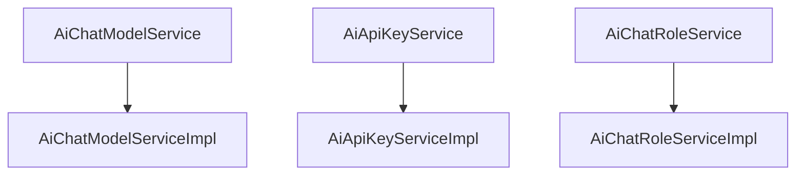

# 基础信息

|      |      |
|------|------|
| 编码语言 | .java |
| 代码路径 | yudao-module-ai/yudao-module-ai-biz/src/main/java/cn/iocoder/yudao/module/ai/service/model |
| 包名 | cn.iocoder.yudao.module.ai.service.model |
| 概述说明 | AiChatRoleServiceImpl类实现了AiChatRoleService接口，负责处理聊天角色的创建、更新、删除和查询等业务逻辑，支持多种条件检索和角色状态管理。AiChatModelServiceImpl类实现了AiChatModelService接口，提供聊天模型的增删改查功能，支持多种查询方式和数据校验。AiApiKeyServiceImpl类实现了AiApiKeyService接口，提供API密钥的全面管理功能，支持多种AI模型的获取和操作，确保数据的一致性和系统的灵活性。 |

# 说明

AiChatRoleServiceImpl类是一个实现了AiChatRoleService接口的服务类，主要负责处理与聊天角色相关的业务逻辑。该类提供了创建、更新、删除和查询聊天角色的功能，能够满足对聊天角色的基本操作需求。通过与chatRoleMapper的交互，该类能够直接与数据库进行通信，执行数据的增删改查操作。在查询功能方面，AiChatRoleServiceImpl支持根据角色ID、用户ID以及角色名称等多种条件进行角色检索，确保用户能够灵活地获取所需信息。此外，该类还包含了角色存在性校验的功能，确保在进行更新或删除操作时，目标角色确实存在于数据库中，从而避免无效操作。同时，AiChatRoleServiceImpl还具备角色状态管理的能力，能够对聊天角色的状态进行有效控制和管理，确保角色在使用过程中的合理性和有效性。通过这些功能，AiChatRoleServiceImpl为聊天角色的管理提供了一个全面且可靠的解决方案。

AiChatModelServiceImpl类实现了AiChatModelService接口，提供了对聊天模型的创建、更新、删除和查询等核心功能。该类通过校验平台和API密钥来确保数据的有效性，防止无效或非法数据的操作。在数据操作方面，支持插入、更新和删除等操作，并通过chatModelMapper与数据库进行交互，确保数据的一致性和完整性。此外，该类还提供了多种查询方式，包括按ID查询、分页查询以及按状态查询等，以满足不同场景下的需求。通过这些功能，AiChatModelServiceImpl类能够有效地管理和维护聊天模型数据，确保系统的稳定运行和数据的安全性。

AiApiKeyServiceImpl类实现了AiApiKeyService接口，提供了全面的API密钥管理功能，包括创建、更新、删除、查询和验证API密钥。该类与Spring AI框架集成，支持多种AI模型的获取，如ChatModel、ImageModel、MidjourneyApi、SunoApi、EmbeddingModel和VectorStore等。通过这些模型，用户可以进行自然语言处理、图像生成、嵌入模型操作以及向量存储等任务。AiApiKeyServiceImpl类通过AiApiKeyMapper与数据库进行交互，执行数据的增删改查操作。此外，AiModelFactory类负责创建或获取模型实例，确保模型的高效管理和使用。整体设计旨在提供一个灵活且可扩展的API密钥管理系统，支持多种AI模型的操作，满足不同应用场景的需求。

### 包内部结构视图

### 描述信息：
该Mermaid图展示了`yudao-module-ai`模块中`service/model`文件夹下的服务接口与实现类之间的调用关系。`AiChatModelService`、`AiApiKeyService`和`AiChatRoleService`分别调用其对应的实现类`AiChatModelServiceImpl`、`AiApiKeyServiceImpl`和`AiChatRoleServiceImpl`。

# 文件列表 File List

| 名称   | 类型  | 说明 |
|-------|------|-------------|
| [AiApiKeyServiceImpl.java](AiApiKeyServiceImpl.md) | file | AiApiKeyServiceImpl类实现AiApiKeyService接口，提供API密钥的创建、更新、删除、查询及验证功能，集成Spring AI支持获取多种模型（如ChatModel、ImageModel等）。通过AiApiKeyMapper进行数据库操作，AiModelFactory用于创建或获取模型实例。 |
| [AiChatRoleService.java](AiChatRoleService.md) | file | 请提供具体的信息内容，以便我为您提炼生成概要说明。 |
| [AiChatModelServiceImpl.java](AiChatModelServiceImpl.md) | file | AiChatModelServiceImpl类实现AiChatModelService接口，提供创建、更新、删除、查询聊天模型功能。通过校验平台和API密钥确保数据有效性，支持插入、更新、删除操作，并提供按ID、分页、状态等多种查询方式。所有操作通过chatModelMapper与数据库交互，确保数据一致性和完整性。 |
| [AiChatRoleServiceImpl.java](AiChatRoleServiceImpl.md) | file | AiChatRoleServiceImpl类实现AiChatRoleService接口，提供聊天角色的创建、更新、删除和查询功能。通过chatRoleMapper与数据库交互，支持按ID、用户ID、名称等条件操作角色，并包含角色存在性校验和状态管理。 |
| [AiApiKeyService.java](AiApiKeyService.md) | file | 请提供需要总结的具体内容，以便我为您生成一个简洁的概要说明。 |
| [AiChatModelService.java](AiChatModelService.md) | file | 请提供需要总结的具体内容，以便我为您生成一个简洁的概要说明。 |

