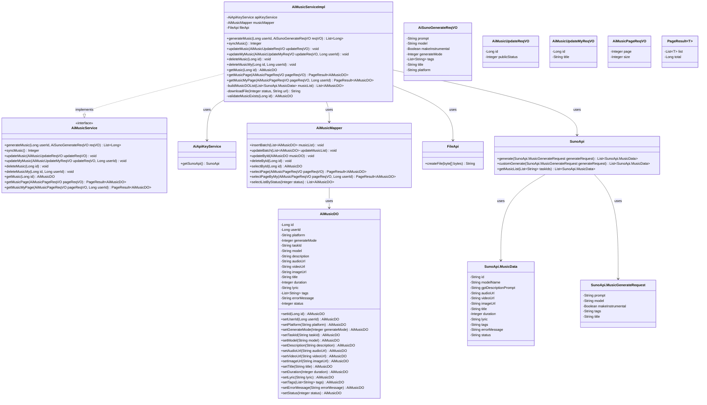

# 基础信息

|      |      |
|------|------|
| 编码语言 | .java |
| 代码路径 | yudao-module-ai/yudao-module-ai-biz/src/main/java/cn/iocoder/yudao/module/ai/service/music/AiMusicServiceImpl.java |
| 包名 | cn.iocoder.yudao.module.ai.service.music |
| 依赖项 | ['cn.hutool.core.collection.CollUtil', 'cn.hutool.core.text.StrPool', 'cn.hutool.core.util.ObjUtil', 'cn.hutool.core.util.ObjectUtil', 'cn.hutool.core.util.StrUtil', 'cn.hutool.http.HttpUtil', 'cn.iocoder.yudao.framework.ai.core.model.suno.api.SunoApi', 'cn.iocoder.yudao.framework.common.pojo.PageResult', 'cn.iocoder.yudao.module.ai.controller.admin.music.vo.AiMusicPageReqVO', 'cn.iocoder.yudao.module.ai.controller.admin.music.vo.AiMusicUpdateMyReqVO', 'cn.iocoder.yudao.module.ai.controller.admin.music.vo.AiMusicUpdateReqVO', 'cn.iocoder.yudao.module.ai.controller.admin.music.vo.AiSunoGenerateReqVO', 'cn.iocoder.yudao.module.ai.dal.dataobject.music.AiMusicDO', 'cn.iocoder.yudao.module.ai.dal.mysql.music.AiMusicMapper', 'cn.iocoder.yudao.module.ai.enums.music.AiMusicGenerateModeEnum', 'cn.iocoder.yudao.module.ai.enums.music.AiMusicStatusEnum', 'cn.iocoder.yudao.module.ai.service.model.AiApiKeyService', 'cn.iocoder.yudao.module.infra.api.file.FileApi', 'jakarta.annotation.Resource', 'lombok.extern.slf4j.Slf4j', 'org.springframework.stereotype.Service', 'org.springframework.transaction.annotation.Transactional', 'java.util', 'cn.iocoder.yudao.framework.common.exception.util.ServiceExceptionUtil.exception', 'cn.iocoder.yudao.framework.common.util.collection.CollectionUtils.convertList', 'cn.iocoder.yudao.framework.common.util.collection.CollectionUtils.convertMap', 'cn.iocoder.yudao.module.ai.enums.ErrorCodeConstants.IMAGE_NOT_EXISTS', 'cn.iocoder.yudao.module.ai.enums.ErrorCodeConstants.MUSIC_NOT_EXISTS'] |
| 概述说明 | AiMusicServiceImpl类实现AiMusicService接口，提供音乐生成、同步、更新、删除和查询功能。通过SunoApi生成音乐，支持描述和歌词模式，生成后插入数据库。同步功能更新任务状态，支持批量处理。更新和删除操作需校验音乐存在性，查询功能支持分页和个性化查询。生成音乐后，音频文件上传至文件服务器。 |

# 说明

AiMusicServiceImpl类实现了AiMusicService接口，提供了音乐生成、同步、更新、删除和查询等功能。在音乐生成方面，该类通过SunoApi生成音乐，支持两种模式：描述模式和歌词模式。生成后的音乐数据会被插入到数据库中。同步功能主要用于更新音乐任务的状态，并且支持批量处理，以提高效率。在进行更新和删除操作时，系统会先校验音乐是否存在，确保操作的准确性和安全性。查询功能则支持分页和用户个性化查询，方便用户根据需求检索音乐数据。此外，生成音乐后，音频文件会被上传至文件服务器，以便后续的存储和访问。整体上，AiMusicServiceImpl类通过集成多种功能，实现了音乐生成与管理的全流程自动化，提升了系统的可用性和用户体验。

# 类列表 Class Summary

| 名称   | 类型  | 说明 |
|-------|------|-------------|
| AiMusicServiceImpl | class | AiMusicServiceImpl类实现了AiMusicService接口，提供音乐生成、同步、更新、删除和查询功能。通过SunoApi生成音乐，支持描述和歌词两种模式，生成后插入数据库。同步功能用于更新音乐任务状态，支持批量处理。更新和删除操作需校验音乐存在性，查询功能支持分页和用户个性化查询。生成音乐后，音频文件会上传至文件服务器。 |

## 类 AiMusicServiceImpl

|      |      |
|------|------|
| 访问范围 | @Service;@Slf4j;public |
| 类型 | class |
| 名称 | AiMusicServiceImpl |
| 说明 | AiMusicServiceImpl类实现了AiMusicService接口，提供音乐生成、同步、更新、删除和查询功能。通过SunoApi生成音乐，支持描述和歌词两种模式，生成后插入数据库。同步功能用于更新音乐任务状态，支持批量处理。更新和删除操作需校验音乐存在性，查询功能支持分页和用户个性化查询。生成音乐后，音频文件会上传至文件服务器。 |

### UML类图

### 描述信息：
该UML类图展示了`AiMusicServiceImpl`类如何实现`AiMusicService`接口，并通过依赖关系使用`AiApiKeyService`、`AiMusicMapper`、`FileApi`和`SunoApi`等类。图中还展示了`AiMusicDO`、`AiSunoGenerateReqVO`等数据类，以及`SunoApi.MusicData`和`SunoApi.MusicGenerateRequest`等内部类的关系。

### 内部方法调用关系图

### 描述信息：
该图展示了`AiMusicServiceImpl`类中各个方法之间的调用关系。`AiMusicServiceImpl`依赖于`apiKeyService`、`musicMapper`和`fileApi`，并通过这些服务完成音乐生成、同步、更新、删除等操作。每个方法调用关系清晰，确保了代码的可维护性和可读性。

### 字段列表 Field List

| 名称  | 类型  | 说明 |
|-------|-------|------|
| apiKeyService | AiApiKeyService | 在代码中，通过@Resource注解注入了一个名为apiKeyService的AiApiKeyService实例，用于管理和操作API密钥相关的功能。 |
| fileApi | FileApi | 在代码中，使用了`@Resource`注解将`FileApi`接口注入到当前类中，以便调用其功能。 |
| musicMapper | AiMusicMapper | 在代码中，使用@Resource注解将AiMusicMapper类型的musicMapper对象注入到当前类中，以便后续操作和访问数据库。 |

### 方法列表 Method List

| 名称  | 类型  | 说明 |
|-------|-------|------|
| updateMusic | void | 该方法用于更新音乐信息，首先校验音乐是否存在，然后通过音乐ID更新其公开状态。 |
| getMusic | AiMusicDO | 该方法通过传入的ID从数据库中查询并返回对应的音乐数据对象。 |
| deleteMusic | void | 该方法用于删除音乐，首先校验音乐是否存在，然后通过音乐映射器根据ID删除音乐。 |
| deleteMusicMy | void | 该方法用于删除用户自己的音乐记录。首先校验音乐是否存在，若存在且用户ID匹配，则删除该音乐记录；否则抛出异常。 |
| updateMyMusic | void | 该方法用于更新用户音乐信息，首先校验音乐是否存在，若存在且用户ID匹配，则更新音乐标题；否则抛出音乐不存在的异常。 |
| getMusicPage | PageResult<AiMusicDO> | 该方法通过传入的AiMusicPageReqVO对象调用musicMapper的selectPage方法，返回一个包含AiMusicDO对象的PageResult分页结果。 |
| validateMusicExists | AiMusicDO | 该方法通过ID查询音乐数据，若不存在则抛出异常，存在则返回音乐对象。 |
| downloadFile | String | 该方法用于下载文件，首先检查URL是否为空或状态不等于成功状态，若满足条件则直接返回URL。否则尝试下载文件字节数据并创建文件，若下载失败则记录错误日志并返回原始URL。 |
| generateMusic | List<Long> | 该方法根据用户请求生成音乐，支持描述模式和歌词模式。首先调用Suno API生成音乐数据，然后根据生成模式构建请求并调用相应API。生成的数据插入数据库，并返回生成的音乐ID列表。若生成模式未知，抛出异常。 |
| getMusicMyPage | PageResult<AiMusicDO> | 该方法 `getMusicMyPage` 接受 `AiMusicPageReqVO` 和 `userId` 作为参数，调用 `musicMapper.selectPageByMy` 方法查询用户相关的音乐分页数据，并返回 `PageResult<AiMusicDO>` 类型的结果。 |
| syncMusic | Integer | 该方法用于同步音乐任务，首先查询状态为进行中的任务列表，若无任务则返回0。若有任务，则分批处理，每批最多36个任务，通过Suno API获取音乐数据。若获取失败则记录日志，成功则更新任务进度并批量更新数据库。最后返回处理的任务总数。 |
| buildMusicDOList | List<AiMusicDO> | 该方法将`SunoApi.MusicData`列表转换为`AiMusicDO`列表，根据`musicData`的状态设置`status`，并填充`AiMusicDO`对象的各项属性，包括任务ID、模型名称、描述、音频URL、视频URL、图片URL、标题、时长、歌词、标签、错误信息和状态。 |

