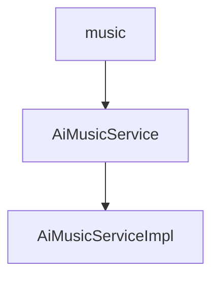

# 基础信息

|      |      |
|------|------|
| 编码语言 | .java |
| 代码路径 | yudao-module-ai/yudao-module-ai-biz/src/main/java/cn/iocoder/yudao/module/ai/service/music |
| 包名 | cn.iocoder.yudao.module.ai.service.music |
| 概述说明 | AiMusicServiceImpl类实现了AiMusicService接口，提供音乐生成、同步、更新、删除和查询功能。音乐生成通过SunoApi支持描述和歌词模式，生成后数据存入数据库。同步功能支持批量更新任务状态，更新和删除操作前校验音乐存在性。查询功能支持分页和个性化检索。生成音乐后音频文件上传至文件服务器，实现全流程自动化管理，提升系统可用性和用户体验。 |

# 说明

AiMusicServiceImpl类实现了AiMusicService接口，提供了音乐生成、同步、更新、删除和查询等核心功能。在音乐生成方面，该类通过SunoApi生成音乐，支持两种模式：描述模式和歌词模式。生成后的音乐数据会被自动插入到数据库中，确保数据的持久化存储。同步功能主要用于更新音乐任务的状态，并且支持批量处理，以提高系统的处理效率。在进行更新和删除操作时，系统会先校验音乐是否存在，确保操作的准确性和安全性，避免对不存在的音乐数据进行操作。查询功能支持分页和用户个性化查询，用户可以根据自己的需求灵活检索音乐数据，提升了用户体验。此外，生成音乐后，音频文件会被上传至文件服务器，以便后续的存储和访问，确保音频文件的可用性和可管理性。整体上，AiMusicServiceImpl类通过集成多种功能，实现了音乐生成与管理的全流程自动化，提升了系统的可用性和用户体验。

### 包内部结构视图

### 描述信息：
该图展示了`music`文件夹中的两个Java文件之间的调用关系。`AiMusicService`接口被`AiMusicServiceImpl`类实现，两者都位于`music`文件夹下。图中清晰地展示了接口与实现类之间的依赖关系。

# 文件列表 File List

| 名称   | 类型  | 说明 |
|-------|------|-------------|
| [AiMusicService.java](AiMusicService.md) | file | 请提供需要总结的具体内容，以便我为您生成一个简洁的概要说明。 |
| [AiMusicServiceImpl.java](AiMusicServiceImpl.md) | file | AiMusicServiceImpl类实现AiMusicService接口，提供音乐生成、同步、更新、删除和查询功能。通过SunoApi生成音乐，支持描述和歌词模式，生成后插入数据库。同步功能更新任务状态，支持批量处理。更新和删除操作需校验音乐存在性，查询功能支持分页和个性化查询。生成音乐后，音频文件上传至文件服务器。 |

