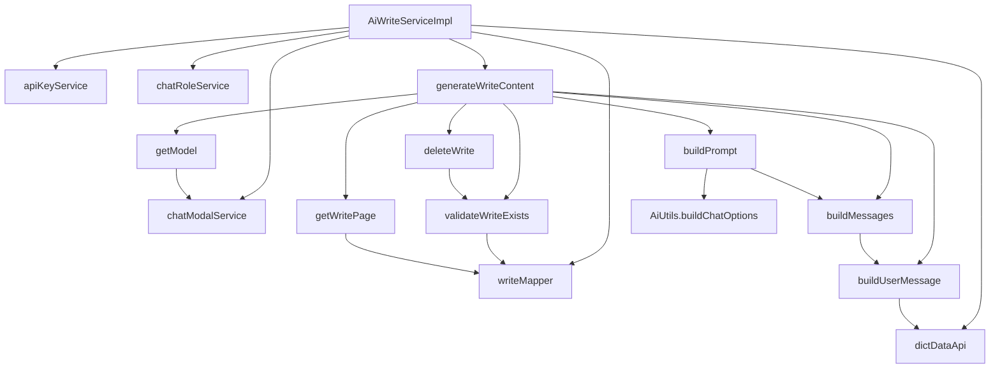

# 基础信息

|      |      |
|------|------|
| 编码语言 | .java |
| 代码路径 | yudao-module-ai/yudao-module-ai-biz/src/main/java/cn/iocoder/yudao/module/ai/service/write/AiWriteServiceImpl.java |
| 包名 | cn.iocoder.yudao.module.ai.service.write |
| 依赖项 | ['cn.hutool.core.collection.CollUtil', 'cn.hutool.core.lang.Assert', 'cn.hutool.core.util.StrUtil', 'cn.iocoder.yudao.framework.ai.core.enums.AiPlatformEnum', 'cn.iocoder.yudao.framework.ai.core.util.AiUtils', 'cn.iocoder.yudao.framework.common.pojo.CommonResult', 'cn.iocoder.yudao.framework.common.pojo.PageResult', 'cn.iocoder.yudao.framework.common.util.object.BeanUtils', 'cn.iocoder.yudao.framework.tenant.core.util.TenantUtils', 'cn.iocoder.yudao.module.ai.controller.admin.write.vo.AiWriteGenerateReqVO', 'cn.iocoder.yudao.module.ai.controller.admin.write.vo.AiWritePageReqVO', 'cn.iocoder.yudao.module.ai.dal.dataobject.model.AiChatModelDO', 'cn.iocoder.yudao.module.ai.dal.dataobject.model.AiChatRoleDO', 'cn.iocoder.yudao.module.ai.dal.dataobject.write.AiWriteDO', 'cn.iocoder.yudao.module.ai.dal.mysql.write.AiWriteMapper', 'cn.iocoder.yudao.module.ai.enums.AiChatRoleEnum', 'cn.iocoder.yudao.module.ai.enums.DictTypeConstants', 'cn.iocoder.yudao.module.ai.enums.ErrorCodeConstants', 'cn.iocoder.yudao.module.ai.enums.write.AiWriteTypeEnum', 'cn.iocoder.yudao.module.ai.service.model.AiApiKeyService', 'cn.iocoder.yudao.module.ai.service.model.AiChatModelService', 'cn.iocoder.yudao.module.ai.service.model.AiChatRoleService', 'cn.iocoder.yudao.module.system.api.dict.DictDataApi', 'jakarta.annotation.Resource', 'lombok.extern.slf4j.Slf4j', 'org.springframework.ai.chat.messages.Message', 'org.springframework.ai.chat.messages.SystemMessage', 'org.springframework.ai.chat.messages.UserMessage', 'org.springframework.ai.chat.model.ChatResponse', 'org.springframework.ai.chat.model.StreamingChatModel', 'org.springframework.ai.chat.prompt.ChatOptions', 'org.springframework.ai.chat.prompt.Prompt', 'org.springframework.stereotype.Service', 'reactor.core.publisher.Flux', 'java.util.ArrayList', 'java.util.List', 'java.util.Objects', 'cn.iocoder.yudao.framework.common.exception.util.ServiceExceptionUtil.exception', 'cn.iocoder.yudao.framework.common.pojo.CommonResult.error', 'cn.iocoder.yudao.framework.common.pojo.CommonResult.success', 'cn.iocoder.yudao.module.ai.enums.ErrorCodeConstants.WRITE_NOT_EXISTS'] |
| 概述说明 | AiWriteServiceImpl类实现AiWriteService接口，负责生成和处理写作数据。通过获取模型、构建Prompt、调用流式API生成内容并存储到数据库，支持删除和分页查询记录。依赖AiApiKeyService、AiChatModelService、AiChatRoleService和AiWriteMapper等关键服务。 |

# 说明

AiWriteServiceImpl类实现了AiWriteService接口，主要功能是生成写作内容并处理相关的写作数据。该类通过获取写作模型、构建Prompt、调用流式API来生成内容，并将生成的结果存储到数据库中。此外，该类还支持删除和分页查询写作记录的功能。为了实现这些功能，AiWriteServiceImpl类依赖了多个关键服务，包括AiApiKeyService、AiChatModelService、AiChatRoleService和AiWriteMapper等。这些依赖服务分别负责处理API密钥、聊天模型、聊天角色以及数据映射等任务，共同协作以完成写作内容的生成和数据处理。

# 类列表 Class Summary

| 名称   | 类型  | 说明 |
|-------|------|-------------|
| AiWriteServiceImpl | class | AiWriteServiceImpl类实现了AiWriteService接口，主要功能包括生成写作内容和处理写作数据。通过获取写作模型、构建Prompt、调用流式API生成内容，并将结果存储到数据库。支持删除和分页查询写作记录。关键依赖包括AiApiKeyService、AiChatModelService、AiChatRoleService和AiWriteMapper等。 |

## 类 AiWriteServiceImpl

|      |      |
|------|------|
| 访问范围 | @Service;@Slf4j;public |
| 类型 | class |
| 名称 | AiWriteServiceImpl |
| 说明 | AiWriteServiceImpl类实现了AiWriteService接口，主要功能包括生成写作内容和处理写作数据。通过获取写作模型、构建Prompt、调用流式API生成内容，并将结果存储到数据库。支持删除和分页查询写作记录。关键依赖包括AiApiKeyService、AiChatModelService、AiChatRoleService和AiWriteMapper等。 |

### UML类图

```mermaid
classDiagram
    class AiWriteServiceImpl {
        +generateWriteContent(AiWriteGenerateReqVO generateReqVO, Long userId) Flux~CommonResult~String~~
        +deleteWrite(Long id) void
        +getWritePage(AiWritePageReqVO pageReqVO) PageResult~AiWriteDO~
        -getModel(AiChatRoleDO writeRole) AiChatModelDO
        -buildPrompt(AiWriteGenerateReqVO generateReqVO, AiChatModelDO model, String systemMessage) Prompt
        -buildMessages(AiWriteGenerateReqVO generateReqVO, String systemMessage) List~Message~
        -buildUserMessage(AiWriteGenerateReqVO generateReqVO) String
        -validateWriteExists(Long id) void
    }

    class AiWriteService {
        <<interface>>
        +generateWriteContent(AiWriteGenerateReqVO generateReqVO, Long userId) Flux~CommonResult~String~~
        +deleteWrite(Long id) void
        +getWritePage(AiWritePageReqVO pageReqVO) PageResult~AiWriteDO~
    }

    class AiApiKeyService {
        +getChatModel(Long keyId) StreamingChatModel
    }

    class AiChatModelService {
        +getChatModel(Long modelId) AiChatModelDO
        +getRequiredDefaultChatModel() AiChatModelDO
    }

    class AiChatRoleService {
        +getChatRoleListByName(String name) List~AiChatRoleDO~
    }

    class DictDataApi {
        +getDictDataLabel(String dictType, String dictValue) String
    }

    class AiWriteMapper {
        +insert(AiWriteDO writeDO) int
        +updateById(AiWriteDO writeDO) int
        +deleteById(Long id) int
        +selectById(Long id) AiWriteDO
        +selectPage(AiWritePageReqVO pageReqVO) PageResult~AiWriteDO~
    }

    class AiWriteDO {
        +Long id
        +Long userId
        +String platform
        +String model
        +String generatedContent
        +String errorMessage
    }

    class AiWriteGenerateReqVO {
        +String format
        +String tone
        +String language
        +String length
        +String prompt
        +String type
        +String originalContent
    }

    class AiWritePageReqVO {
        +String format
        +String tone
        +String language
        +String length
        +String prompt
        +String type
        +String originalContent
    }

    class AiChatRoleDO {
        +Long modelId
        +String systemMessage
    }

    class AiChatModelDO {
        +String platform
        +String model
        +String temperature
        +String maxTokens
        +Long keyId
    }

    class Prompt {
        +List~Message~ chatMessages
        +ChatOptions options
    }

    class Message {
        <<interface>>
    }

    class SystemMessage {
        +String content
    }

    class UserMessage {
        +String content
    }

    class ChatOptions {
        +String platform
        +String model
        +String temperature
        +String maxTokens
    }

    class ChatResponse {
        +ChatResult result
    }

    class ChatResult {
        +ChatOutput output
    }

    class ChatOutput {
        +String content
    }

    class CommonResult~T~ {
        +T data
        +String message
        +int code
    }

    class PageResult~T~ {
        +List~T~ list
        +Long total
    }

    AiWriteServiceImpl ..|> AiWriteService : implements
    AiWriteServiceImpl --> AiApiKeyService : depends
    AiWriteServiceImpl --> AiChatModelService : depends
    AiWriteServiceImpl --> AiChatRoleService : depends
    AiWriteServiceImpl --> DictDataApi : depends
    AiWriteServiceImpl --> AiWriteMapper : depends
    AiWriteServiceImpl --> AiWriteDO : creates
    AiWriteServiceImpl --> AiWriteGenerateReqVO : uses
    AiWriteServiceImpl --> AiWritePageReqVO : uses
    AiWriteServiceImpl --> AiChatRoleDO : uses
    AiWriteServiceImpl --> AiChatModelDO : uses
    AiWriteServiceImpl --> Prompt : creates
    AiWriteServiceImpl --> Message : uses
    AiWriteServiceImpl --> SystemMessage : creates
    AiWriteServiceImpl --> UserMessage : creates
    AiWriteServiceImpl --> ChatOptions : creates
    AiWriteServiceImpl --> ChatResponse : uses
    AiWriteServiceImpl --> CommonResult~String~ : returns
    AiWriteServiceImpl --> PageResult~AiWriteDO~ : returns
    Prompt --> Message : contains
    Prompt --> ChatOptions : contains
    ChatResponse --> ChatResult : contains
    ChatResult --> ChatOutput : contains
    CommonResult~T~ --> T : contains
    PageResult~T~ --> T : contains
```

### 描述信息：
该UML类图展示了`AiWriteServiceImpl`类与其依赖的其他类之间的关系。`AiWriteServiceImpl`实现了`AiWriteService`接口，并依赖于多个服务类如`AiApiKeyService`、`AiChatModelService`等。它还使用了多个数据对象如`AiWriteDO`、`AiWriteGenerateReqVO`等，并通过`AiWriteMapper`与数据库进行交互。类图展示了类之间的依赖、实现和关联关系。

### 内部方法调用关系图

### 描述信息：
该图展示了`AiWriteServiceImpl`类中各个方法之间的调用关系。`generateWriteContent`是核心方法，调用了`getModel`、`buildPrompt`、`buildMessages`和`buildUserMessage`等方法来完成写作内容的生成。`deleteWrite`和`getWritePage`方法分别用于删除和分页查询写作内容，依赖于`writeMapper`进行数据库操作。

### 字段列表 Field List

| 名称  | 类型  | 说明 |
|-------|-------|------|
| writeMapper | AiWriteMapper | 在代码中，通过@Resource注解注入了一个名为writeMapper的AiWriteMapper对象，用于数据访问和操作。 |
| dictDataApi | DictDataApi | 在代码中，通过@Resource注解注入了一个名为dictDataApi的私有变量，该变量类型为DictDataApi。 |
| chatRoleService | AiChatRoleService | 在代码中，通过@Resource注解将AiChatRoleService注入到当前类中，以便使用其功能。 |
| chatModalService | AiChatModelService | 在代码中，通过@Resource注解将AiChatModelService注入为chatModalService，用于后续的依赖管理和使用。 |
| apiKeyService | AiApiKeyService | 在代码中，通过@Resource注解将AiApiKeyService注入到当前类中，以便使用其功能。 |

### 方法列表 Method List

| 名称  | 类型  | 说明 |
|-------|-------|------|
| deleteWrite | void | 该方法用于删除指定ID的写入记录。首先校验记录是否存在，若存在则通过`writeMapper`的`deleteById`方法删除该记录。 |
| validateWriteExists | void | 方法validateWriteExists用于验证指定ID的记录是否存在。若通过writeMapper查询不到该ID的记录，则抛出WRITE_NOT_EXISTS异常。 |
| buildMessages | List<Message> | 该方法用于构建消息列表，首先检查系统消息是否为空，若不为空则添加系统消息，然后添加用户输入消息，最后返回包含系统消息和用户消息的列表。 |
| getWritePage | PageResult<AiWriteDO> | 该方法 `getWritePage` 接受一个 `AiWritePageReqVO` 类型的参数 `pageReqVO`，并调用 `writeMapper.selectPage` 方法返回 `PageResult<AiWriteDO>` 类型的分页结果。 |
| buildUserMessage | String | 该方法根据传入的生成请求对象，获取格式、语气、语言和长度等参数，并根据请求类型（写作或回复）格式化生成相应的提示信息。如果是写作类型，使用提示内容格式化；如果是回复类型，则结合原始内容和提示内容进行格式化。 |
| getModel | AiChatModelDO | 该方法根据传入的`writeRole`对象获取对应的AI聊天模型。如果`writeRole`或其`modelId`为空，或无法获取模型，则返回默认的聊天模型。若最终仍无法获取模型，则抛出异常提示“获取不到模型”。 |
| buildPrompt | Prompt | 该方法用于构建AI生成请求的提示信息，包括创建消息列表和配置选项对象。首先根据请求和系统消息生成消息列表，然后验证平台并构建包含模型、温度和最大令牌数的聊天选项，最后返回包含消息列表和选项的提示对象。 |
| generateWriteContent | Flux<CommonResult<String>> | 该方法用于生成写作内容，首先获取写作模型和角色设定消息，校验平台后插入写作信息。接着构建Prompt并调用流式聊天模型，实时返回生成内容并更新数据库。过程中处理异常并记录错误信息，最终返回流式响应结果。 |

