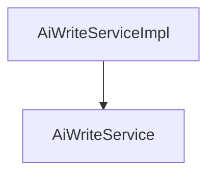

# 基础信息

|      |      |
|------|------|
| 编码语言 | .java |
| 代码路径 | yudao-module-ai/yudao-module-ai-biz/src/main/java/cn/iocoder/yudao/module/ai/service/write |
| 包名 | cn.iocoder.yudao.module.ai.service.write |
| 概述说明 | AiWriteServiceImpl类实现AiWriteService接口，负责生成写作内容并处理相关数据。通过获取模型、构建Prompt、调用API生成内容，并将结果存储至数据库。支持删除和分页查询写作记录。依赖AiApiKeyService、AiChatModelService、AiChatRoleService和AiWriteMapper等服务，分别处理API密钥、聊天模型、角色及数据映射，协作完成内容生成与数据处理。 |

# 说明

AiWriteServiceImpl类实现了AiWriteService接口，主要负责生成写作内容并处理相关的写作数据。该类通过获取写作模型、构建Prompt、调用流式API来生成内容，并将生成的结果存储到数据库中。此外，该类还支持删除和分页查询写作记录的功能。为了实现这些功能，AiWriteServiceImpl类依赖了多个关键服务，包括AiApiKeyService、AiChatModelService、AiChatRoleService和AiWriteMapper等。这些依赖服务分别负责处理API密钥、聊天模型、聊天角色以及数据映射等任务，共同协作以完成写作内容的生成和数据处理。通过这些依赖服务的协作，AiWriteServiceImpl类能够高效地生成写作内容，并对相关数据进行管理和查询。

### 包内部结构视图

### 描述信息：
该Mermaid图展示了`AiWriteServiceImpl`类与`AiWriteService`接口之间的调用关系。`AiWriteServiceImpl`实现了`AiWriteService`接口，因此图中使用箭头表示`AiWriteServiceImpl`调用`AiWriteService`。图形简洁明了，符合规范要求。

# 文件列表 File List

| 名称   | 类型  | 说明 |
|-------|------|-------------|
| [AiWriteService.java](AiWriteService.md) | file | 请提供需要总结的具体内容，以便我为您生成一个简洁的概要说明。 |
| [AiWriteServiceImpl.java](AiWriteServiceImpl.md) | file | AiWriteServiceImpl类实现AiWriteService接口，负责生成和处理写作数据。通过获取模型、构建Prompt、调用流式API生成内容并存储到数据库，支持删除和分页查询记录。依赖AiApiKeyService、AiChatModelService、AiChatRoleService和AiWriteMapper等关键服务。 |

