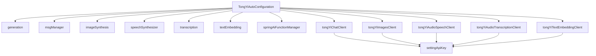

# 基础信息

|      |      |
|------|------|
| 编码语言 | .java |
| 代码路径 | yudao-module-ai/yudao-spring-boot-starter-ai/src/main/java/com/alibaba/cloud/ai/tongyi/TongYiAutoConfiguration.java |
| 包名 | com.alibaba.cloud.ai.tongyi |
| 依赖项 | ['com.alibaba.cloud.ai.tongyi.audio.speech.TongYiAudioSpeechModel', 'com.alibaba.cloud.ai.tongyi.audio.speech.TongYiAudioSpeechProperties', 'com.alibaba.cloud.ai.tongyi.audio.transcription.TongYiAudioTranscriptionModel', 'com.alibaba.cloud.ai.tongyi.audio.transcription.TongYiAudioTranscriptionProperties', 'com.alibaba.cloud.ai.tongyi.chat.TongYiChatModel', 'com.alibaba.cloud.ai.tongyi.chat.TongYiChatProperties', 'com.alibaba.cloud.ai.tongyi.common.constants.TongYiConstants', 'com.alibaba.cloud.ai.tongyi.common.exception.TongYiException', 'com.alibaba.cloud.ai.tongyi.embedding.TongYiTextEmbeddingModel', 'com.alibaba.cloud.ai.tongyi.embedding.TongYiTextEmbeddingProperties', 'com.alibaba.cloud.ai.tongyi.image.TongYiImagesModel', 'com.alibaba.cloud.ai.tongyi.image.TongYiImagesProperties', 'com.alibaba.dashscope.aigc.generation.Generation', 'com.alibaba.dashscope.aigc.imagesynthesis.ImageSynthesis', 'com.alibaba.dashscope.audio.asr.transcription.Transcription', 'com.alibaba.dashscope.audio.tts.SpeechSynthesizer', 'com.alibaba.dashscope.common.MessageManager', 'com.alibaba.dashscope.embeddings.TextEmbedding', 'com.alibaba.dashscope.exception.NoApiKeyException', 'com.alibaba.dashscope.utils.ApiKey', 'com.alibaba.dashscope.utils.Constants', 'org.springframework.ai.model.function.FunctionCallbackContext', 'org.springframework.boot.autoconfigure.AutoConfiguration', 'org.springframework.boot.autoconfigure.condition.ConditionalOnClass', 'org.springframework.boot.autoconfigure.condition.ConditionalOnMissingBean', 'org.springframework.boot.autoconfigure.condition.ConditionalOnProperty', 'org.springframework.boot.context.properties.EnableConfigurationProperties', 'org.springframework.context.ApplicationContext', 'org.springframework.context.annotation.Bean', 'org.springframework.context.annotation.Scope', 'java.util.Objects'] |
| 概述说明 | TongYiAutoConfiguration类是一个Spring自动配置类，用于配置多个TongYi模型（如聊天、图像、语音、文本嵌入等）。通过条件注解确保相关类存在时自动创建Bean，支持属性配置启用或禁用功能，API密钥可通过环境变量或配置文件设置，确保安全访问TongYi服务。 |

# 说明

TongYiAutoConfiguration类是一个用于Spring应用的自动配置类，其主要功能是配置多个TongYi模型，包括聊天、图像、语音和文本嵌入等。该类通过条件注解确保在相关类存在时自动创建相应的Bean，从而简化了应用的配置过程。此外，TongYiAutoConfiguration支持通过属性配置来启用或禁用特定功能，提供了灵活的配置选项。为了确保安全访问TongYi服务，API密钥可以通过环境变量或配置文件进行设置，这种方式既方便又安全，避免了硬编码密钥的风险。总的来说，TongYiAutoConfiguration类为Spring应用提供了便捷且安全的TongYi模型集成方案。

# 类列表 Class Summary

| 名称   | 类型  | 说明 |
|-------|------|-------------|
| TongYiAutoConfiguration | class | TongYiAutoConfiguration类是一个自动配置类，用于在Spring应用中配置多个TongYi模型（如聊天、图像、语音、文本嵌入等）。通过条件注解，确保相关类存在时自动创建Bean，并支持通过属性配置启用或禁用特定功能。API密钥可通过环境变量或配置文件设置，确保安全访问TongYi服务。 |

## 类 TongYiAutoConfiguration

|      |      |
|------|------|
| 访问范围 | @AutoConfiguration;@ConditionalOnClass({;		MessageManager.class,;		TongYiChatModel.class,;		TongYiImagesModel.class,;		TongYiAudioSpeechModel.class,;		TongYiTextEmbeddingModel.class,;		TongYiAudioTranscriptionModel.class;});@EnableConfigurationProperties({;		TongYiChatProperties.class,;		TongYiImagesProperties.class,;		TongYiAudioSpeechProperties.class,;		TongYiConnectionProperties.class,;		TongYiTextEmbeddingProperties.class,;		TongYiAudioTranscriptionProperties.class;});public |
| 类型 | class |
| 名称 | TongYiAutoConfiguration |
| 说明 | TongYiAutoConfiguration类是一个自动配置类，用于在Spring应用中配置多个TongYi模型（如聊天、图像、语音、文本嵌入等）。通过条件注解，确保相关类存在时自动创建Bean，并支持通过属性配置启用或禁用特定功能。API密钥可通过环境变量或配置文件设置，确保安全访问TongYi服务。 |

### UML类图

```mermaid
classDiagram
    class TongYiAutoConfiguration {
        +Generation generation()
        +MessageManager msgManager()
        +ImageSynthesis imageSynthesis()
        +SpeechSynthesizer speechSynthesizer()
        +Transcription transcription()
        +TextEmbedding textEmbedding()
        +FunctionCallbackContext springAiFunctionManager(ApplicationContext context)
        +TongYiChatModel tongYiChatClient(Generation generation, TongYiChatProperties chatOptions, TongYiConnectionProperties connectionProperties)
        +TongYiImagesModel tongYiImagesClient(ImageSynthesis imageSynthesis, TongYiImagesProperties imagesOptions, TongYiConnectionProperties connectionProperties)
        +TongYiAudioSpeechModel tongYiAudioSpeechClient(SpeechSynthesizer speechSynthesizer, TongYiAudioSpeechProperties speechProperties, TongYiConnectionProperties connectionProperties)
        +TongYiAudioTranscriptionModel tongYiAudioTranscriptionClient(Transcription transcription, TongYiAudioTranscriptionProperties transcriptionProperties, TongYiConnectionProperties connectionProperties)
        +TongYiTextEmbeddingModel tongYiTextEmbeddingClient(TextEmbedding textEmbedding, TongYiConnectionProperties connectionProperties)
        -void settingApiKey(TongYiConnectionProperties connectionProperties)
    }

    class Generation {
        +Generation()
    }

    class MessageManager {
        +MessageManager(int capacity)
    }

    class ImageSynthesis {
        +ImageSynthesis()
    }

    class SpeechSynthesizer {
        +SpeechSynthesizer()
    }

    class Transcription {
        +Transcription()
    }

    class TextEmbedding {
        +TextEmbedding()
    }

    class FunctionCallbackContext {
        +void setApplicationContext(ApplicationContext context)
    }

    class TongYiChatModel {
        +TongYiChatModel(Generation generation, ChatOptions options)
    }

    class TongYiImagesModel {
        +TongYiImagesModel(ImageSynthesis imageSynthesis, ImagesOptions options)
    }

    class TongYiAudioSpeechModel {
        +TongYiAudioSpeechModel(SpeechSynthesizer speechSynthesizer, SpeechOptions options)
    }

    class TongYiAudioTranscriptionModel {
        +TongYiAudioTranscriptionModel(TranscriptionOptions options, Transcription transcription)
    }

    class TongYiTextEmbeddingModel {
        +TongYiTextEmbeddingModel(TextEmbedding textEmbedding)
    }

    class TongYiChatProperties {
        +ChatOptions getOptions()
    }

    class TongYiImagesProperties {
        +ImagesOptions getOptions()
    }

    class TongYiAudioSpeechProperties {
        +SpeechOptions getOptions()
    }

    class TongYiAudioTranscriptionProperties {
        +TranscriptionOptions getOptions()
    }

    class TongYiConnectionProperties {
        +String getApiKey()
    }

    TongYiAutoConfiguration --> Generation : creates
    TongYiAutoConfiguration --> MessageManager : creates
    TongYiAutoConfiguration --> ImageSynthesis : creates
    TongYiAutoConfiguration --> SpeechSynthesizer : creates
    TongYiAutoConfiguration --> Transcription : creates
    TongYiAutoConfiguration --> TextEmbedding : creates
    TongYiAutoConfiguration --> FunctionCallbackContext : creates
    TongYiAutoConfiguration --> TongYiChatModel : creates
    TongYiAutoConfiguration --> TongYiImagesModel : creates
    TongYiAutoConfiguration --> TongYiAudioSpeechModel : creates
    TongYiAutoConfiguration --> TongYiAudioTranscriptionModel : creates
    TongYiAutoConfiguration --> TongYiTextEmbeddingModel : creates
    TongYiAutoConfiguration ..> TongYiChatProperties : depends on
    TongYiAutoConfiguration ..> TongYiImagesProperties : depends on
    TongYiAutoConfiguration ..> TongYiAudioSpeechProperties : depends on
    TongYiAutoConfiguration ..> TongYiAudioTranscriptionProperties : depends on
    TongYiAutoConfiguration ..> TongYiConnectionProperties : depends on
```

### 描述信息：
该UML类图展示了`TongYiAutoConfiguration`类及其依赖的多个类和接口。`TongYiAutoConfiguration`类通过`@Bean`注解创建了多个Bean实例，并依赖于多个属性类（如`TongYiChatProperties`、`TongYiImagesProperties`等）来配置这些Bean。每个Bean类都有相应的构造函数和方法，用于初始化和管理其状态。

### 内部方法调用关系图

### 描述信息：
该图展示了`TongYiAutoConfiguration`类中各个Bean方法之间的调用关系。`TongYiAutoConfiguration`类通过`@Bean`注解创建了多个Bean实例，如`generation`、`msgManager`等。这些Bean实例在创建过程中调用了`settingApiKey`方法来设置API密钥。每个客户端（如`tongYiChatClient`、`tongYiImagesClient`等）都依赖于`settingApiKey`方法来确保API密钥的正确配置。

### 字段列表 Field List

| 名称  | 类型  | 说明 |
|-------|-------|------|

### 方法列表 Method List

| 名称  | 类型  | 说明 |
|-------|-------|------|
| transcription | Transcription | 该代码片段定义了一个Spring Bean，名为"transcription"，当容器中不存在该类型的Bean时，会自动创建一个新的Transcription实例并返回。 |
| settingApiKey | void | 该方法用于设置API密钥，优先从环境变量中获取，若未定义则从连接属性中获取，最后尝试通过ApiKey类获取。若均未成功，则抛出异常。 |
| textEmbedding | TextEmbedding | 在Spring框架中，使用`@Bean`注解定义了一个`TextEmbedding`类型的Bean，并通过`@ConditionalOnMissingBean`条件注解确保仅当上下文中不存在相同类型的Bean时才会创建该Bean。 |
| msgManager | MessageManager | 该代码定义了一个名为`msgManager`的Spring Bean，作用域为原型（prototype），仅在缺少该类型Bean时创建。该Bean返回一个初始容量为10的`MessageManager`实例。 |
| generation | Generation | 该代码片段定义了一个Spring Bean，名为`generation`，其作用域为`prototype`，表示每次请求时都会创建一个新的实例。该Bean的创建条件是当前上下文中不存在同类型的Bean（通过`@ConditionalOnMissingBean`注解实现）。 |
| imageSynthesis | ImageSynthesis | 该代码片段定义了一个名为`imageSynthesis`的Bean，其作用域为`prototype`，表示每次请求都会创建一个新的实例。该Bean的创建条件是当容器中不存在同类型的Bean时才会生效。`ImageSynthesis`是一个自定义类，用于图像合成功能。 |
| springAiFunctionManager | FunctionCallbackContext | 该代码片段定义了一个Spring Bean，名为`springAiFunctionManager`，使用`@ConditionalOnMissingBean`注解确保在没有其他相同类型的Bean时才会创建。该Bean是一个`FunctionCallbackContext`实例，并通过`setApplicationContext`方法设置其应用上下文。 |
| speechSynthesizer | SpeechSynthesizer | 该代码片段定义了一个名为`speechSynthesizer`的Bean，使用`@Scope("prototype")`指定其为原型作用域，每次请求时生成新实例。`@ConditionalOnMissingBean`确保仅在上下文中不存在相同类型的Bean时才会创建该Bean。返回类型为`SpeechSynthesizer`的新实例。 |
| tongYiImagesClient | TongYiImagesModel | 该代码片段定义了一个名为`tongYiImagesClient`的Bean，其创建条件为配置属性`TongYiImagesProperties.CONFIG_PREFIX.enabled`为`true`或未配置时默认启用。该Bean依赖于`ImageSynthesis`、`TongYiImagesProperties`和`TongYiConnectionProperties`三个组件，并通过`settingApiKey`方法设置API密钥，最终返回一个`TongYiImagesModel`实例。 |
| tongYiTextEmbeddingClient | TongYiTextEmbeddingModel | 该代码片段定义了一个名为`tongYiTextEmbeddingClient`的Bean，其创建条件依赖于配置属性`TongYiTextEmbeddingProperties.CONFIG_PREFIX.enabled`是否为`true`，默认情况下为`true`。该Bean依赖于`TextEmbedding`和`TongYiConnectionProperties`两个参数，并通过`settingApiKey`方法设置API密钥，最终返回一个`TongYiTextEmbeddingModel`实例。 |
| tongYiChatClient | TongYiChatModel | 该代码片段定义了一个名为`TongYiChatModel`的Bean，其创建条件依赖于配置属性`TongYiChatProperties.CONFIG_PREFIX.enabled`，默认值为`true`。Bean的创建需要`Generation`、`TongYiChatProperties`和`TongYiConnectionProperties`三个参数，并在初始化时调用`settingApiKey`方法设置API密钥，最终返回一个包含`generation`和`chatOptions`的`TongYiChatModel`实例。 |
| tongYiAudioSpeechClient | TongYiAudioSpeechModel | 该代码片段定义了一个Spring Bean `TongYiAudioSpeechModel`，其创建依赖于配置属性`TongYiAudioSpeechProperties`中的`enabled`属性是否为`true`。如果未配置该属性，默认视为`true`。Bean的创建需要`SpeechSynthesizer`、`TongYiAudioSpeechProperties`和`TongYiConnectionProperties`三个参数，并在初始化时设置API密钥。最终返回一个包含`speechSynthesizer`和`speechProperties`选项的`TongYiAudioSpeechModel`实例。 |
| tongYiAudioTranscriptionClient | TongYiAudioTranscriptionModel | 该代码片段定义了一个Spring Bean，名为`tongYiAudioTranscriptionClient`，其创建条件为配置属性`TongYiAudioTranscriptionProperties.CONFIG_PREFIX.enabled`为`true`或未设置时默认为`true`。该Bean依赖于`Transcription`、`TongYiAudioTranscriptionProperties`和`TongYiConnectionProperties`三个参数，并通过`settingApiKey`方法设置API密钥，最终返回一个`TongYiAudioTranscriptionModel`实例，该实例使用`transcriptionProperties`的选项和`transcription`进行初始化。 |

