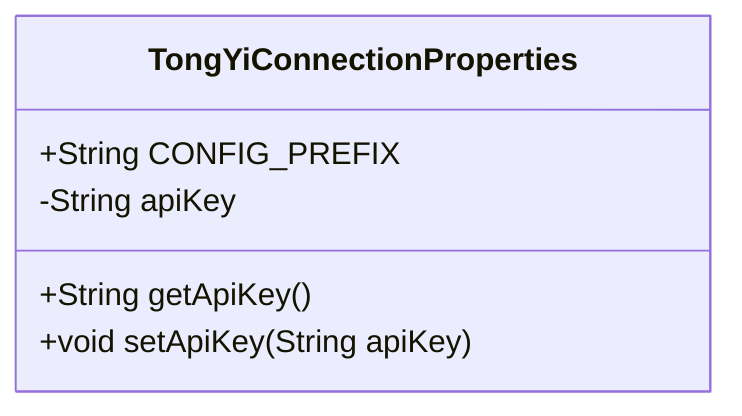
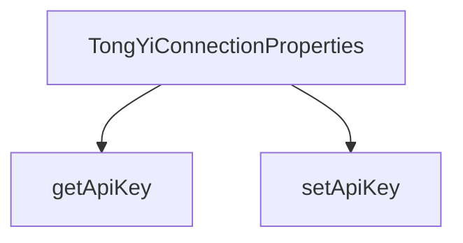

# 基础信息

|      |      |
|------|------|
| 编码语言 | .java |
| 代码路径 | yudao-module-ai/yudao-spring-boot-starter-ai/src/main/java/com/alibaba/cloud/ai/tongyi/TongYiConnectionProperties.java |
| 包名 | com.alibaba.cloud.ai.tongyi |
| 依赖项 | ['org.springframework.boot.context.properties.ConfigurationProperties', 'com.alibaba.cloud.ai.tongyi.common.constants.TongYiConstants.SCA_AI_CONFIGURATION'] |
| 概述说明 | TongYiConnectionProperties类用于配置Spring Cloud Alibaba AI与TongYi LLM的连接，提供API密钥的设置和获取方法，配置前缀为SCA_AI_CONFIGURATION + "tongyi"。 |

# 说明

TongYiConnectionProperties类是用于配置Spring Cloud Alibaba AI与TongYi LLM（大语言模型）连接的工具。该类的主要功能是管理和设置与TongYi LLM进行通信所需的API密钥。通过该类，用户可以方便地配置和获取API密钥，以确保与TongYi LLM的连接能够顺利进行。此外，该类的配置前缀为SCA_AI_CONFIGURATION加上"tongyi"，这意味着在Spring Boot的配置文件中，相关的配置项将以这个前缀开头，便于统一管理和识别。通过这种方式，开发者可以轻松地在Spring Cloud Alibaba AI项目中集成TongYi LLM，并确保连接的安全性。

# 类列表 Class Summary

| 名称   | 类型  | 说明 |
|-------|------|-------------|
| TongYiConnectionProperties | class | TongYiConnectionProperties类用于配置Spring Cloud Alibaba AI与TongYi LLM的连接，包含API密钥的设置和获取方法，配置前缀为SCA_AI_CONFIGURATION + "tongyi"。 |

## 类 TongYiConnectionProperties

|      |      |
|------|------|
| 访问范围 | @ConfigurationProperties(TongYiConnectionProperties.CONFIG_PREFIX);public |
| 类型 | class |
| 名称 | TongYiConnectionProperties |
| 说明 | TongYiConnectionProperties类用于配置Spring Cloud Alibaba AI与TongYi LLM的连接，包含API密钥的设置和获取方法，配置前缀为SCA_AI_CONFIGURATION + "tongyi"。 |

### UML类图

### 描述信息：
该UML类图展示了一个名为`TongYiConnectionProperties`的类，该类包含一个静态常量`CONFIG_PREFIX`和一个私有属性`apiKey`，并提供了`getApiKey`和`setApiKey`方法来访问和修改`apiKey`。该类用于配置与TongYi LLM API的连接信息。

### 内部方法调用关系图

### 描述信息：
该图展示了`TongYiConnectionProperties`类中的两个方法`getApiKey`和`setApiKey`之间的调用关系。`getApiKey`用于获取API密钥，而`setApiKey`用于设置API密钥。这两个方法共同管理`TongYiConnectionProperties`类中的`apiKey`属性。

### 字段列表 Field List

| 名称  | 类型  | 说明 |
|-------|-------|------|
| apiKey | String | 概要说明：该信息描述了一个私有字符串变量，名为apiKey，用于存储API密钥。 |
| CONFIG_PREFIX = SCA_AI_CONFIGURATION + "tongyi" | String | public static final String CONFIG_PREFIX = SCA_AI_CONFIGURATION + "tongyi"; 定义了一个常量字符串CONFIG_PREFIX，其值为SCA_AI_CONFIGURATION与"tongyi"拼接而成。 |

### 方法列表 Method List

| 名称  | 类型  | 说明 |
|-------|-------|------|
| getApiKey | String | 该方法返回一个名为`apiKey`的字符串变量。 |
| setApiKey | void | 该方法用于设置API密钥，接受一个字符串参数apiKey，并将其赋值给类的成员变量this.apiKey。 |

