# 基础信息

|      |      |
|------|------|
| 编码语言 | .java |
| 代码路径 | yudao-module-ai/yudao-spring-boot-starter-ai/src/main/java/com/alibaba/cloud/ai/tongyi |
| 包名 | com.alibaba.cloud.ai.tongyi |
| 概述说明 | TongYiChatOptions类用于配置聊天模型生成参数，包括模型选择、随机种子、最大生成token数、采样方法、重复惩罚、温度控制等，支持流式输出、互联网搜索、结果格式、增量输出和工具调用。TongYiChatProperties类用于配置Spring Cloud Alibaba AI中的通义千问聊天客户端，默认模型为QWEN_TURBO，温度值为0.8。TongYiChatModel支持流式和非流式聊天响应，通过TongYiChatOptions配置参数，支持函数回调工具调用。TongYiConstants类定义Spring Cloud Alibaba AI配置和常量，包含配置前缀和常量前缀。TongYiException和TongYiImagesException类用于处理异常。TongYiAutoConfiguration类用于Spring应用的自动配置，支持聊天、图像、语音和文本嵌入模型。AudioSpeechModels类管理音频语音模型，TongYiAudioSpeechOptions类配置音频合成选项。TongYiAudioTranscriptionProperties类配置音频转录功能，默认使用Paraformer_V1模型。TongYiImagesProperties类配置图像生成功能，默认模型为WANX_V1。TongYiImagesModel类调用通义图像生成服务，TongYiImagesOptions类配置图像生成参数。 |

# 说明

TongYiChatOptions类是一个用于配置聊天模型生成参数的类，提供了多种参数选项以控制模型的生成行为。这些参数包括模型选择、随机种子、最大生成token数、采样方法、重复惩罚、温度控制、停止条件、流式输出、互联网搜索、结果格式、增量输出和工具调用等。通过这些参数，用户可以精细调整模型的输出，以满足不同的应用场景和需求。TongYiChatProperties类用于配置Spring Cloud Alibaba AI中的通义千问聊天客户端，定义了配置的前缀，并提供了默认的模型、温度值以及启用状态的设置。TongYiChatModel是一个基于DashScope生成客户端的聊天模型，具备流式和非流式聊天响应的能力，支持函数回调功能，能够处理工具调用和生成元数据。

TongYiConstants类用于定义Spring Cloud Alibaba AI配置和常量，包含配置前缀和常量前缀，以及一个特定的环境变量名称用于存储TongYi AI的API密钥。TongYiException是一个自定义的异常类，继承自Java的RuntimeException类，提供了两个构造函数用于传递异常信息。TongYiImagesException类是从TongYiException类继承而来的，专门用于处理与图像相关的异常情况。

TongYiAutoConfiguration类是一个用于Spring应用的自动配置类，主要功能是配置多个TongYi模型，包括聊天、图像、语音和文本嵌入等。该类通过条件注解确保在相关类存在时自动创建相应的Bean，支持通过属性配置来启用或禁用特定功能。

`AudioSpeechModels` 类用于管理音频语音模型，包含一个私有构造函数，定义了一个静态常量 `SAMBERT_ZHICHU_V1`，表示“舌尖男声”语音模型。`TongYiAudioSpeechOptions` 类用于配置音频合成选项，允许用户通过模型选择、文本内容、音频格式、采样率等参数定制生成的音频。`TongYiAudioSpeechModel` 类实现了 `SpeechModel` 和 `SpeechStreamModel` 接口，用于调用 TongYi 音频语音服务。`TongYiAudioSpeechProperties` 类用于配置 Spring Cloud Alibaba AI 中的音频语音功能。

`SpeechPrompt` 类实现了 `ModelRequest` 接口，用于处理语音消息请求。`SpeechResponse` 类实现了 `ModelResponse` 接口，用于处理语音响应。`SpeechMessage` 类用于封装语音消息文本内容。`Speech` 类实现了 `ModelResult<ByteBuffer>` 接口，用于处理音频数据及其元数据。

`TongYiAudioTranscriptionProperties` 类用于配置音频转录功能，默认使用 `Paraformer_V1` 模型。`AudioTranscriptionResponse` 类实现了 `ModelResponse<AudioTranscriptionResult>` 接口，用于处理音频转录的响应数据。`AudioTranscriptionResult` 类实现了 `ModelResult<String>` 接口，用于处理音频转录的结果。`AudioTranscriptionPrompt` 类实现了 `ModelRequest<Resource>` 接口，用于处理音频转录请求。`TongYiAudioTranscriptionOptions` 类用于配置音频转录选项。`TongYiAudioTranscriptionModel` 类提供了默认选项和转录 API 接口。

`AudioTranscriptionModels` 类包含三个 Paraformer 语音识别模型，覆盖了从低采样率电话语音到高采样率多语言音频的广泛识别需求。

TongYiAudioSpeechResponseMetadata类和TongYiAudioTranscriptionResponseMetadata类分别用于处理语音合成和音频转录响应的元数据信息。TongYiImagesResponseMetadata类主要用于处理图像合成结果的元数据。TongYiAiUsage类实现了Usage接口，包含一个GenerationUsage对象作为属性。TongYiTextEmbeddingResponseMetadata类主要用于处理文本嵌入响应的元数据。TongYiAiChatResponseMetadata类主要用于处理聊天响应的元数据信息。

TongYiTextEmbeddingProperties类用于配置文本嵌入的相关属性。TongYiEmbeddingOptions类用于设置文本嵌入的相关选项。TongYiTextEmbeddingModel类是一个用于处理文本嵌入任务的类，继承自AbstractEmbeddingModel。

TongYiConnectionProperties类用于配置Spring Cloud Alibaba AI与TongYi LLM连接的工具。TongYiImagesProperties类用于配置图像生成功能。TongYiImagesModel类实现了ImageModel接口，专门用于调用通义图像生成服务。TongYiImagesOptions类用于配置图像生成参数。

### 包内部结构视图

```mermaid
graph TD
    tongyi --> chat
    tongyi --> common
    tongyi --> audio
    tongyi --> metadata
    tongyi --> embedding
    tongyi --> image
    tongyi --> TongYiAutoConfiguration
    tongyi --> TongYiConnectionProperties

    chat --> TongYiChatOptions
    chat --> TongYiChatProperties
    chat --> TongYiChatModel

    common --> constants
    common --> exception

    constants --> TongYiConstants

    exception --> TongYiException
    exception --> TongYiImagesException

    audio --> AudioSpeechModels
    audio --> speech
    audio --> transcription
    audio --> AudioTranscriptionModels

    speech --> TongYiAudioSpeechOptions
    speech --> TongYiAudioSpeechModel
    speech --> TongYiAudioSpeechProperties
    speech --> api

    api --> SpeechPrompt
    api --> SpeechStreamModel
    api --> SpeechModel
    api --> SpeechMetadata
    api --> SpeechResponse
    api --> SpeechMessage
    api --> Speech

    transcription --> TongYiAudioTranscriptionProperties
    transcription --> TongYiAudioTranscriptionOptions
    transcription --> TongYiAudioTranscriptionModel
    transcription --> api

    api --> AudioTranscriptionResponse
    api --> AudioTranscriptionResult
    api --> AudioTranscriptionPrompt

    metadata --> audio
    metadata --> TongYiImagesResponseMetadata
    metadata --> TongYiAiUsage
    metadata --> TongYiTextEmbeddingResponseMetadata
    metadata --> TongYiAiChatResponseMetadata

    audio --> TongYiAudioTranscriptionMetadata
    audio --> TongYiAudioSpeechResponseMetadata
    audio --> TongYiAudioTranscriptionResponseMetadata

    embedding --> TongYiTextEmbeddingProperties
    embedding --> TongYiEmbeddingOptions
    embedding --> TongYiTextEmbeddingModel

    image --> TongYiImagesProperties
    image --> TongYiImagesModel
    image --> TongYiImagesOptions
```

### 描述信息：
该图展示了`yudao-module-ai`模块中`tongyi`包下的文件与文件夹之间的调用关系。`tongyi`包包含多个子模块，如`chat`、`common`、`audio`、`metadata`、`embedding`和`image`，每个子模块下又有多个类和接口，展示了它们之间的依赖关系。

# 文件列表 File List

| 名称   | 类型  | 说明 |
|-------|------|-------------|
| [TongYiConnectionProperties.java](TongYiConnectionProperties.md) | file | TongYiConnectionProperties类用于配置Spring Cloud Alibaba AI与TongYi LLM的连接，提供API密钥的设置和获取方法，配置前缀为SCA_AI_CONFIGURATION + "tongyi"。 |
| [TongYiAutoConfiguration.java](TongYiAutoConfiguration.md) | file | TongYiAutoConfiguration类是一个Spring自动配置类，用于配置多个TongYi模型（如聊天、图像、语音、文本嵌入等）。通过条件注解确保相关类存在时自动创建Bean，支持属性配置启用或禁用功能，API密钥可通过环境变量或配置文件设置，确保安全访问TongYi服务。 |
| [common](common/_package.md) | folder | TongYiConstants类定义了Spring Cloud Alibaba AI的配置和常量，包含配置前缀"spring.cloud.ai.tongyi."和常量前缀"SPRING_CLOUD_ALIBABA_"，并提供了环境变量"SPRING_CLOUD_ALIBABA_TONGYI_API_KEY"用于存储API密钥。TongYiException是自定义异常类，提供两种构造函数传递异常信息和原因。TongYiImagesException继承自TongYiException，专门处理图像相关异常，提供两种构造函数传递异常信息和原因，保留异常上下文。 |
| [image](image/_package.md) | folder | TongYiImagesProperties类是Spring Cloud Alibaba AI框架中用于配置图像生成功能的关键类，管理图像生成的配置参数，包括前缀、默认模型WANX_V1、启用状态及模型选择和生成数量等选项。TongYiImagesModel类实现了ImageModel接口，用于调用通义图像生成服务，包含默认图像选项、图像合成API等属性，提供call、merge、convert等方法处理图像生成和响应。TongYiImagesOptions类用于配置图像生成参数，默认模型为"wanx-v1"，支持设置图像大小、数量等，采用Builder模式简化配置过程。 |
| [embedding](embedding/_package.md) | folder | TongYiTextEmbeddingProperties类用于配置文本嵌入功能，默认启用，提供enabled属性的getter和setter方法以便灵活调整。TongYiEmbeddingOptions类通过Builder模式设置文本列表和类型，支持链式调用，便于配置。TongYiTextEmbeddingModel类继承自AbstractEmbeddingModel，包含TextEmbedding客户端、MetadataMode和TongYiEmbeddingOptions等组件，提供embed和call方法处理文本嵌入，建议通过代码直接设置模型参数以保持灵活性。 |
| [metadata](metadata/_package.md) | folder | TongYiAudioSpeechResponseMetadata和TongYiAudioTranscriptionResponseMetadata类继承自HashMap并实现ResponseMetadata接口，分别用于管理语音合成和音频转录响应的元数据。TongYiImagesResponseMetadata类处理图像合成结果的元数据，包含创建时间、任务ID等属性。TongYiAiUsage类封装GenerationUsage对象，提供生成操作令牌使用情况的查询功能。TongYiTextEmbeddingResponseMetadata类处理文本嵌入响应的元数据，包含总令牌数属性。TongYiAiChatResponseMetadata类管理聊天响应的元数据，包含id、usage和promptMetadata属性。这些类通过丰富的属性和方法，支持开发者对各类响应的元数据进行有效管理和操作。 |
| [audio](audio/_package.md) | folder | `AudioSpeechModels` 类管理音频语音模型，包含私有构造函数和静态常量 `SAMBERT_ZHICHU_V1`，支持中英文语音处理，默认采样率48 Hz。`TongYiAudioSpeechOptions` 类用于配置音频合成选项，支持多种参数定制。`TongYiAudioSpeechModel` 类实现语音服务调用，支持同步、异步和流式调用。`TongYiAudioSpeechProperties` 类配置音频语音功能，默认使用 `SAMBERT_ZHICHU_V1` 模型。`SpeechPrompt` 和 `SpeechResponse` 类处理语音请求和响应，包含语音消息和元数据。`SpeechMessage` 和 `Speech` 类封装语音消息和音频数据。`TongYiAudioTranscriptionProperties` 类配置音频转录功能，默认使用 `Paraformer_V1` 模型。`AudioTranscriptionResponse` 和 `AudioTranscriptionResult` 类处理转录响应和结果。`AudioTranscriptionPrompt` 类处理转录请求，`TongYiAudioTranscriptionOptions` 类配置转录选项。`TongYiAudioTranscriptionModel` 类提供转录API接口。`AudioTranscriptionModels` 类包含三个 `Paraformer` 模型，支持不同采样率和多语言音频识别。 |
| [chat](chat/_package.md) | folder | TongYiChatOptions类用于配置聊天模型生成参数，包括模型选择、随机种子、最大生成token数、采样方法、重复惩罚、温度控制、停止条件、流式输出、互联网搜索、结果格式、增量输出和工具调用等，支持Builder模式设置。TongYiChatProperties类用于配置Spring Cloud Alibaba AI中的通义千问聊天客户端，提供默认模型、温度值和启用状态设置。TongYiChatModel基于DashScope生成客户端，支持流式和非流式聊天响应，通过TongYiChatOptions配置参数，具备函数回调功能，适用于多种聊天场景。 |

