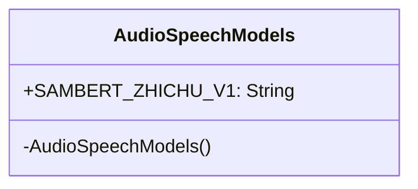
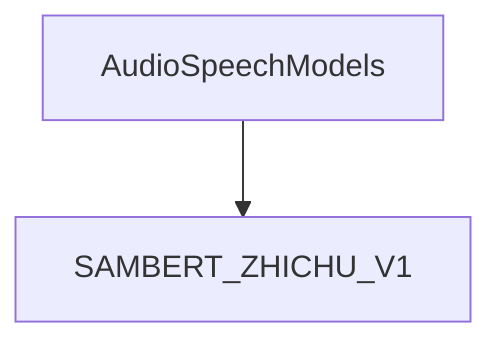

# 基础信息

|      |      |
|------|------|
| 编码语言 | .java |
| 代码路径 | yudao-module-ai/yudao-spring-boot-starter-ai/src/main/java/com/alibaba/cloud/ai/tongyi/audio/AudioSpeechModels.java |
| 包名 | com.alibaba.cloud.ai.tongyi.audio |
| 依赖项 | [] |
| 概述说明 | AudioSpeechModels类具有私有构造函数，包含静态常量SAMBERT_ZHICHU_V1，代表“舌尖男声”模型，支持中英文，默认采样率为48 Hz。 |

# 说明

`AudioSpeechModels` 类是一个用于管理音频语音模型的类。该类包含一个私有构造函数，这意味着它不能被外部直接实例化，通常用于实现单例模式或控制类的实例化过程。类中定义了一个静态常量 `SAMBERT_ZHICHU_V1`，该常量表示一个名为“舌尖男声”的语音模型。这个模型支持中英文两种语言的语音处理，并且默认的采样率为48 Hz。采样率是指每秒钟对音频信号进行采样的次数，48 Hz 的采样率意味着每秒钟对音频信号进行48次采样，这通常用于高质量的音频处理场景。通过这个类，用户可以方便地访问和使用“舌尖男声”模型，进行中英文的语音合成或其他相关任务。

# 类列表 Class Summary

| 名称   | 类型  | 说明 |
|-------|------|-------------|
| AudioSpeechModels | class | `AudioSpeechModels` 类包含一个私有构造函数和一个静态常量 `SAMBERT_ZHICHU_V1`，表示“舌尖男声”模型，支持中英文，默认采样率为48 Hz。 |

## 类 AudioSpeechModels

|      |      |
|------|------|
| 访问范围 | public final |
| 类型 | class |
| 名称 | AudioSpeechModels |
| 说明 | `AudioSpeechModels` 类包含一个私有构造函数和一个静态常量 `SAMBERT_ZHICHU_V1`，表示“舌尖男声”模型，支持中英文，默认采样率为48 Hz。 |

### UML类图

### 描述信息：
该UML类图展示了一个名为`AudioSpeechModels`的公共最终类。该类包含一个私有构造函数和一个公共静态常量`SAMBERT_ZHICHU_V1`，表示“舌尖男声”的语音模型。该类设计为不可实例化，仅用于存储常量。

### 内部方法调用关系图

### 描述信息：
该图展示了`AudioSpeechModels`类与其静态常量`SAMBERT_ZHICHU_V1`之间的调用关系。`AudioSpeechModels`类是一个不可继承的最终类，包含一个私有构造函数和一个表示“舌尖男声”的静态常量。该常量用于定义语音模型的名称和默认采样率。

### 字段列表 Field List

| 名称  | 类型  | 说明 |
|-------|-------|------|
| SAMBERT_ZHICHU_V1 = "sambert-zhichu-v1" | String | public static final String SAMBERT_ZHICHU_V1 = "sambert-zhichu-v1"; 定义了一个常量字符串，值为 "sambert-zhichu-v1"。 |

### 方法列表 Method List

| 名称  | 类型  | 说明 |
|-------|-------|------|

