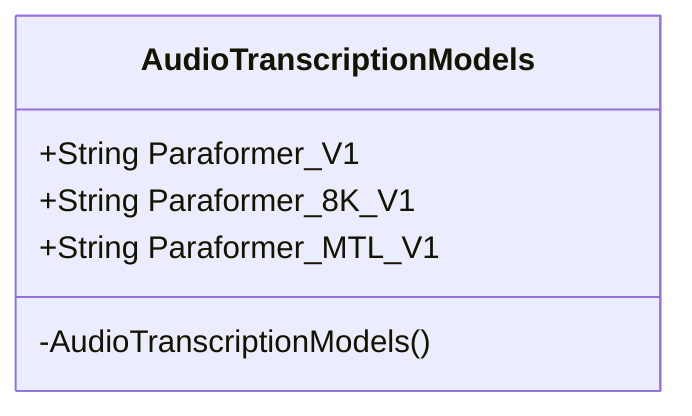
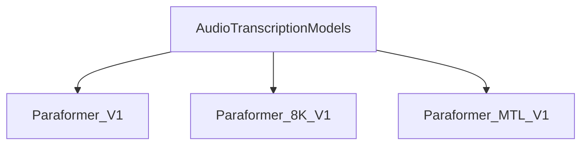

# 基础信息

|      |      |
|------|------|
| 编码语言 | .java |
| 代码路径 | yudao-module-ai/yudao-spring-boot-starter-ai/src/main/java/com/alibaba/cloud/ai/tongyi/audio/AudioTranscriptionModels.java |
| 包名 | com.alibaba.cloud.ai.tongyi.audio |
| 依赖项 | [] |
| 概述说明 | AudioTranscriptionModels类包含三个Paraformer语音识别模型：Paraformer_V1支持16kHz及以上采样率的中英文音频或视频识别；Paraformer_8K_V1专为8kHz电话语音识别设计；Paraformer_MTL_V1支持16kHz及以上采样率的多语言音频或视频识别。 |

# 说明

AudioTranscriptionModels类包含三个Paraformer语音识别模型，分别针对不同的音频识别需求。第一个模型是Paraformer_V1，它支持16kHz及以上采样率的中英文音频或视频识别，适用于高采样率的音频场景。第二个模型是Paraformer_8K_V1，专门为8kHz电话语音识别设计，适用于电话通话等低采样率的音频场景。第三个模型是Paraformer_MTL_V1，支持16kHz及以上采样率的多语言音频或视频识别，适用于需要处理多种语言的音频或视频场景。这三个模型覆盖了从低采样率电话语音到高采样率多语言音频的广泛识别需求，提供了灵活且高效的语音识别解决方案。

# 类列表 Class Summary

| 名称   | 类型  | 说明 |
|-------|------|-------------|
| AudioTranscriptionModels | class | AudioTranscriptionModels类包含三个Paraformer语音识别模型：Paraformer_V1支持16kHz及以上采样率的中英文音频或视频识别；Paraformer_8K_V1专为8kHz电话语音识别设计；Paraformer_MTL_V1支持16kHz及以上采样率的多语言音频或视频识别。 |

## 类 AudioTranscriptionModels

|      |      |
|------|------|
| 访问范围 | public final |
| 类型 | class |
| 名称 | AudioTranscriptionModels |
| 说明 | AudioTranscriptionModels类包含三个Paraformer语音识别模型：Paraformer_V1支持16kHz及以上采样率的中英文音频或视频识别；Paraformer_8K_V1专为8kHz电话语音识别设计；Paraformer_MTL_V1支持16kHz及以上采样率的多语言音频或视频识别。 |

### UML类图

### 描述信息：
该UML类图展示了一个名为`AudioTranscriptionModels`的类，该类包含三个公共静态常量字符串属性，分别表示不同版本的Paraformer语音识别模型。类中的构造函数被声明为私有，以防止外部实例化。

### 内部方法调用关系图

### 描述信息：
该图展示了 `AudioTranscriptionModels` 类与其三个静态常量方法 `Paraformer_V1`、`Paraformer_8K_V1` 和 `Paraformer_MTL_V1` 之间的调用关系。这些方法分别代表不同版本的 Paraformer 语音识别模型，支持不同采样率和语言的音频或视频识别。

### 字段列表 Field List

| 名称  | 类型  | 说明 |
|-------|-------|------|
| Paraformer_8K_V1 = "paraformer-8k-v1" | String | Paraformer_8K_V1 是一个定义为 "paraformer-8k-v1" 的公共静态常量字符串。 |
| Paraformer_V1 = "paraformer-v1" | String | Paraformer_V1 是一个定义为 "paraformer-v1" 的公共静态常量字符串。 |
| Paraformer_MTL_V1 = "paraformer-mtl-v1" | String | Paraformer_MTL_V1 是一个静态常量字符串，其值为 "paraformer-mtl-v1"。 |

### 方法列表 Method List

| 名称  | 类型  | 说明 |
|-------|-------|------|

