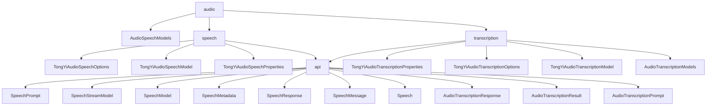

# 基础信息

|      |      |
|------|------|
| 编码语言 | .java |
| 代码路径 | yudao-module-ai/yudao-spring-boot-starter-ai/src/main/java/com/alibaba/cloud/ai/tongyi/audio |
| 包名 | com.alibaba.cloud.ai.tongyi.audio |
| 概述说明 | `AudioSpeechModels` 类管理音频语音模型，包含私有构造函数和静态常量 `SAMBERT_ZHICHU_V1`，支持中英文语音处理，默认采样率48 Hz。`TongYiAudioSpeechOptions` 类用于配置音频合成选项，支持多种参数定制。`TongYiAudioSpeechModel` 类实现语音服务调用，支持同步、异步和流式调用。`TongYiAudioSpeechProperties` 类配置音频语音功能，默认使用 `SAMBERT_ZHICHU_V1` 模型。`SpeechPrompt` 和 `SpeechResponse` 类处理语音请求和响应，包含语音消息和元数据。`SpeechMessage` 和 `Speech` 类封装语音消息和音频数据。`TongYiAudioTranscriptionProperties` 类配置音频转录功能，默认使用 `Paraformer_V1` 模型。`AudioTranscriptionResponse` 和 `AudioTranscriptionResult` 类处理转录响应和结果。`AudioTranscriptionPrompt` 类处理转录请求，`TongYiAudioTranscriptionOptions` 类配置转录选项。`TongYiAudioTranscriptionModel` 类提供转录API接口。`AudioTranscriptionModels` 类包含三个 `Paraformer` 模型，支持不同采样率和多语言音频识别。 |

# 说明

`AudioSpeechModels` 类是一个用于管理音频语音模型的类，包含一个私有构造函数，通常用于实现单例模式或控制类的实例化过程。该类定义了一个静态常量 `SAMBERT_ZHICHU_V1`，表示“舌尖男声”语音模型，支持中英文语音处理，默认采样率为48 Hz。`TongYiAudioSpeechOptions` 类用于配置音频合成选项，允许用户通过模型选择、文本内容、音频格式、采样率等参数定制生成的音频，并支持单词和音素级别的时间戳功能。`TongYiAudioSpeechModel` 类实现了 `SpeechModel` 和 `SpeechStreamModel` 接口，用于调用 TongYi 音频语音服务，支持同步、异步或流式调用，具备选项合并和参数转换功能。`TongYiAudioSpeechProperties` 类用于配置 Spring Cloud Alibaba AI 中的音频语音功能，默认使用 `SAMBERT_ZHICHU_V1` 模型，支持 WAV 格式音频文件，并包含 `TongYiAudioSpeechOptions` 选项配置。

`SpeechPrompt` 类实现了 `ModelRequest` 接口，用于处理语音消息请求，包含 `SpeechMessage` 和 `TongYiAudioSpeechOptions` 两个主要属性。`SpeechResponse` 类实现了 `ModelResponse` 接口，用于处理语音响应，包含 `Speech` 对象和 `TongYiAudioSpeechResponseMetadata` 元数据。`SpeechMessage` 类用于封装语音消息文本内容，支持文本内容的获取和设置。`Speech` 类实现了 `ModelResult<ByteBuffer>` 接口，用于处理音频数据及其元数据，包含 `ByteBuffer audio` 和 `SpeechMetadata` 两个属性。

`TongYiAudioTranscriptionProperties` 类是 Spring Cloud Alibaba AI 中用于配置音频转录功能的类，默认使用 `Paraformer_V1` 模型，并包含 `TongYiAudioTranscriptionOptions` 配置选项。`AudioTranscriptionResponse` 类实现了 `ModelResponse<AudioTranscriptionResult>` 接口，用于处理音频转录的响应数据，包含 `AudioTranscriptionResult` 列表和 `TongYiAudioTranscriptionResponseMetadata` 元数据。`AudioTranscriptionResult` 类实现了 `ModelResult<String>` 接口，用于处理音频转录的结果，包含文本内容和转录元数据。`AudioTranscriptionPrompt` 类实现了 `ModelRequest<Resource>` 接口，用于处理音频转录请求，包含 `audioResource` 和 `transcriptionOptions` 两个属性。`TongYiAudioTranscriptionOptions` 类用于配置音频转录选项，支持模型选择、音频文件 URL、说话人分离等功能。`TongYiAudioTranscriptionModel` 类提供了默认选项和转录 API 接口，支持音频转录请求的处理。

`AudioTranscriptionModels` 类包含三个 Paraformer 语音识别模型：`Paraformer_V1` 支持 16kHz 及以上采样率的中英文音频或视频识别；`Paraformer_8K_V1` 专门为 8kHz 电话语音识别设计；`Paraformer_MTL_V1` 支持 16kHz 及以上采样率的多语言音频或视频识别。这些模型覆盖了从低采样率电话语音到高采样率多语言音频的广泛识别需求，提供了灵活且高效的语音识别解决方案。

### 包内部结构视图

### 描述信息：
该Mermaid图展示了`yudao-module-ai`模块中音频处理相关的类和方法调用关系。`audio`文件夹下包含`AudioSpeechModels`和`transcription`两个主要子文件夹，分别处理语音合成和语音转录功能。`speech`文件夹下的类负责语音合成的配置和模型，而`transcription`文件夹下的类则处理语音转录的配置和模型。

# 文件列表 File List

| 名称   | 类型  | 说明 |
|-------|------|-------------|
| [AudioTranscriptionModels.java](AudioTranscriptionModels.md) | file | AudioTranscriptionModels类包含三个Paraformer语音识别模型：Paraformer_V1支持16kHz及以上采样率的中英文音频或视频识别；Paraformer_8K_V1专为8kHz电话语音识别设计；Paraformer_MTL_V1支持16kHz及以上采样率的多语言音频或视频识别。 |
| [AudioSpeechModels.java](AudioSpeechModels.md) | file | AudioSpeechModels类具有私有构造函数，包含静态常量SAMBERT_ZHICHU_V1，代表“舌尖男声”模型，支持中英文，默认采样率为48 Hz。 |
| [transcription](transcription/_package.md) | folder | TongYiAudioTranscriptionProperties类用于配置Spring Cloud Alibaba AI中的音频转录功能，默认启用并使用Paraformer_V1模型，支持通过TongYiAudioTranscriptionOptions进行定制。AudioTranscriptionResponse类处理音频转录响应，包含转录结果列表和元数据，提供多种访问方法。AudioTranscriptionResult类管理转录结果，包含文本内容和元数据，支持对象比较和哈希值生成。AudioTranscriptionPrompt类处理音频转录请求，支持音频资源和转录选项的配置。TongYiAudioTranscriptionOptions类提供多种转录配置选项，如模型选择、说话人分离、时间戳对齐等，支持高度定制化。TongYiAudioTranscriptionModel类实现音频转录功能，支持请求处理、异常处理和结果获取，适应不同应用场景。 |
| [speech](speech/_package.md) | folder | TongYiAudioSpeechOptions类用于配置音频合成选项，支持模型选择、文本内容、音频格式等参数，并允许启用时间戳功能。TongYiAudioSpeechModel类用于调用音频语音服务，支持同步、异步和流式调用，提供灵活的语音合成功能。TongYiAudioSpeechProperties类用于配置Spring Cloud Alibaba AI中的音频语音功能，支持模型选择和音频格式自定义。SpeechPrompt类处理语音消息请求，包含SpeechMessage和TongYiAudioSpeechOptions属性。SpeechResponse类处理语音响应，包含Speech对象和元数据。SpeechMessage类封装语音消息文本内容。Speech类处理音频数据及其元数据，支持音频数据的获取和元数据设置。 |

