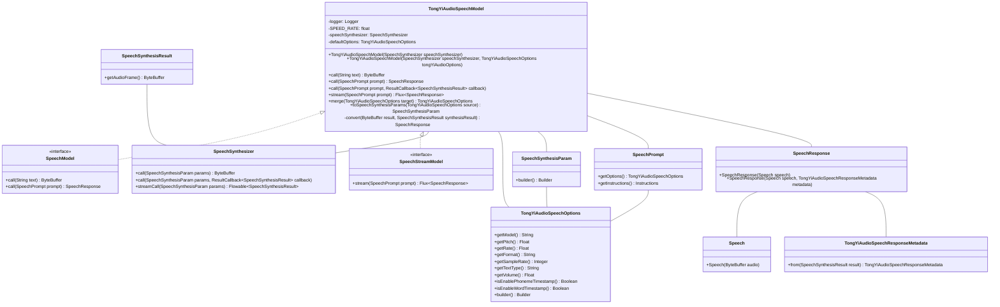

# 基础信息

|      |      |
|------|------|
| 编码语言 | .java |
| 代码路径 | yudao-module-ai/yudao-spring-boot-starter-ai/src/main/java/com/alibaba/cloud/ai/tongyi/audio/speech/TongYiAudioSpeechModel.java |
| 包名 | com.alibaba.cloud.ai.tongyi.audio.speech |
| 依赖项 | ['com.alibaba.cloud.ai.tongyi.audio.AudioSpeechModels', 'com.alibaba.cloud.ai.tongyi.audio.speech.api', 'com.alibaba.cloud.ai.tongyi.metadata.audio.TongYiAudioSpeechResponseMetadata', 'com.alibaba.dashscope.audio.tts.SpeechSynthesisParam', 'com.alibaba.dashscope.audio.tts.SpeechSynthesisResult', 'com.alibaba.dashscope.audio.tts.SpeechSynthesizer', 'com.alibaba.dashscope.common.ResultCallback', 'io.reactivex.Flowable', 'org.slf4j.Logger', 'org.slf4j.LoggerFactory', 'org.springframework.util.Assert', 'reactor.core.publisher.Flux', 'reactor.core.scheduler.Schedulers', 'java.nio.ByteBuffer'] |
| 概述说明 | TongYiAudioSpeechModel类实现了SpeechModel和SpeechStreamModel接口，用于调用TongYi音频语音服务。它包含默认语速、语音合成器和选项配置，支持同步、异步和流式调用，可将文本转为语音并返回音频数据。类中还提供选项合并和参数转换功能，确保语音合成的灵活性和可配置性。 |

# 说明

TongYiAudioSpeechModel类是一个实现了SpeechModel和SpeechStreamModel接口的类，专门用于调用TongYi音频语音服务。该类集成了默认的语速设置、语音合成器以及多种选项配置，提供了丰富的功能来满足不同的语音合成需求。通过该类，用户可以以同步、异步或流式的方式调用服务，将文本转换为语音并获取相应的音频数据。此外，TongYiAudioSpeechModel类还具备选项合并和参数转换的功能，这些功能确保了语音合成过程的灵活性和可配置性，使得用户能够根据具体需求调整和优化语音合成的效果。整体而言，TongYiAudioSpeechModel类为开发者提供了一个强大且易于使用的工具，用于实现高质量的文本到语音转换。

# 类列表 Class Summary

| 名称   | 类型  | 说明 |
|-------|------|-------------|
| TongYiAudioSpeechModel | class | TongYiAudioSpeechModel类实现了SpeechModel和SpeechStreamModel接口，用于调用TongYi音频语音服务。它包含默认语速、语音合成器和选项配置，提供多种方法调用服务，包括同步、异步和流式调用，支持文本转语音并返回音频数据。类中还包含选项合并和参数转换功能，确保语音合成的灵活性和可配置性。 |


## 类 TongYiAudioSpeechModel

|      |      |
|------|------|
| 访问范围 | public |
| 类型 | class |
| 名称 | TongYiAudioSpeechModel |
| 说明 | TongYiAudioSpeechModel类实现了SpeechModel和SpeechStreamModel接口，用于调用TongYi音频语音服务。它包含默认语速、语音合成器和选项配置，提供多种方法调用服务，包括同步、异步和流式调用，支持文本转语音并返回音频数据。类中还包含选项合并和参数转换功能，确保语音合成的灵活性和可配置性。 |


### UML类图



### 描述：
该UML类图展示了`TongYiAudioSpeechModel`类及其相关接口和依赖关系。`TongYiAudioSpeechModel`实现了`SpeechModel`和`SpeechStreamModel`接口，并依赖于`SpeechSynthesizer`、`TongYiAudioSpeechOptions`、`SpeechSynthesisParam`等类。类图中展示了类的属性、方法以及它们之间的关系，如实现、依赖和关联。


### 内部方法调用关系图

```mermaid
graph TD
    TongYiAudioSpeechModel --> call(String)
    TongYiAudioSpeechModel --> call(SpeechPrompt)
    TongYiAudioSpeechModel --> call(SpeechPrompt, ResultCallback)
    TongYiAudioSpeechModel --> stream(SpeechPrompt)
    TongYiAudioSpeechModel --> merge(TongYiAudioSpeechOptions)
    TongYiAudioSpeechModel --> toSpeechSynthesisParams(TongYiAudioSpeechOptions)
    TongYiAudioSpeechModel --> convert(ByteBuffer, SpeechSynthesisResult)
    call(String) --> call(SpeechPrompt)
    call(SpeechPrompt) --> merge(TongYiAudioSpeechOptions)
    call(SpeechPrompt) --> toSpeechSynthesisParams(TongYiAudioSpeechOptions)
    call(SpeechPrompt) --> speechSynthesizer.call(SpeechSynthesisParam)
    call(SpeechPrompt) --> convert(ByteBuffer, SpeechSynthesisResult)
    call(SpeechPrompt, ResultCallback) --> merge(TongYiAudioSpeechOptions)
    call(SpeechPrompt, ResultCallback) --> toSpeechSynthesisParams(TongYiAudioSpeechOptions)
    call(SpeechPrompt, ResultCallback) --> speechSynthesizer.call(SpeechSynthesisParam, ResultCallback)
    stream(SpeechPrompt) --> merge(TongYiAudioSpeechOptions)
    stream(SpeechPrompt) --> toSpeechSynthesisParams(TongYiAudioSpeechOptions)
    stream(SpeechPrompt) --> speechSynthesizer.streamCall(SpeechSynthesisParam)
    stream(SpeechPrompt) --> Flux.from(resultFlowable)
    Flux.from(resultFlowable) --> Flux.just(res.getAudioFrame())
    Flux.just(res.getAudioFrame()) --> map(audio)
    map(audio) --> SpeechResponse(speech, respMetadata)
```

### 描述信息：
该图展示了`TongYiAudioSpeechModel`类中各个方法之间的调用关系。`call`方法通过调用`merge`和`toSpeechSynthesisParams`方法处理请求参数，并最终调用`speechSynthesizer`的方法生成语音。`stream`方法则通过流式调用处理语音生成，并将结果转换为`SpeechResponse`。

### 字段列表 Field List

| 名称  | 类型  | 说明 |
|-------|-------|------|
| logger = LoggerFactory.getLogger(getClass()) | Logger | 在Java类中，使用LoggerFactory.getLogger(getClass())创建了一个私有的Logger实例，用于记录日志信息。 |
| SPEED_RATE = 1.0f | float | 代码定义了一个私有的静态常量SPEED_RATE，其类型为float，值为1.0f。 |
| defaultOptions | TongYiAudioSpeechOptions | private final TongYiAudioSpeechOptions defaultOptions; 定义了一个私有的、不可变的TongYiAudioSpeechOptions类型的默认选项对象。 |
| speechSynthesizer | SpeechSynthesizer | private final SpeechSynthesizer speechSynthesizer; 声明了一个私有的、不可变的SpeechSynthesizer对象，用于语音合成功能。 |

### 方法列表 Method List

| 名称  | 类型  | 说明 |
|-------|-------|------|
| call | ByteBuffer | 该方法重写了父类的`call`方法，接受一个字符串参数`text`，创建`SpeechPrompt`对象并调用另一个`call`方法，最终返回`ByteBuffer`类型的结果。 |
| stream | Flux<SpeechResponse> | 该方法通过合并传入的语音提示参数，调用语音合成器生成语音流，并将结果转换为包含音频帧和元数据的响应对象，最终在并行调度器上发布。 |
| call | void | 该方法接收一个SpeechPrompt对象和一个ResultCallback回调函数，合并prompt的选项生成SCASpeechParam，将其转换为speechSynthesisParams并设置文本内容，最后调用speechSynthesizer的call方法进行语音合成。 |
| convert | SpeechResponse | 该方法将ByteBuffer和SpeechSynthesisResult对象转换为SpeechResponse对象。如果SpeechSynthesisResult为空，则创建仅包含Speech对象的SpeechResponse；否则，从SpeechSynthesisResult中提取元数据并创建包含Speech和元数据的SpeechResponse。 |
| call | SpeechResponse | 该方法接收一个`SpeechPrompt`对象，合并其选项生成`SCASpeechParam`，将其转换为`speechSynthesisParams`并设置文本内容。随后调用`speechSynthesizer`生成语音，最终将结果转换为`SpeechResponse`返回。 |
| merge | TongYiAudioSpeechOptions | 该方法合并两个TongYiAudioSpeechOptions对象，优先使用defaultOptions中的值，若为空则使用target中的值。合并的字段包括model、pitch、rate、format、sampleRate、textType、volume、enablePhonemeTimestamp和enableWordTimestamp，最终返回合并后的对象。 |
| toSpeechSynthesisParams | SpeechSynthesisParam | 该方法将TongYiAudioSpeechOptions对象转换为SpeechSynthesisParam对象。通过检查源对象的各个属性（如model、text、format、rate、pitch、textType、sampleRate、enablePhonemeTimestamp、enableWordTimestamp、volume），若属性不为空则将其值赋给SpeechSynthesisParam的相应属性，最终构建并返回SpeechSynthesisParam对象。 |


