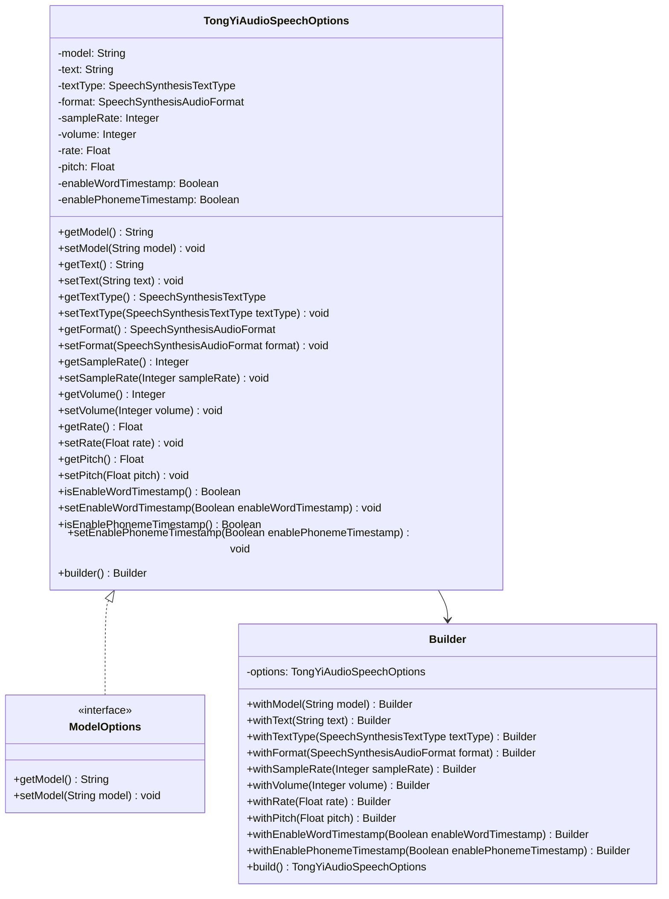

# 基础信息

|      |      |
|------|------|
| 编码语言 | .java |
| 代码路径 | yudao-module-ai/yudao-spring-boot-starter-ai/src/main/java/com/alibaba/cloud/ai/tongyi/audio/speech/TongYiAudioSpeechOptions.java |
| 包名 | com.alibaba.cloud.ai.tongyi.audio.speech |
| 依赖项 | ['com.alibaba.cloud.ai.tongyi.audio.AudioSpeechModels', 'com.alibaba.dashscope.audio.tts.SpeechSynthesisAudioFormat', 'com.alibaba.dashscope.audio.tts.SpeechSynthesisTextType', 'org.springframework.ai.model.ModelOptions'] |
| 概述说明 | TongYiAudioSpeechOptions类用于配置音频合成选项，包含模型、文本内容、文本类型、音频格式、采样率、音量、语速、音高及是否启用单词和音素级别时间戳，支持通过Builder模式灵活设置参数。 |

# 说明

TongYiAudioSpeechOptions类是一个用于配置音频合成选项的工具，允许用户通过多种参数来定制生成的音频。该类支持设置的主要参数包括模型选择、文本内容、文本类型、音频格式、采样率、音量、语速和音高。此外，用户还可以选择是否启用单词和音素级别的时间戳功能，以便在生成的音频中精确标记每个单词或音素的起始和结束时间。通过使用Builder模式，用户可以灵活地设置这些参数，从而实现对音频合成过程的精细控制。这种设计使得TongYiAudioSpeechOptions类能够满足不同场景下的音频合成需求，提供了高度的可定制性和灵活性。

# 类列表 Class Summary

| 名称   | 类型  | 说明 |
|-------|------|-------------|
| TongYiAudioSpeechOptions | class | TongYiAudioSpeechOptions类用于配置音频合成选项，包括模型、文本内容、文本类型、音频格式、采样率、音量、语速、音高，以及是否启用单词和音素级别的时间戳。通过Builder模式可以灵活设置这些参数。 |

## 类 TongYiAudioSpeechOptions

|      |      |
|------|------|
| 访问范围 | public |
| 类型 | class |
| 名称 | TongYiAudioSpeechOptions |
| 说明 | TongYiAudioSpeechOptions类用于配置音频合成选项，包括模型、文本内容、文本类型、音频格式、采样率、音量、语速、音高，以及是否启用单词和音素级别的时间戳。通过Builder模式可以灵活设置这些参数。 |

### UML类图

### 描述：
该UML类图展示了`TongYiAudioSpeechOptions`类及其内部`Builder`类的结构。`TongYiAudioSpeechOptions`实现了`ModelOptions`接口，并包含多个属性和方法用于配置音频合成的参数。`Builder`类用于构建`TongYiAudioSpeechOptions`的实例，提供了链式调用的方式来设置各个属性。

### 内部方法调用关系图

```mermaid
graph TD
    TongYiAudioSpeechOptions --> builder
    TongYiAudioSpeechOptions --> getModel
    TongYiAudioSpeechOptions --> setModel
    TongYiAudioSpeechOptions --> getText
    TongYiAudioSpeechOptions --> setText
    TongYiAudioSpeechOptions --> getTextType
    TongYiAudioSpeechOptions --> setTextType
    TongYiAudioSpeechOptions --> getFormat
    TongYiAudioSpeechOptions --> setFormat
    TongYiAudioSpeechOptions --> getSampleRate
    TongYiAudioSpeechOptions --> setSampleRate
    TongYiAudioSpeechOptions --> getVolume
    TongYiAudioSpeechOptions --> setVolume
    TongYiAudioSpeechOptions --> getRate
    TongYiAudioSpeechOptions --> setRate
    TongYiAudioSpeechOptions --> getPitch
    TongYiAudioSpeechOptions --> setPitch
    TongYiAudioSpeechOptions --> isEnableWordTimestamp
    TongYiAudioSpeechOptions --> setEnableWordTimestamp
    TongYiAudioSpeechOptions --> isEnablePhonemeTimestamp
    TongYiAudioSpeechOptions --> setEnablePhonemeTimestamp
    builder --> Builder
    Builder --> withModel
    Builder --> withText
    Builder --> withTextType
    Builder --> withFormat
    Builder --> withSampleRate
    Builder --> withVolume
    Builder --> withRate
    Builder --> withPitch
    Builder --> withEnableWordTimestamp
    Builder --> withEnablePhonemeTimestamp
    Builder --> build
```

### 描述信息：
该图展示了`TongYiAudioSpeechOptions`类与其内部`Builder`类之间的方法调用关系。`TongYiAudioSpeechOptions`类提供了多个getter和setter方法，用于设置和获取音频合成相关的参数。`Builder`类则通过一系列`with`方法构建`TongYiAudioSpeechOptions`实例，并通过`build`方法返回最终的配置对象。

### 字段列表 Field List

| 名称  | 类型  | 说明 |
|-------|-------|------|
| volume = 50 | Integer | 该代码定义了一个名为volume的私有整数变量，初始值为50。 |
| sampleRate = 16000 | Integer | 该代码定义了一个名为sampleRate的私有整数变量，其值为16000。 |
| enablePhonemeTimestamp = false | Boolean | 该信息描述了一个布尔类型的私有变量`enablePhonemeTimestamp`，其默认值为`false`。 |
| text | String | private String text; 是一个Java类中的私有字符串变量声明，用于存储文本数据。 |
| rate = 1.0f | Float | private Float rate = 1.0f; 定义了一个私有的浮点型变量rate，初始值为1.0。 |
| enableWordTimestamp = false | Boolean | 该信息描述了一个布尔类型的变量`enableWordTimestamp`，其默认值为`false`，表示是否启用单词时间戳功能。 |
| pitch = 1.0f | Float | private Float pitch = 1.0f; 定义了一个私有的浮点型变量pitch，初始值为1.0。 |
| format = SpeechSynthesisAudioFormat.WAV | SpeechSynthesisAudioFormat | private SpeechSynthesisAudioFormat format = SpeechSynthesisAudioFormat.WAV; 表示私有变量format被定义为SpeechSynthesisAudioFormat类型，并初始化为WAV格式。 |
| model = AudioSpeechModels.SAMBERT_ZHICHU_V1 | String | private String model = AudioSpeechModels.SAMBERT_ZHICHU_V1; 定义了一个私有字符串变量model，其值为AudioSpeechModels.SAMBERT_ZHICHU_V1。 |
| textType = SpeechSynthesisTextType.PLAIN_TEXT | SpeechSynthesisTextType | private SpeechSynthesisTextType textType = SpeechSynthesisTextType.PLAIN_TEXT; 定义了一个私有变量textType，其类型为SpeechSynthesisTextType，并初始化为PLAIN_TEXT，表示文本类型为纯文本。 |

### 方法列表 Method List

| 名称  | 类型  | 说明 |
|-------|-------|------|
| setEnableWordTimestamp | void | 该方法用于设置是否启用单词时间戳功能，通过传入一个布尔值参数来更新类的成员变量enableWordTimestamp。 |
| setRate | void | 该方法用于设置一个浮点类型的变量`rate`，通过传入的参数`rate`来更新当前对象的`rate`值。 |
| setFormat | void | 该方法用于设置语音合成音频格式，通过传入的`SpeechSynthesisAudioFormat`对象来更新当前对象的`format`属性。 |
| getSampleRate | Integer | 该方法返回一个整数值，表示样本率。 |
| getModel | String | 该方法返回一个字符串类型的模型名称。 |
| getText | String | 该方法返回一个字符串类型的变量`text`的值。 |
| getVolume | Integer | 该方法返回一个整数类型的`volume`值。 |
| isEnableWordTimestamp | Boolean | 该方法返回一个布尔值，表示是否启用了单词时间戳功能。 |
| getPitch | Float | 该方法返回一个浮点数类型的变量`pitch`的值。 |
| setVolume | void | 该方法用于设置音量，接受一个整数类型的参数volume，并将其赋值给当前对象的volume属性。 |
| builder | Builder | `public static Builder builder()` 方法用于创建并返回一个新的 `Builder` 实例。 |
| getRate | Float | 方法 `getRate()` 返回一个 `Float` 类型的值 `rate`。 |
| getTextType | SpeechSynthesisTextType | `getTextType()` 方法返回 `textType` 的值，用于获取当前文本类型。 |
| setSampleRate | void | 该方法用于设置采样率，接受一个整数参数sampleRate，并将其赋值给类的成员变量sampleRate。 |
| isEnablePhonemeTimestamp | Boolean | 该方法返回一个布尔值，表示是否启用了音素时间戳功能。 |
| setModel | void | 该方法用于设置模型属性，接受一个字符串参数model，并将其赋值给当前对象的model属性。 |
| getFormat | SpeechSynthesisAudioFormat | `getFormat()` 方法返回 `SpeechSynthesisAudioFormat` 类型的 `format` 对象。 |
| setText | void | `setText`方法用于设置一个字符串类型的`text`变量，将传入的`text`参数赋值给类的成员变量`this.text`。 |
| setEnablePhonemeTimestamp | void | 该方法用于设置是否启用音素时间戳功能，通过传入布尔值参数`enablePhonemeTimestamp`来更新类中的相应属性。 |
| setTextType | void | 该方法用于设置语音合成文本类型，通过传入`SpeechSynthesisTextType`类型的参数`textType`，将其赋值给类的成员变量`textType`。 |
| setPitch | void | 该方法用于设置对象的pitch属性，接受一个Float类型的参数pitch，并将其赋值给对象的pitch属性。 |

