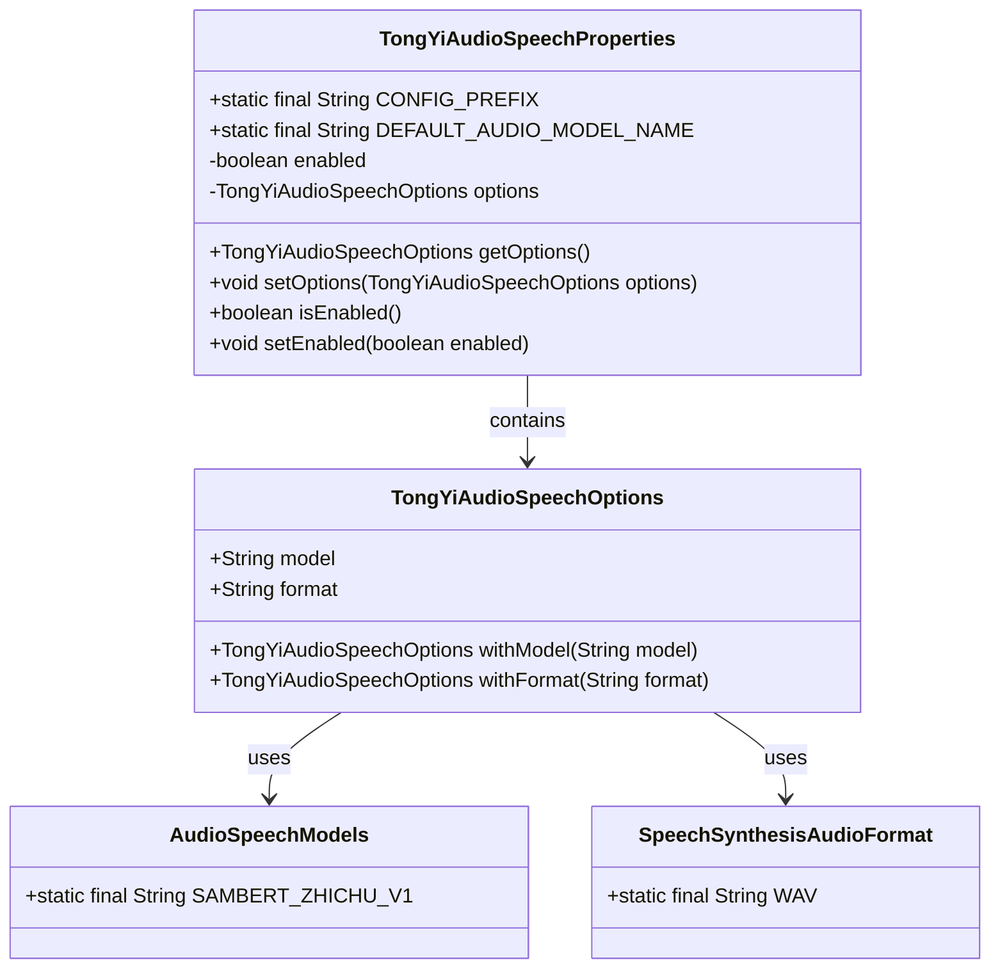
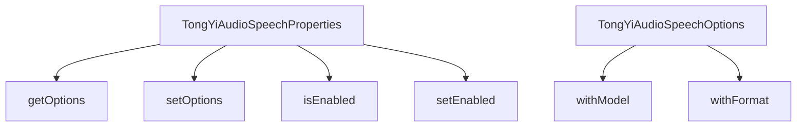

# 基础信息

|      |      |
|------|------|
| 编码语言 | .java |
| 代码路径 | yudao-module-ai/yudao-spring-boot-starter-ai/src/main/java/com/alibaba/cloud/ai/tongyi/audio/speech/TongYiAudioSpeechProperties.java |
| 包名 | com.alibaba.cloud.ai.tongyi.audio.speech |
| 依赖项 | ['com.alibaba.cloud.ai.tongyi.audio.AudioSpeechModels', 'com.alibaba.dashscope.audio.tts.SpeechSynthesisAudioFormat', 'org.springframework.boot.context.properties.ConfigurationProperties', 'org.springframework.boot.context.properties.NestedConfigurationProperty', 'com.alibaba.cloud.ai.tongyi.common.constants.TongYiConstants.SCA_AI_CONFIGURATION'] |
| 概述说明 | TongYiAudioSpeechProperties类配置Spring Cloud Alibaba AI的音频语音功能，前缀为SCA_AI_CONFIGURATION.audio.speech，默认使用SAMBERT_ZHICHU_V1模型，支持WAV格式，并启用TongYiQWEN AI音频客户端，包含TongYiAudioSpeechOptions选项配置及getter和setter方法。 |

# 说明

TongYiAudioSpeechProperties类是用于配置Spring Cloud Alibaba AI中的音频语音功能的类。该类的配置前缀为SCA_AI_CONFIGURATION.audio.speech。默认情况下，该类使用SAMBERT_ZHICHU_V1模型来处理音频语音任务，并且支持WAV格式的音频文件。此外，TongYiAudioSpeechProperties类默认启用了TongYiQWEN AI音频客户端，以便进行音频处理和语音识别等操作。

该类还包含TongYiAudioSpeechOptions选项配置，这些选项可以通过getter和setter方法进行访问和修改。通过这些配置选项，用户可以自定义音频语音处理的行为，例如选择不同的模型、调整音频格式或其他相关参数。TongYiAudioSpeechProperties类的设计旨在提供灵活且易于使用的接口，以便开发人员能够根据具体需求对音频语音功能进行配置和扩展。

# 类列表 Class Summary

| 名称   | 类型  | 说明 |
|-------|------|-------------|
| TongYiAudioSpeechProperties | class | TongYiAudioSpeechProperties类配置了Spring Cloud Alibaba AI的音频语音功能，前缀为SCA_AI_CONFIGURATION.audio.speech。默认使用SAMBERT_ZHICHU_V1模型，支持WAV格式，并默认启用TongYiQWEN AI音频客户端。包含TongYiAudioSpeechOptions选项配置，提供getter和setter方法。 |

## 类 TongYiAudioSpeechProperties

|      |      |
|------|------|
| 访问范围 | @ConfigurationProperties(TongYiAudioSpeechProperties.CONFIG_PREFIX);public |
| 类型 | class |
| 名称 | TongYiAudioSpeechProperties |
| 说明 | TongYiAudioSpeechProperties类配置了Spring Cloud Alibaba AI的音频语音功能，前缀为SCA_AI_CONFIGURATION.audio.speech。默认使用SAMBERT_ZHICHU_V1模型，支持WAV格式，并默认启用TongYiQWEN AI音频客户端。包含TongYiAudioSpeechOptions选项配置，提供getter和setter方法。 |

### UML类图

### 描述信息：
该UML类图展示了`TongYiAudioSpeechProperties`类及其相关类的结构。`TongYiAudioSpeechProperties`类包含配置属性和方法，用于管理音频语音合成的配置。`TongYiAudioSpeechOptions`类用于设置音频模型和格式，依赖于`AudioSpeechModels`和`SpeechSynthesisAudioFormat`类来获取默认值和格式。

### 内部方法调用关系图

### 描述信息：
该图展示了`TongYiAudioSpeechProperties`类与其方法之间的调用关系。`TongYiAudioSpeechProperties`类通过`getOptions`和`setOptions`方法管理`TongYiAudioSpeechOptions`对象，并通过`isEnabled`和`setEnabled`方法控制音频客户端的启用状态。`TongYiAudioSpeechOptions`类则通过`withModel`和`withFormat`方法配置音频模型和格式。

### 字段列表 Field List

| 名称  | 类型  | 说明 |
|-------|-------|------|
| enabled = true | boolean | 私有布尔变量enabled初始值为true。 |
| options = TongYiAudioSpeechOptions.builder()
			.withModel(DEFAULT_AUDIO_MODEL_NAME)
			.withFormat(SpeechSynthesisAudioFormat.WAV)
			.build() | TongYiAudioSpeechOptions | 该代码片段展示了TongYiAudioSpeechOptions的配置，使用了默认音频模型名称和WAV格式进行语音合成。 |
| CONFIG_PREFIX = SCA_AI_CONFIGURATION + "audio.speech" | String | public static final String CONFIG_PREFIX = SCA_AI_CONFIGURATION + "audio.speech"; 定义了一个静态常量字符串CONFIG_PREFIX，其值为SCA_AI_CONFIGURATION与"audio.speech"的拼接结果。 |
| DEFAULT_AUDIO_MODEL_NAME = AudioSpeechModels.SAMBERT_ZHICHU_V1 | String | public static final String DEFAULT_AUDIO_MODEL_NAME = AudioSpeechModels.SAMBERT_ZHICHU_V1; 定义了一个名为DEFAULT_AUDIO_MODEL_NAME的常量，其值为AudioSpeechModels.SAMBERT_ZHICHU_V1，表示默认的音频模型名称。 |

### 方法列表 Method List

| 名称  | 类型  | 说明 |
|-------|-------|------|
| isEnabled | boolean | 方法 `isEnabled()` 返回布尔值 `enabled`，表示当前对象是否启用。 |
| getOptions | TongYiAudioSpeechOptions | 该方法返回当前对象的`options`属性，类型为`TongYiAudioSpeechOptions`。 |
| setOptions | void | 该方法用于设置TongYiAudioSpeech的选项，通过传入TongYiAudioSpeechOptions对象来更新当前实例的options属性。 |
| setEnabled | void | 该方法用于设置一个布尔类型的`enabled`状态，通过传入的`enabled`参数更新当前对象的`enabled`属性值。 |

