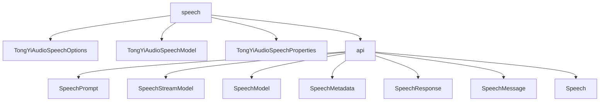

# 基础信息

|      |      |
|------|------|
| 编码语言 | .java |
| 代码路径 | yudao-module-ai/yudao-spring-boot-starter-ai/src/main/java/com/alibaba/cloud/ai/tongyi/audio/speech |
| 包名 | com.alibaba.cloud.ai.tongyi.audio.speech |
| 概述说明 | TongYiAudioSpeechOptions类用于配置音频合成选项，支持模型选择、文本内容、音频格式等参数，并允许启用时间戳功能。TongYiAudioSpeechModel类用于调用音频语音服务，支持同步、异步和流式调用，提供灵活的语音合成功能。TongYiAudioSpeechProperties类用于配置Spring Cloud Alibaba AI中的音频语音功能，支持模型选择和音频格式自定义。SpeechPrompt类处理语音消息请求，包含SpeechMessage和TongYiAudioSpeechOptions属性。SpeechResponse类处理语音响应，包含Speech对象和元数据。SpeechMessage类封装语音消息文本内容。Speech类处理音频数据及其元数据，支持音频数据的获取和元数据设置。 |

# 说明

TongYiAudioSpeechOptions类是一个用于配置音频合成选项的工具，允许用户通过多种参数定制生成的音频。主要参数包括模型选择、文本内容、文本类型、音频格式、采样率、音量、语速和音高。用户还可以选择是否启用单词和音素级别的时间戳功能，以精确标记每个单词或音素的起始和结束时间。通过Builder模式，用户可以灵活设置这些参数，实现对音频合成过程的精细控制，满足不同场景下的需求。

TongYiAudioSpeechModel类实现了SpeechModel和SpeechStreamModel接口，专门用于调用TongYi音频语音服务。该类集成了默认的语速设置、语音合成器及多种选项配置，支持同步、异步或流式调用服务，将文本转换为语音并获取音频数据。此外，该类具备选项合并和参数转换功能，确保语音合成过程的灵活性和可配置性，帮助用户根据需求优化语音合成效果。

TongYiAudioSpeechProperties类用于配置Spring Cloud Alibaba AI中的音频语音功能，配置前缀为SCA_AI_CONFIGURATION.audio.speech。默认使用SAMBERT_ZHICHU_V1模型处理音频语音任务，支持WAV格式音频文件，并默认启用TongYiQWEN AI音频客户端。该类包含TongYiAudioSpeechOptions选项配置，用户可通过getter和setter方法自定义音频语音处理行为，如选择模型、调整音频格式等，提供灵活且易于使用的接口。

SpeechPrompt类实现了ModelRequest接口，用于处理语音消息请求。包含SpeechMessage和TongYiAudioSpeechOptions两个主要属性，分别存储语音消息内容和处理选项。提供多个构造函数初始化属性，并重写equals和hashCode方法，确保对象比较和哈希计算的正确性。

SpeechResponse类实现了ModelResponse接口，用于处理语音响应。包含Speech对象和TongYiAudioSpeechResponseMetadata元数据，分别存储语音数据和附加信息。提供构造函数初始化对象，并重写getResult、getResults和getMetadata方法获取结果和元数据，同时重写equals和hashCode方法支持对象比较和哈希计算。

SpeechMessage类用于封装语音消息文本内容，提供构造函数初始化文本内容，并支持获取和设置文本内容。重写equals和hashCode方法，确保对象比较和哈希计算的准确性。

Speech类实现了ModelResult<ByteBuffer>接口，用于处理音频数据及其元数据。包含ByteBuffer audio和SpeechMetadata speechMetadata两个属性，分别存储音频数据和元数据。提供获取音频数据和元数据的方法，并支持元数据设置。重写equals、hashCode和toString方法，确保对象比较和字符串表示的准确性，有效管理音频数据及其元数据。

### 包内部结构视图

### 描述信息：
该图展示了`yudao-module-ai`模块中`speech`文件夹下的文件与子文件夹`api`之间的调用关系。`speech`文件夹包含`TongYiAudioSpeechOptions`、`TongYiAudioSpeechModel`和`TongYiAudioSpeechProperties`三个文件，并调用了`api`子文件夹中的多个类，如`SpeechPrompt`、`SpeechStreamModel`等。

# 文件列表 File List

| 名称   | 类型  | 说明 |
|-------|------|-------------|
| [TongYiAudioSpeechProperties.java](TongYiAudioSpeechProperties.md) | file | TongYiAudioSpeechProperties类配置Spring Cloud Alibaba AI的音频语音功能，前缀为SCA_AI_CONFIGURATION.audio.speech，默认使用SAMBERT_ZHICHU_V1模型，支持WAV格式，并启用TongYiQWEN AI音频客户端，包含TongYiAudioSpeechOptions选项配置及getter和setter方法。 |
| [TongYiAudioSpeechModel.java](TongYiAudioSpeechModel.md) | file | TongYiAudioSpeechModel类实现了SpeechModel和SpeechStreamModel接口，用于调用TongYi音频语音服务。它包含默认语速、语音合成器和选项配置，支持同步、异步和流式调用，可将文本转为语音并返回音频数据。类中还提供选项合并和参数转换功能，确保语音合成的灵活性和可配置性。 |
| [TongYiAudioSpeechOptions.java](TongYiAudioSpeechOptions.md) | file | TongYiAudioSpeechOptions类用于配置音频合成选项，包含模型、文本内容、文本类型、音频格式、采样率、音量、语速、音高及是否启用单词和音素级别时间戳，支持通过Builder模式灵活设置参数。 |
| [api](api/_package.md) | folder | SpeechPrompt类实现ModelRequest接口，处理语音消息请求，包含SpeechMessage和TongYiAudioSpeechOptions属性，提供多个构造函数及getInstructions、getOptions方法，重写equals和hashCode确保对象比较和哈希计算正确。SpeechResponse类实现ModelResponse接口，处理语音响应，包含Speech对象和TongYiAudioSpeechResponseMetadata元数据，提供两个构造函数及getResult、getResults、getMetadata方法，重写equals和hashCode。SpeechMessage类封装语音消息文本内容，提供构造函数及文本内容访问方法，重写equals和hashCode。Speech类实现ModelResult<ByteBuffer>接口，处理音频数据及元数据，提供音频数据和元数据访问方法，重写equals、hashCode和toString方法。 |

