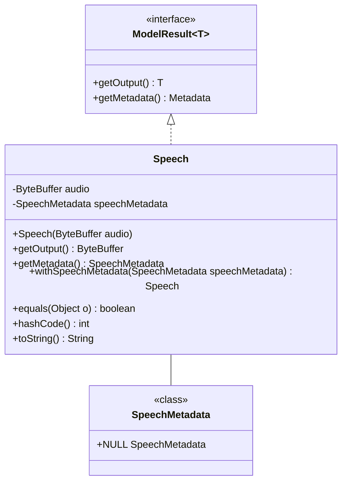

# 基础信息

|      |      |
|------|------|
| 编码语言 | .java |
| 代码路径 | yudao-module-ai/yudao-spring-boot-starter-ai/src/main/java/com/alibaba/cloud/ai/tongyi/audio/speech/api/Speech.java |
| 包名 | com.alibaba.cloud.ai.tongyi.audio.speech.api |
| 依赖项 | ['org.springframework.ai.model.ModelResult', 'org.springframework.lang.Nullable', 'java.nio.ByteBuffer', 'java.util.Arrays', 'java.util.Objects'] |
| 概述说明 | `Speech`类实现了`ModelResult<ByteBuffer>`接口，包含音频数据`ByteBuffer audio`和元数据`SpeechMetadata speechMetadata`，提供获取音频和元数据的方法，支持元数据设置，并重写了`equals`、`hashCode`和`toString`方法以确保对象比较和字符串表示的准确性。 |

# 说明

`Speech`类实现了`ModelResult<ByteBuffer>`接口，主要用于处理音频数据及其相关元数据。该类包含两个主要属性：`ByteBuffer audio`用于存储音频数据，`SpeechMetadata speechMetadata`用于存储与音频相关的元数据。为了便于访问这些数据，`Speech`类提供了获取音频数据和元数据的方法。此外，该类还支持元数据的设置功能，允许用户根据需要更新元信息。

为了确保对象的比较和字符串表示的准确性，`Speech`类重写了`equals`、`hashCode`和`toString`方法。这些方法的重写使得在比较两个`Speech`对象时能够基于其音频数据和元数据进行准确的判断，同时在将对象转换为字符串时能够提供清晰且详细的描述。通过这些设计，`Speech`类不仅能够有效地管理音频数据及其元数据，还能确保对象在使用过程中的一致性和可读性。

# 类列表 Class Summary

| 名称   | 类型  | 说明 |
|-------|------|-------------|
| Speech | class | `Speech`类实现了`ModelResult<ByteBuffer>`接口，包含音频数据`ByteBuffer audio`和元数据`SpeechMetadata speechMetadata`。提供了获取音频和元数据的方法，支持元数据设置，并重写了`equals`、`hashCode`和`toString`方法以确保对象比较和字符串表示的准确性。 |


## 类 Speech

|      |      |
|------|------|
| 访问范围 | public |
| 类型 | class |
| 名称 | Speech |
| 说明 | `Speech`类实现了`ModelResult<ByteBuffer>`接口，包含音频数据`ByteBuffer audio`和元数据`SpeechMetadata speechMetadata`。提供了获取音频和元数据的方法，支持元数据设置，并重写了`equals`、`hashCode`和`toString`方法以确保对象比较和字符串表示的准确性。 |


### UML类图



### 描述信息：
该UML类图展示了`Speech`类实现了`ModelResult<ByteBuffer>`接口，并包含`ByteBuffer`类型的`audio`属性和`SpeechMetadata`类型的`speechMetadata`属性。`Speech`类提供了获取音频数据、元数据的方法，并支持元数据的设置。`SpeechMetadata`类包含一个静态的`NULL`实例。


### 内部方法调用关系图

```mermaid
graph TD
    Speech --> getOutput
    Speech --> getMetadata
    Speech --> withSpeechMetadata
    Speech --> equals
    Speech --> hashCode
    Speech --> toString
    getMetadata --> SpeechMetadata.NULL
    equals --> Arrays.equals
    equals --> Objects.equals
    hashCode --> Arrays.hashCode
    hashCode --> Objects.hash
    toString --> audio
    toString --> speechMetadata
```

### 描述信息：
该图展示了`Speech`类中各个方法之间的调用关系。`Speech`类通过`getOutput`和`getMetadata`方法获取音频数据和元数据，`withSpeechMetadata`方法用于设置元数据。`equals`和`hashCode`方法依赖于`Arrays`和`Objects`类的方法来进行比较和哈希计算，`toString`方法则用于生成对象的字符串表示。

### 字段列表 Field List

| 名称  | 类型  | 说明 |
|-------|-------|------|
| audio | ByteBuffer | 私有成员变量audio是一个ByteBuffer类型，用于存储音频数据。 |
| speechMetadata | SpeechMetadata | SpeechMetadata类包含私有成员变量speechMetadata，用于存储与语音相关的元数据信息。 |

### 方法列表 Method List

| 名称  | 类型  | 说明 |
|-------|-------|------|
| getOutput | ByteBuffer | 该方法返回当前音频数据的ByteBuffer对象。 |
| hashCode | int | 该方法重写了hashCode方法，使用Objects.hash计算哈希值，参数包括音频数组的哈希值和语音元数据。 |
| getMetadata | SpeechMetadata | 该方法用于获取语音元数据，如果语音元数据存在则返回该元数据，否则返回一个空元数据对象。 |
| toString | String | `toString`方法重写，返回包含`audio`和`speechMetadata`的字符串，格式为`Speech{text=audio, speechMetadata=speechMetadata}`。 |
| withSpeechMetadata | Speech | 方法 `public Speech withSpeechMetadata(@Nullable SpeechMetadata speechMetadata)` 用于设置 `Speech` 对象的 `speechMetadata` 属性，并返回当前对象实例。参数 `speechMetadata` 可为空。 |
| equals | boolean | 该方法重写了equals方法，用于比较两个对象是否相等。首先检查是否为同一对象，是则返回true；然后检查对象是否为Speech类型，不是则返回false；最后比较audio数组和speechMetadata属性是否相等，全部相等则返回true。 |


